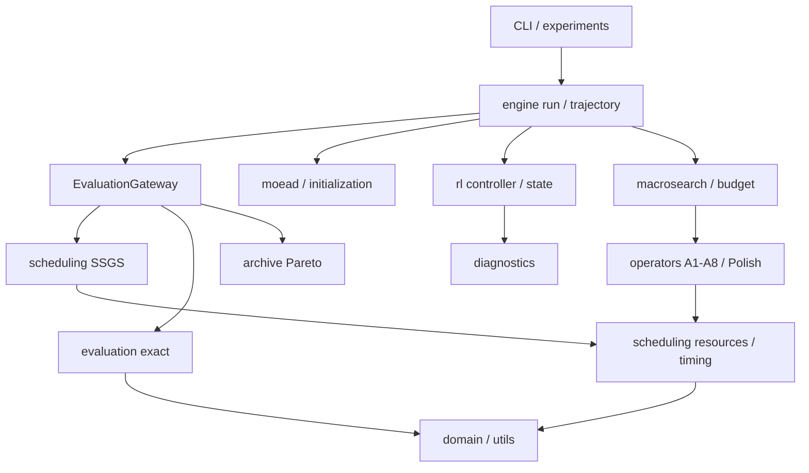

# 架构与所有权

Genotype.ms唯一拥有assignment；Schedule只持timing/diagnostics。结束时刻从duration推导。当前资源事件不持久缓存，由MS/timing计算；未来cache必须绑定genotype身份并验证。

箭头为调用/数据依赖示意。domain不依赖算法，evaluation不依赖Archive/RL。MacroSearch依赖Evaluator Protocol，engine注入实现，避免循环导入。operators不调用engine，所有Archive副作用集中gateway。io校验输入，utils统一数值和随机流；experiments负责artifact而非搜索语义。

包独立设置domain/io/utils/scheduling/evaluation/initialization/moead/archive/operators/macrosearch/rl/engine/diagnostics/experiments/cli。相近小对象集中domain/models.py；A1–A6共用structural.py的合法顺序工具，避免复制。数学模型→算法→代码契约的来源见specifications/sources.json。
