# 200代实验：结果分析与下一步

## 资料与核验状态

- 来源：academic-research-suite / experiment-agent，validate 模式，2026-09-28；版本 v1。
- 状态：ANALYZED。已独立核验产物、重新聚合指标并抽样重算目标；没有重跑363条随机搜索，不将其称为完整复现实验。
- 实验源码：`a703820e6bf3878f30fe2eea404c92083118c7ed`；批次 `20260927T152341Z`。
- 363/363条完成：开发63条，独立验证300条，全部200代、种群100；7,260,000条代内记录，1,089个档案解通过精确评价器抽查。59个实例—算法种子配对单元的实例与初始种群哈希一致；Q表动作计数与轨迹一致。详见 [核验记录](data/validation_audit.json)。
- 北京时间2026-09-27 23:23:41启动，09-28 00:19:40结束，约55分59秒。24路并行缩短了整批工期；不能把这一工期当成单算法运行效率。
- 原始结果与校验文件：[GitHub结果包](https://github.com/atlantic0423/geo-llm-scheduler/releases/tag/200gen-20260927-results)。本文所有图均有同名PDF；图表数据在本目录 `data/`。

## 1. 这次最值得汇报的结论

**固定预算6的完整算法，在200代终点表现最好；但优势主要来自普通综合随机实例，对区域电价差异实例的优势明显减弱。只屏蔽状态9中的A4/A5/A6没有稳定净收益；降低严重度预算分档边界也没有改善总体质量。** 因而本轮支持继续保留固定6作为锚点，不支持直接把屏蔽或新严重度方案设为默认。

这与此前等时间实验中完整算法落后并不矛盾。完整算法每代附加局部搜索：本次平均精确评价32,929次，基线20,100次；其平均耗时224.62秒，而NSGA-II为87.13秒。它用更多计算获得较好的200代终点，尚未证明单位计算收益更高。

独立验证共10个实例，每实例5个算法种子。本文先在实例内平均，再比较10个实例，避免把50条运行当作50个独立问题。16个终点对照统一做Holm校正后，没有一个达到0.05；以下结论是本批样本的方向、幅度及一致性判断，不写成普遍显著优势。

## 2. 实验怎么做

实例均为50请求、3区域、每区3个同构服务实例。111–115为综合随机实例，116–120引入区域电价和需量费差异。两类使用不同实例种子，所以组间差别不能单独归因于电价。开发集使用81–83，各3个算法种子；验证集每实例5个种子，初始种群配对冻结。

|组别|设置|运行数|
|---|---|---:|
|M0/M1/M2/M3|固定6；分别不屏蔽、屏蔽A6、屏蔽A4/A5、屏蔽A4/A5/A6|每组9|
|B1/B2/B3|严重度预算边界分别1/2、0.75/1.5、0.5/1.25|每组9|
|V1|普通MOEA/D|50|
|V2|NSGA-II|50|
|V3|完整算法、不屏蔽、固定6|50|
|V4|完整算法、M3屏蔽、固定6|50|
|V5|完整算法、不屏蔽、B3严重度预算|50|
|V6|完整算法、M3屏蔽、B3严重度预算|50|

屏蔽只作用于**状态9：流动时间偏好＋分时电价主导＋停滞**。状态阈值仍为资源0.13、KV 0.05、区域0.60、电价0.43、需量0.33、可压缩0.16。严格方向触发、质量容差0、轨迹长度5；学习率0.3、折扣0.7，探索率按代数从0.30降到0.05；轨迹末步未来价值为0，轨迹完成后精修一次。

开发集只负责选候选，独立验证负责判断泛化。M3是三个屏蔽候选中最好的，B3是三个严重度候选中最好的，但开发集M0超体积1.06096，仍高于M3的1.04128及B3的1.05591。因此“选中”从一开始就不表示超过基线。

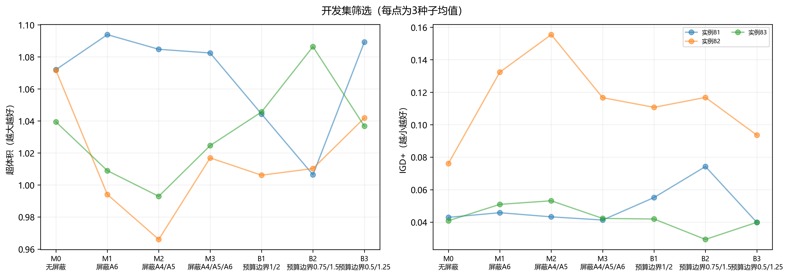

依据：[开发与验证逐条指标](data/run_metrics.csv)、[各组摘要](data/arm_summary.csv)。可选随机预算和旧阈值桥接没有运行，不能用本次数据回答这些对照问题。

## 3. 等代数结果：质量提高，但代价明显

|组别|平均超体积↑|平均IGD+↓|平均秒数|平均精确评价次数|
|---|---:|---:|---:|---:|
|V1 普通MOEA/D|1.02770|0.06909|105.75|20,100|
|V2 NSGA-II|1.06397|0.06106|87.13|20,100|
|V3 完整算法固定6|**1.08597**|0.04003|224.62|32,929|
|V4 仅屏蔽|1.08494|**0.03929**|225.88|33,076|
|V5 仅严重度|1.05975|0.05145|229.19|32,683|
|V6 屏蔽＋严重度|1.06525|0.05103|228.54|32,607|

超体积采用每实例共同归一化尺度和参考点(1.1,1.1)，所以数值可超过1。IGD+相对于全部比较组的经验非支配前沿，是真实最优前沿未知时的相对指标。不同实例先统一各自比较口径，再等权平均；不能把开发和验证的HV直接相减。

V3比V1平均HV增加0.05827，10实例中9胜1负；比V2增加0.02201，但仅5胜5负。V3比V2的IGD+减少0.02104，9胜1负。两个质量指标排序不完全相同：HV同时反映覆盖范围，IGD+反映相对经验前沿的距离，不能择一夸大胜负。

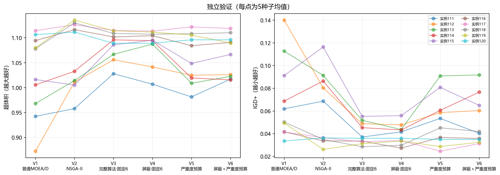
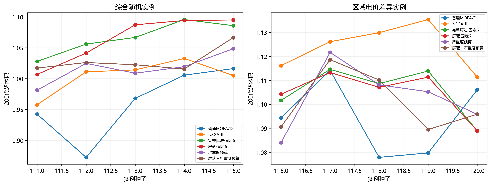

分组后，V3相对V2的HV在综合随机实例增加0.06226，在区域价格差异实例减少0.01825。**平均优势掩盖了适用条件。** 合理推断是：附加局部搜索在某些问题结构下有价值，但不能保证广泛覆盖价格差异带来的目标折中；NSGA-II的种群保留与多样性机制可能更有利于前沿覆盖。这是由分组结果支持的解释方向，尚未通过同一实例只切换电价的配对实验分离原因。

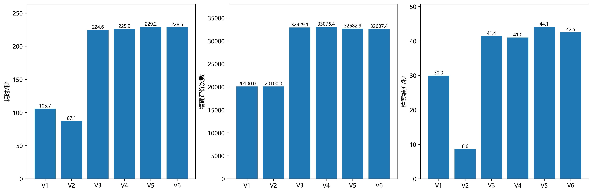
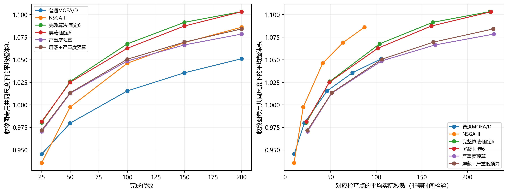

V3耗时约为V2的2.58倍、V1的2.12倍，精确评价约为基线的1.64倍。额外代价不仅来自候选评价，还包括状态诊断、关键时刻搜索、候选构造、SSGS和档案维护。V3平均档案维护41.43秒，占平均总耗时约18.45%；V1为29.98秒、约28.35%；V2为8.56秒、约9.82%。运行时间受并发负载影响，应视为本服务器上的观察值，不宣称精确跨机器加速比。

作为补充，从每条轨迹取不超过60秒的最近记录，V3相对V2的HV差为−0.02963、IGD+改善量为−0.02079。该检查点是事后补充诊断，不是预先冻结的等时间主检验，但与“单位时间收益仍不足”方向一致。[60秒对照](data/time60_contrasts.csv)。收敛图采用包含中途点的共同尺度，不能直接拿它的纵轴数值与终点表比较。

## 4. 为什么屏蔽没带来明显提升

V4相对V3的HV差仅−0.00104，IGD+改善0.00074；平均时间没有降低，反而略增1.27秒。样本不支持稳定净收益，也不足以证明两者严格等价。

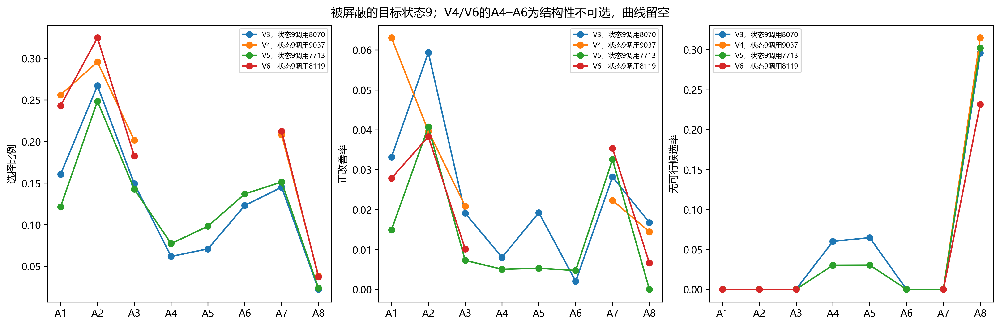

|状态9动作|V3调用数|正改善率|平均即时奖励|
|---|---:|---:|---:|
|A1|1,296|3.3%|0.054|
|A2|2,156|5.9%|0.148|
|A3|1,204|1.9%|0.056|
|A4|499|0.8%|−0.046|
|A5|572|1.9%|−0.017|
|A6|993|0.2%|0.015|
|A7|1,171|2.8%|0.009|
|A8|179|1.7%|−0.266|

数据确实支持“状态9中A4/A5/A6即时改善偏弱”。但从这点跳到“屏蔽一定提高整轮算法”有四个缺口。

1. **作用范围有限。** V3状态9只有8,070次，占全部86,255次动作调用的9.36%；其中A4/A5/A6共2,064次，仅占全部调用2.39%。即使全省掉，影响也不应按整个算法的比例夸大。
2. **屏蔽会把计算转给其他动作，并不会取消轨迹。** V4总调用反而为87,905次；状态9调用为9,037次。V4状态9的A8由179增到346次，而平均奖励仍约−0.267。去掉几个弱动作后，剩余集合仍含不适合当前解的动作，无法自动保证预算利用率。
3. **低成功率不是完全没有价值。** A6在状态9只有0.2%正改善，但平均奖励仍为正，说明少量较大的成功可抵消大量零改善。只看成功次数会丢失改善幅度，也不能排除未接受候选对独立档案的贡献。
4. **整条搜索路径会改变。** 改变可选集合会改变探索概率、Q更新、后续解和触发次数。V4的动作统计来自不同路径，不能把它当作同一父解上直接替换动作的因果效果。

因此下一步更值得测试“当前解确实没有合法候选时屏蔽”，或保留最低探索概率的软抑制，而不是依据粗状态永久删除动作。A4/A5可基于正等待和合法前插机会；A8可基于峰值直接贡献及合法移动窗口。机会判断本身也有成本，应单独记录。

## 5. 为什么严重度预算仍然不如固定6

V5相对V3平均HV减少0.02622，8/10实例下降；IGD+增加0.01142，7/10实例变差。V6也没有恢复到V3：HV少0.02072，IGD+高0.01101。联合处理的交互证据不足，不能声称屏蔽和严重度之间存在稳定协同。

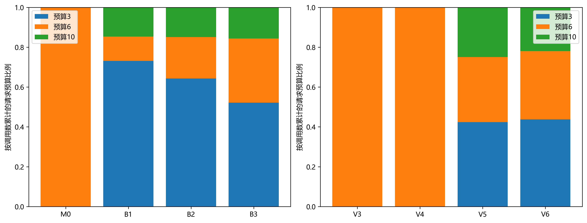

V5的请求预算分布为：3占42.36%、6占32.68%、10占24.96%；平均请求5.73，平均有效5.59。V6分别为43.75%、34.29%、21.96%，平均请求5.57、有效5.43。**降低分档边界没有把总预算整体推高；大量调用仍落在3档。** V3平均有效预算5.86。预算候选通常能够用完，无候选率约1.3%，所以本次主要矛盾并不是大面积生成不了候选。

当前映射将连续严重度除以对应状态阈值后分档。B3中比值不超过0.5给3，大于0.5且不超过1.25给6，超过1.25给10。A1映射资源，A2取资源/KV较大者，A3映射区域，A7映射可压缩，A8映射需量。A4/A5仍按偏好，A6仍按停滞；它们不受此次连续分档边界修改影响。

|动作|V3正改善率|V5正改善率|V5平均请求预算|
|---|---:|---:|---:|
|A1|11.6%|12.5%|5.07|
|A2|10.6%|9.0%|4.61|
|A3|3.0%|2.2%|6.05|
|A4|5.9%|3.9%|6.28|
|A5|6.6%|5.3%|6.35|
|A6|2.1%|1.5%|8.70|
|A7|10.5%|8.9%|4.92|
|A8|4.2%|3.7%|6.04|

**最清楚的错位是：低改善动作A6平均得到8.70，而较有效的A2/A7仅4.61/4.92。** 严重度衡量“当前问题有多突出”，并不直接衡量“某动作多评一个候选能改善多少”。停滞也不保证随机破坏重建有效。降低所有连续分档边界，不能修复A6的停滞映射，更不能保证资源投向收益最高的动作。

此外，单次预算下降会改变轨迹接受与后续触发。V5总调用89,540次，比V3多3.81%，抵消一部分单次候选节省；其精确评价仅少约0.75%，运行时间却略增。档案维护平均44.12秒也高于V3的41.43秒。可推断预算策略改变了搜索路径和费用组成，而不是简单地“预算少所以更快”。

下一步应把严重度作为输入之一，结合动作合法候选数、近期单位评价收益，或对同一父解比较3/6/10的边际改善。必须加入请求预算分布匹配的随机对照，才能区分“严重度指导有效”与“只是预算分布变了”。本轮没有该对照，因此不能彻底否定自适应搜索，只能否定这套边界与映射已优于固定6的说法。

## 6. 热力图告诉我们什么

先看V3基准，再与V4/V5/V6同名图比较。选择概率先跨run累计计数，再计算比例；没有平均每条run百分比。每格附样本量，调用少于30的格留白显示数量；被屏蔽格单独注明“屏蔽”。

$$
P(a\mid s)=\frac{\sum_r N_r(s,a)}{\sum_r N_r(s)}.
$$

正改善率是该状态动作调用中即时奖励大于0的比例，不是候选可行率、档案贡献率或最终解质量。平均奖励包括无可行候选时的−1、有候选但无改善时的0，以及归一化标量改善百分比，正奖励上限10。Q值还包含后续价值，所以动作选择不必严格按即时成功率排序。可用条件概率在 `state_action.csv` 的 `selection_given_available` 列。

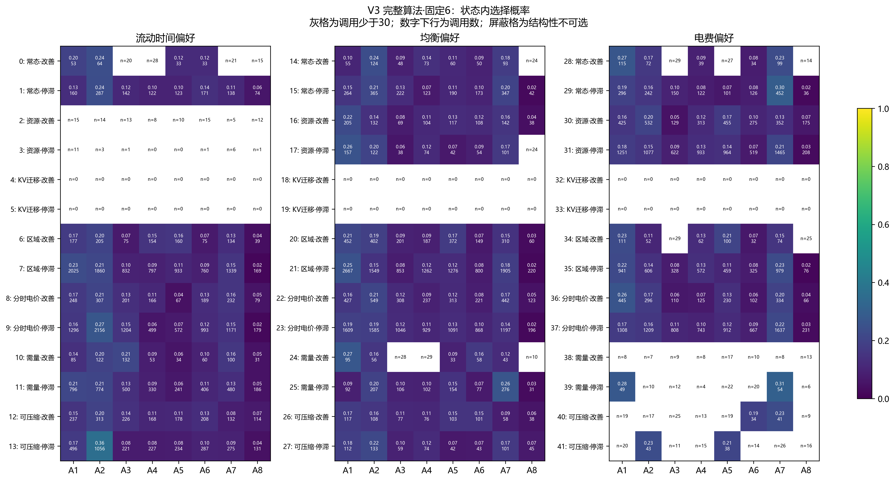
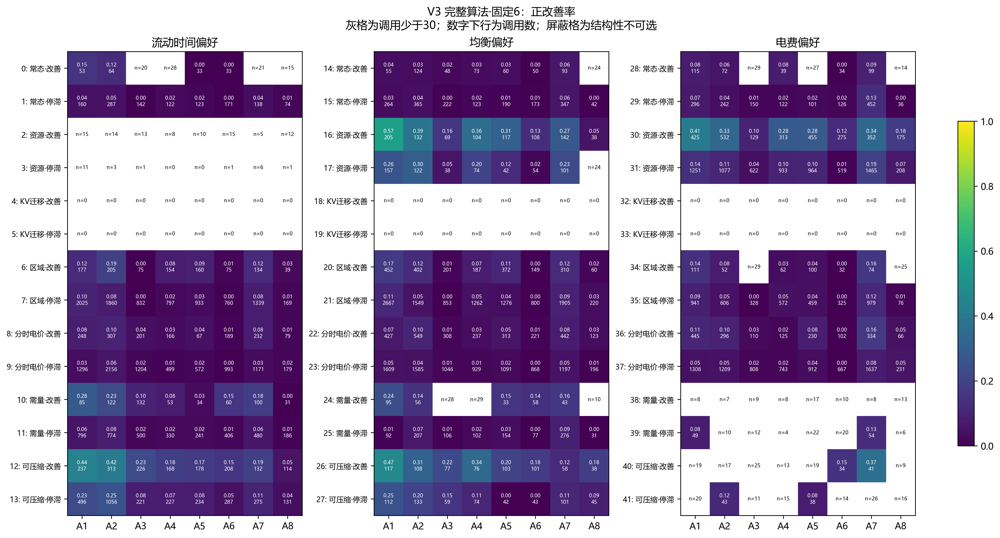
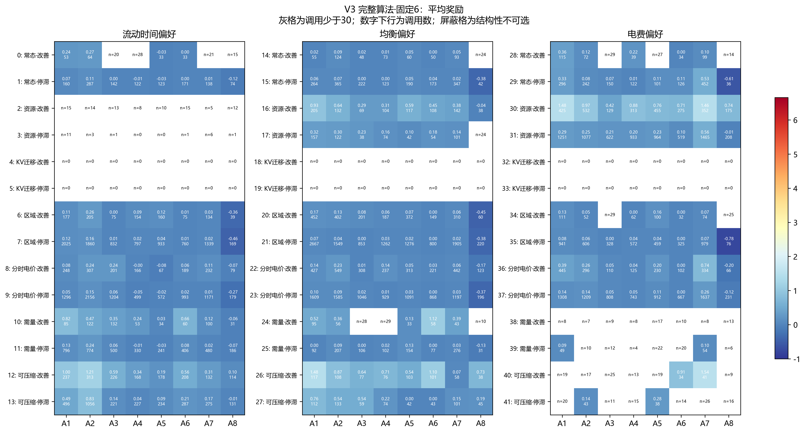

**状态与算子确实存在明显关系，但“主导条件同名算子最好”并不成立。** 例如V3的均衡偏好、资源主导、改善状态16中，A1正改善约57%，A2约39%，A4约36%；电费偏好资源改善状态30中，A1约41%、A7约34%。资源拥塞影响完成时间与实例活跃区间，因此重分配和压缩都有机会同时改善目标。

可压缩改善状态12中，A1/A2约44%/42%，A7约19%；状态26中A1约47%、A4约34%、A7约12%。可压缩标签来自当前时间安排的压缩潜力，但A7冻结分配和未选工序，只能做有限时序移动；A1/A2可以重分配后重建，改变后续资源序列，因此仍可能更有效。这些是结构约束与观察的一致性解释；不同动作并未在相同父解上同时比较，不能当成严格反事实排序。

区域主导状态中A3通常低于A1/A2/A7，也说明区域负载差异不保证跨区域迁移能改善当前加权目标。区域迁移会同时改变资源序列、电价与需量窗口，改善某个代理量可能损害另一个目标。

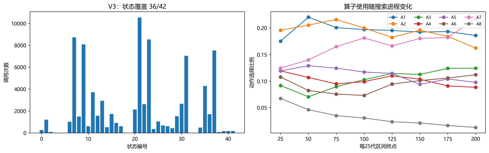

V3覆盖36/42，V4同为36；V5/V6覆盖38，但各只有6次KV主导调用，增加的覆盖极稀疏。V3全部动作调用中，分时电价29,923次、区域27,170次，合计约66.19%；KV为0。不能把38/42直接解读成更好的学习：覆盖数量增加而最终质量下降，说明覆盖与收益是不同指标。KV未成为最大比值，也不等于迁移延迟不存在。

A8在状态9的即时奖励负、调用较少；在部分资源改善状态仍有正改善。因此本轮不支持整体删除A8。它也确实存在被总体平均掩盖的候选瓶颈：V3中A8无可行候选率35.63%，请求6但平均有效仅2.32；V5无候选率33.55%，平均有效2.41。其严格削峰、合法移动窗、冻结其它工序和有限构造尝试的条件会限制可用候选。仅改变预算分档不能自动扩大合法移动机会。应依据峰值可改变性、候选合法性和特定状态样本分析，而不是给整个算子贴无效标签。

补充图：V4/V5/V6分别提供选择、正改善、奖励、无候选、覆盖与搜索进程图；V3也有 [无候选图](figures/V3_no_candidate.png)。各图固定色标便于比较，低样本格不与高样本格作同等解释。

## 7. 下一步的优先顺序

1. **保留V3作为主锚点。** 本轮不把硬屏蔽或B3设为默认。新增独立实例，重点检查区域价格差异下前沿覆盖不足；在同一基础实例上只改变电价，隔离工作负载种子与电价因素。
2. **做机会感知屏蔽的配对实验。** 比较不屏蔽、当前状态9硬屏蔽、合法机会屏蔽、保留最低探索率的软屏蔽。记录被屏蔽理由、检查耗时、候选数、档案贡献，验证减少无效动作是否真正降低总时间。
3. **重新检验严重度到预算的映射。** 优先检查A6的高预算，以及A2/A7被降到低预算的场景。在同一冻结父解、同一候选顺序上比较3/6/10，测量新增候选带来的边际改善与成本，再提出新映射。该受控试验不能用当前不同搜索路径统计替代。
4. **补分布匹配随机预算对照。** 用开发集冻结3/6/10概率，在新验证集比较固定6、严重度、匹配随机预算，同时报告等时间、等评价及等代数结果。
5. **优化档案与日志成本，但保持语义一致。** 本批35GB原始数据压缩后约1.15GB，说明轨迹中重复信息较多；可研究紧凑日志、索引和缓存。任何优化须做精确结果/档案一致性回归与基准测试，所有比较组统一使用。

建议汇报先放“独立验证分组图＋成本图”，明确完整算法的价值与代价；再放状态9局部图说明屏蔽为什么没奏效；最后放预算分档与V3正改善热力图，说明下一步要从粗标签转向真实动作机会与边际收益。

## 8. 统计边界与复现说明

[配对比较表](data/paired_contrasts.csv)包含每实例种子均值的差值、胜负、两类实例分层自助区间和10实例符号翻转检验。区间是5＋5固定分层下的描述性区间；符号翻转检验依赖零假设下差值符号可交换/近似对称，且与该区间不是同一个推断过程。故出现区间不含0而检验未通过的情况，不应择优解释。Holm校正覆盖16项终点检验；60秒表为另一个探索性检验族。

11类统计误读已检查：分组反转（报告价格组与综合组差异）；群体到个体外推（不把状态均值当单父解效果）；选择偏差（开发与验证分开）；碰撞变量偏差（不据所访问状态推断无条件因果）；忽略基率（热力图标调用数）；向均值回归（候选选型不等于获胜）；幸存者偏差（363条全纳入）；多重寻找（列全16对照并校正）；分析路径自由度（60秒标为事后补充）；相关当因果（动作机会解释标推断）；反向因果（搜索路径与状态分布共同变化）。置信程度：对本批数值核验较高，对广泛研究结论保留。

复现命令：先下载Release全部9个 `raw_part_*.tar.gz`、`manifest.json`、`SHA256SUMS.txt`，用 `scripts/recover_20h_results.py unpack --root <原始结果目录> --assets <下载目录> --report <校验报告>` 校验解包；再用 `PYTHONPATH=src python scripts/analyze_200gen_results.py --root <原始结果目录> --output <新分析目录> --workers 6` 重新扫描与出图。应使用干净输出目录，避免使用旧缓存。运行源码由manifest固定，分析脚本随本报告版本提交。

全部原始数据保留在本地 `outputs/campaign_20h/20260927T152341Z`；分卷在 `outputs/campaign_20h/recovery_20260927T152341Z`。服务器原件保留，不因完成回收就自动删除。
