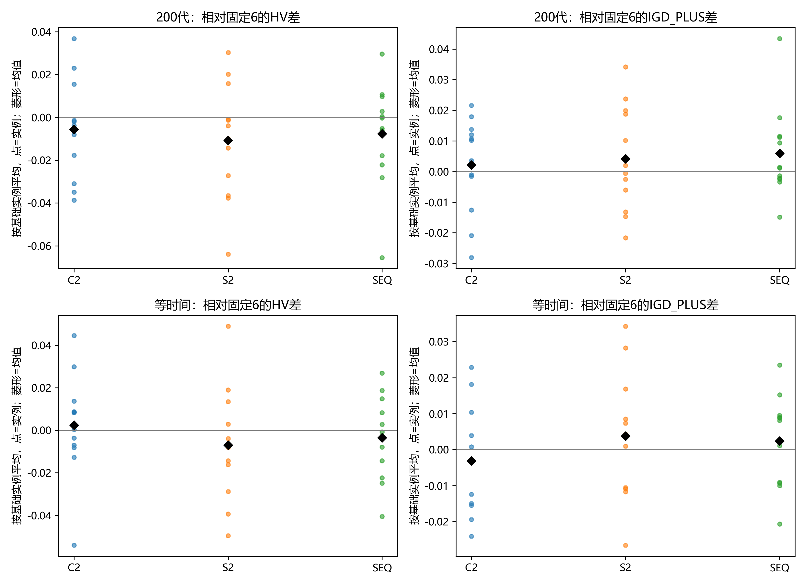
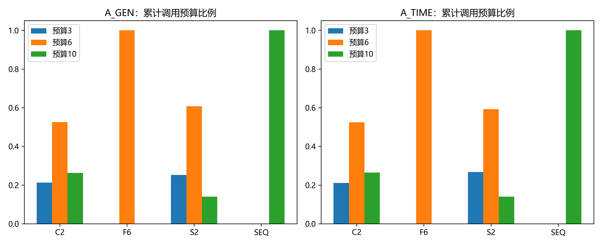
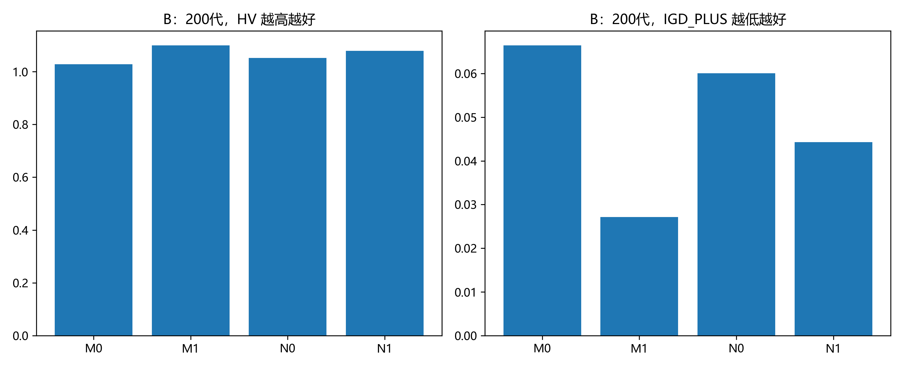
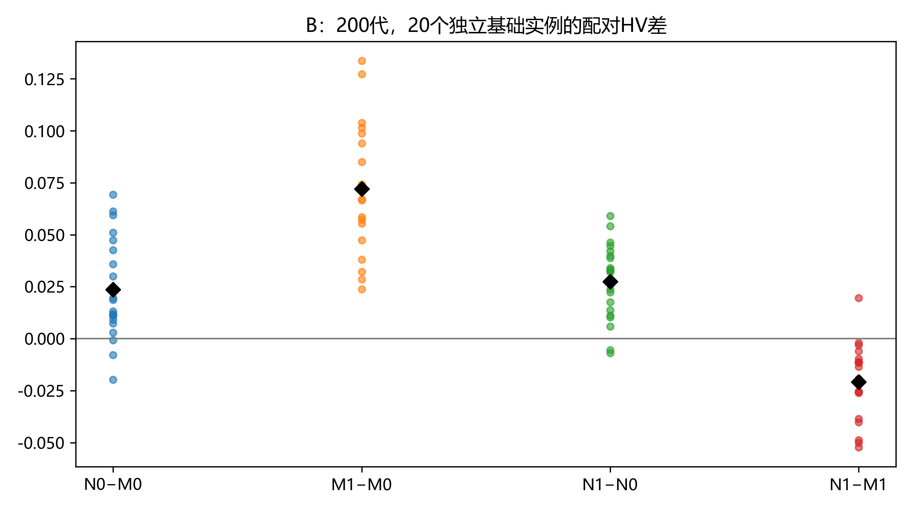
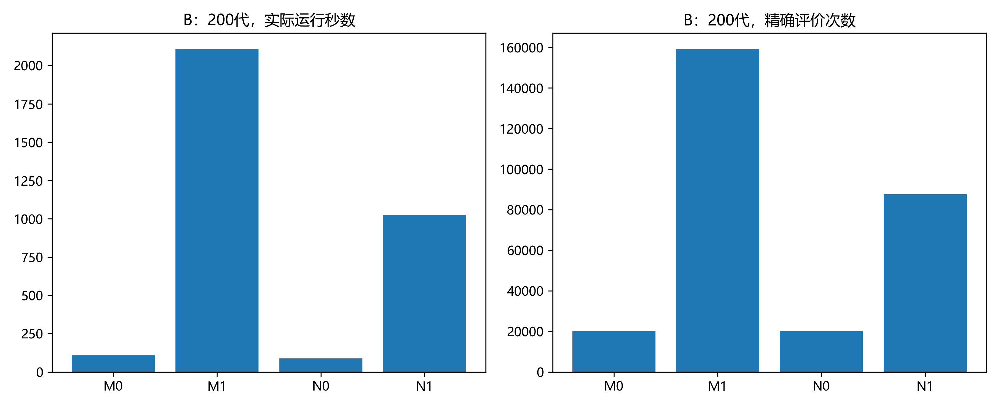
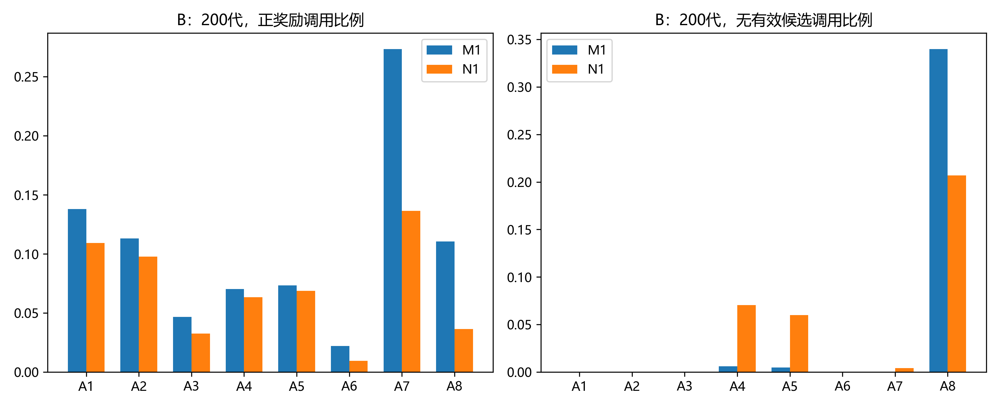
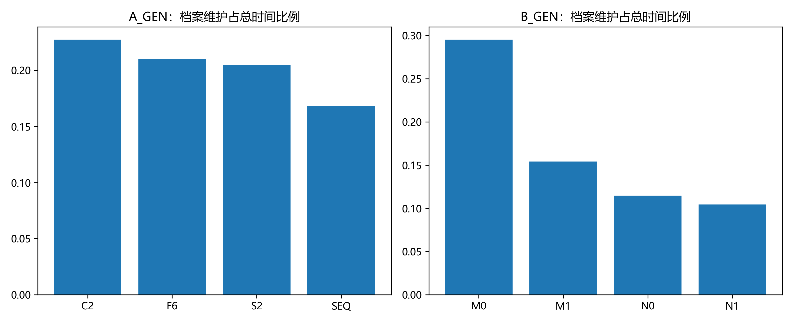

# E15 已完成阶段分析：自适应候选预算与主干比较

## 数据来源与验证范围

本报告截至 2026 年 10 月 1 日约 12:52（北京时间）的扫描，使用 E15 冻结版本 `3c59adaf8dbe62f822300929a30d585e476eb10f`。分析对象是完整结束的 A 等代数、A 等时间和 B 等代数实验，共 1,056 条；另有 245 条 B 等时间结果已验真，但不纳入算法质量比较。尚未完成的协议不参与参考前沿或指标归一化。

分析状态：**已分析并核验交付文件；未重新执行原始搜索以验证研究结果**。原始完整轨迹仍在服务器。此次回收了 1,301 条完整结果的紧凑文件、配置、完成标记和扫描记录，9,113 个文件已核验大小和 SHA256。数据包 SHA256 为 `7a98d1e6ff372e3d22770091bbb19b1a4c95cf9bab042854eee537b56c3be748`。紧凑包不含 `trace.jsonl`，不能称为全部原始结果已回收。

依据包括 [实验协议](e15_experimental_protocol.md)、[逐条指标](e15_interim_20261001/complete_stage_metrics.csv)、[分组摘要](e15_interim_20261001/arm_summary.csv)、[配对统计](e15_interim_20261001/paired_statistics.csv) 和 [完整分析统计](e15_interim_20261001/statistics.json)。本报告属于阶段性研究分析，不自动改变默认算法或预算策略。

## 1. 哪些已经完成

| 阶段 | 问题 | 已完成 / 计划 | 本次是否分析质量 |
|---|---|---:|---|
| A_GEN | 四种候选预算，50 个任务，200 代 | 288/288 | 是 |
| A_TIME | 同一预算对照，2,095 秒 | 288/288 | 是 |
| B_GEN | 两种主干 × 有无模因层，200 代 | 480/480 | 是 |
| B_TIME | 同一主干对照，2,095 秒 | 245/480 | 否，完整配对不足 |
| C_EVAL | B 的同一实例，20,100 次精确评价 | 0/480 | 否 |
| D_GEN | 100 个任务，200 代扩展 | 0/288 | 否 |
| D_TIME | 100 个任务，5,122 秒扩展 | 0/288 | 否 |
| 总计 | 正式矩阵，不含预跑 | **1,301/2,592** | 质量分析仅取完整协议 |

B_TIME 的完成分布是 M1=120、N1=120、M0=5、N0=0。直接平均成功结果会强烈偏向能够完成的算法和实例，形成幸存者偏差。两组模因算法的等时间数据虽已齐，也不在本报告中另建只包含它们的参考前沿，以免与后续完整四组指标口径不一致。

## 2. 实验在比较什么

A 使用 12 个独立基础实例，每个有 H/T 两种电价版本、三个算法随机种子。H/T 只改变区域分时电价与需量费率，硬件与任务结构保持配对；它们不是两个独立基础实例。B 使用另一个集合的 20 个基础实例。所有组在同一实例与种子下读取相同冻结初始种群。

| 编号 | 本文中文名称 | 机制 |
|---|---|---|
| F6 | 固定预算 6 | 每次最多评价 6 个同源候选 |
| C2 | 覆盖驱动第二版 | 用参考方向到目标代表点的最小夹角，按四分位数分配 3/6/10 |
| S2 | 严重度驱动第二版 | 按算子自己的历史严重度中秩百分位分配 3/6/10 |
| SEQ | 序贯预算 | 先评价 3 个，存在改善才扩到 6，新增阶段继续改善才扩到 10 |
| M0 | 普通 MOEA/D | 无模因层 |
| N0 | 普通 NSGA-II | 无模因层 |
| M1 | MOEA/D＋模因 | 使用 A 选出的 SEQ，五步学习轨迹及一次右移精修 |
| N1 | NSGA-II＋模因 | 同样使用 SEQ；辅助参考方向用于局部控制，生存选择仍为排序与拥挤距离 |

固定参数：种群 100，轨迹长度 5，学习率 0.30、折扣 0.70，探索率从 0.30 降至 0.05，质量门容忍值 0.10，停滞门工作值 5；状态仍为 42 个，六阈值按资源、KV、区域、电价、需量、可压缩顺序为 0.13、0.05、0.60、0.43、0.33、0.16。不使用算子屏蔽。轨迹最后一步未来价值为零。右移精修不参与算子奖励。

HV 为超体积，越高越好；IGD+ 为到共同近似前沿的单侧距离，越低越好。同一实例、同一终止协议内，全部算法和种子共享目标归一化范围、近似参考前沿和 HV 参考点 $(1.1,1.1)$。不同协议的 HV 绝对值不直接比较。

配对比较先平均每个基础实例内的两种电价和三个种子，再计算算法差：

$$
\Delta_b=\frac{1}{6}\sum_{v\in\{H,T\}}\sum_{s\in\{101,202,303\}}
\left[m_{b,v,s}^{\mathrm{右组}}-m_{b,v,s}^{\mathrm{左组}}\right].
$$

置信区间用基础实例为单位的 20,000 次重抽样，随机种子为 20261001；两侧符号检验不把算法种子或电价版本当成独立样本。20 个已列出的质量对比统一采用 Holm 校正。均值区间与符号检验检验的统计量不同，不能互相替代。小样本重抽样区间是探索性证据，不是普遍有效性保证。

## 3. A：自适应预算并没有稳定超过固定预算

### 3.1 两种公平口径分别看

| 口径 | 组 | 平均 HV | 平均 IGD+ | 平均精确评价数 | 平均运行秒数 |
|---|---|---:|---:|---:|---:|
| 200 代 | 固定 6 | 1.09070 | 0.04683 | 214,761 | 2,759 |
| 200 代 | 覆盖第二版 | 1.08509 | 0.04895 | 225,637 | 3,312 |
| 200 代 | 严重度第二版 | 1.07992 | 0.05099 | 205,872 | 2,727 |
| 200 代 | 序贯 | 1.08306 | 0.05279 | 161,520 | 2,402 |
| 等时间 | 固定 6 | 1.09492 | 0.04472 | 198,016 | 2,095.38 |
| 等时间 | 覆盖第二版 | 1.09730 | 0.04164 | 198,801 | 2,095.34 |
| 等时间 | 严重度第二版 | 1.08797 | 0.04846 | 189,802 | 2,095.35 |
| 等时间 | 序贯 | 1.09141 | 0.04712 | 160,761 | 2,095.39 |

图中每个小点是一个独立基础实例的配对差，黑菱形是均值。HV 差为正是更好，IGD+ 差为负是更好。

覆盖第二版在等时间下平均 HV 提高 0.00238、IGD+ 降低 0.00308，方向上最好；但 HV 的基础实例均值差区间为 [-0.01115, 0.01489]，12 个实例只有 7 个为正。在 200 代下其平均 HV 反而低 0.00561，只有 3/12 实例为正。**可以说覆盖驱动有值得保留的等时间迹象，不能说已稳定胜出。**

严重度第二版两种口径的 HV 均值都低于固定 6；序贯也未超过固定 6。这些对比的校正后符号检验均未提供稳定差异证据，不能把“没有证据胜出”改写成“证明三种自适应均无用”。

### 3.2 预算是真正分档的，问题不在于完全没有触发

200 代中，覆盖第二版的 3/6/10 调用占比约 21.24%/52.53%/26.24%；严重度第二版约 25.22%/60.73%/14.04%。因此第二版确实打破了“预算几乎恒为 6”的问题。

严重度高档没有恰好占 20% 不能直接判为程序错误。在线严重度不是独立同分布连续变量，重复值用中秩处理，前五次预热、历史分布变化及算子选择反馈都可能改变最终档位比例。把“按百分位分配”误解成“必须精确产生 20% 高档”是不正确的。

序贯的柱子全部显示 10，含义是**本次构造的最高上限**，不是每次真的评价了 10 个。按漏斗累计计数，序贯在 200 代平均只送入 **3.575 个**候选，等时间平均 **3.516 个**；固定 6 分别为 5.823 和 5.820。后面的停搜门确实在减少评价。

### 3.3 为什么会出现这些结果

**覆盖缺口不等于容易填补的缺口。** 该策略测量的是当前目标空间代表点到参考方向的夹角，不是某个算子在该方向上产生有效改善的概率。欠覆盖可能是尚未搜索，也可能是问题可行前沿的几何形状或当前表示导致。单纯加预算未必能改变它。200 代中覆盖组评价次数比固定组高约 5.1%，时间高约 20.0%，HV 却稍低；“更多预算就更好”在这组数据中不成立。

**覆盖组更大的档案没有自动转化为更好前沿。** 200 代覆盖组平均档案 1,646.5，固定组 1,202.2，但 HV/IGD+ 不占优。档案使用表型去重，同一目标可以有多个成员；成员数大不能当作目标空间覆盖质量提高。覆盖组平均档案维护占时 22.74%，固定组 21.03%。覆盖计算本身平均仅 21.03 秒，占其总耗时约 0.64%，缓存命中占查询约 89.3%，因此不能把全部额外耗时都归咎于覆盖公式计算。

**严重度反映问题强弱，不直接反映边际收益。** 资源等待、可压缩程度等代理量决定预算，却没有显式估计“第 7–10 个候选比前三个多带来多少净收益”。严重度来源还受当前算子语义限制：A4/A5 主要复用偏好，A6 复用停滞信息；这些量不等价于合法候选数和可改进余量。分档正确只能证明实现生效，不能证明预算分配经济有效。机制解释需要随后用同父解的预算反事实检验，不能仅凭最终 HV 断言某个阈值就是原因。

**序贯以较低评价量换取接近的 HV，但可能漏掉后段候选。** 若前三个候选没有标量改善，就不会评价后面候选；前几个候选的偶然性、候选生成顺序和当前标量方向会决定是否继续。按规则，未标量改善但可能有 Pareto 价值的后段候选也无法入档。所有已经评价的完整候选仍会尝试更新档案，这条规则没有破坏；代价在于未被评价的候选没有机会。200 代时序贯少约 24.8% 精确评价、少约 12.9% 时间，但 HV 低约 0.7%，IGD+ 较差。等时间时它平均走完 209.0 代，高于固定组 196.4 代，仍未稳定反超；多走一些普通繁殖代数不足以保证补回局部搜索少看的候选。

### 3.4 为什么后续选了序贯，而不是覆盖第二版

冻结代码将每个“协议 × 基础实例”的 H/T 与三种子 HV 差先平均，再将两个协议共 24 个差值一起取中位数，三种自适应中选最高者：覆盖=-0.002844、严重度=-0.007720、序贯=-0.001714。所以 SEQ 被送入 B/C/D，`adaptive_beats_fixed=false`。

这是**从三个候选中选择最不差者进行独立验证**，不是宣布序贯超过固定 6。这里的 24 个值只用于冻结选择，不当成 24 个独立实例做推断。本报告的统计按协议分开，各自只有 12 个独立基础实例。实验协议文档中的选择描述较简略，应以该次已冻结代码和选择记录解释本批结果。

## 4. B：普通主干与模因主干的结果方向不同

### 4.1 200 代下，四组结果

| 组 | 平均 HV | 平均 IGD+ | 平均时间/秒 | 平均精确评价 | 平均档案成员 |
|---|---:|---:|---:|---:|---:|
| M0：普通 MOEA/D | 1.02799 | 0.06647 | 109.27 | 20,100 | 415.8 |
| N0：普通 NSGA-II | 1.05169 | 0.06007 | 89.21 | 20,100 | 209.7 |
| M1：MOEA/D＋模因 | **1.09997** | **0.02718** | 2,106.94 | 159,008 | 950.8 |
| N1：NSGA-II＋模因 | 1.07917 | 0.04430 | 1,025.49 | 87,565 | 594.4 |

普通 NSGA-II 相对普通 MOEA/D，平均 HV 差 +0.02370，20 个独立基础实例中 17 个更好，均值差区间 [0.01335, 0.03439]，校正后符号检验为 0.0361。它的平均时间也更低。**本批等代数数据支持普通 NSGA-II 是有竞争力的全局主干。** 但 IGD+ 差的区间 [-0.01381, 0.00049] 包含零，胜负为 10/10，因此不能说两个指标都在每个实例上稳定优于普通 MOEA/D。

加入模因后，N1 相对 M1 的平均 HV 差为 -0.02080，20 个基础实例只有 1 个为正，区间 [-0.02858, -0.01297]，校正后符号检验 0.000721。IGD+ 也更差，平均差 +0.01712。**“普通 NSGA-II 更强”没有自动延续到当前模因移植版本。**

两个主干加入模因后都提高了等代数质量：M1 相对 M0 的 HV 改善在 20/20 基础实例为正；N1 相对 N0 在 18/20 为正。但模因层包含算子、预算、学习、Trigger 和右移精修，不能把全部收益归给 Q-learning。

### 4.2 等代数优势伴随明显额外投入

M1 的时间约为 M0 的 **19.28 倍**，精确评价约 **7.91 倍**；N1 的时间约为 N0 的 **11.50 倍**，评价约 **4.36 倍**。M1 相对 N1 用了约 **2.05 倍时间、1.82 倍评价**。因此 200 代更好说明相同外层繁殖代数下模因层能提高解质量，不能单独说明单位时间或单位评价效率更好。

等时间 B 尚未补齐，等评价 C 尚未完成，这正是现阶段不能做最终主干决策的原因。已有 245 条等时间数据也不能消除这一缺口。

上述耗时是这次并行批次的实际墙钟，受并发负载和运行环境影响，不是隔离单进程的速度基准。不同协议分别分析，不能将不同运行批次的时间差全部归因于算法。2,095 秒对照即使结束时间接近，也仍需核对资源压力，避免把内存竞争造成的吞吐损失解释为搜索质量差异。

### 4.3 为什么当前模因层在 MOEA/D 上收益更大

以下数据来自所有 120 条 B_GEN 结果累计计数，并非简单平均每条 run 的百分比：

| 行为 | M1 | N1 |
|---|---:|---:|
| 模因触发 / 子代 | 596,613 / 2,400,000 = 24.86% | 376,436 / 2,400,000 = 15.69% |
| 整段搜索标量改善 / 已触发轨迹 | 49.22% | 32.50% |
| 右移精修接受 / 调用 | 36.96% | 12.94% |
| 右移精修精确评价总数 | 6,061,329 | 1,991,469 |
| 单步调用正奖励比例 | 15.50% | 8.58% |
| 每次局部调用平均精确候选 | 3.556 | 3.243 |

首先，**触发相同公式不等于得到相同搜索机会**。MOEA/D 的权重附属于固定子问题；NSGA-II 用父代辅助方向建立局部语境，子代在该语境下进行方向门与质量门判断。其父代分布、关联方向、归一化上下文及质量参照不同。本批 N1 只触发了 M1 的约 63.1% 次数。于是少投入不只是运行速度造成，还源于实际进入模因层的机会更少。

其次，**两类生存选择与局部奖励的目标并不完全一致**。局部接受与奖励追求某个方向的归一化 Tchebycheff 改善：

$$
g_{\lambda}(x)=\max_m\left\{\lambda_m\frac{f_m(x)-z_m^*}{\max(z_m^{max}-z_m^*,\epsilon)}\right\}.
$$

MOEA/D 后续邻域替换也沿权重方向进行，局部目标与全局保留规则更接近；NSGA-II 后续按 Pareto 排序与拥挤距离保留，局部标量改善不保证成为全局优势。此处是由算法规则能够推导出的结构差异；本批统计尚不能量化其中有多少收益被环境选择丢失，需要记录模因结果的后代存活率才能验证强弱。

第三，**时序精修机会也变少了**。右移精修仅能利用 P→D 之间的合法余量，冻结 Decode 和其它工序。N1 的精修接受率约为 M1 的三分之一，精修精确评价量也只有约三分之一。可以确定当前搜索产生的可用精修机会和结果不同；不能仅凭接受率断言 NSGA-II 必然没有时序余量。应进一步分解“没有合法窗口、无降费候选、窗口有候选但未接受”。

第四，结果并非所有目标都一致偏向 M1。N1 的平均最小 Flow 为 34,614.75 秒，优于 M1 的 34,697.50；但平均最小电费为 2,314.93 元，差于 M1 的 2,286.29 元。这与“N1 对 Flow 端较强，但综合前沿质量落后”的解释相符。两个极值通常来自不同解，不能把它们拼成一份同时达到两端最优的调度。

## 5. 算子结果：A7 的主干差异最值得追踪

| 算子 | M1 正奖励调用比例 | N1 正奖励调用比例 | M1 无候选比例 | N1 无候选比例 |
|---|---:|---:|---:|---:|
| A1 单阶段重分配 | 13.79% | 10.91% | 0.00% | 0.00% |
| A2 P/D 路径重分配 | 11.31% | 9.75% | 0.00% | 0.00% |
| A3 区域迁移 | 4.66% | 3.26% | 0.00% | 0.00% |
| A4 单工序前插 | 7.02% | 6.32% | 0.59% | 7.05% |
| A5 P/D 联合前插 | 7.32% | 6.86% | 0.49% | 5.99% |
| A6 随机任务大邻域 | 2.21% | 0.93% | 0.00% | 0.00% |
| A7 活跃时间压缩 | 27.33% | 13.65% | 0.01% | 0.40% |
| A8 峰值协同修复 | 11.04% | 3.63% | 33.97% | 20.69% |

正奖励比例的分母是全部调用，含无候选调用；本定义对应局部标量改善，不等于 HV 改善、Pareto 支配或最终档案贡献。无候选调用奖励 -1；有候选但未改善奖励 0。A8 的“不产生候选”和“有候选但不改善”必须分开看：M1 无候选更多，但一旦成功构造，其总体正奖励率仍高于 N1。不能用单一失败率给算子排序。

M1 的 A7 调用占比约 35.90%，N1 约 22.06%；正奖励率也约相差两倍。A7 在固定分配与冻结其它工序下压缩活跃区间，因此不同主干留下的时序结构会直接改变候选机会和收益。这个结果支持把 A7 的结构适配作为下一轮重点，但不是同父解反事实：两组访问的状态与 incumbent 不同，不能断言 N1 上的 A7 代码本身变弱。

A6 两组都没有明显候选构造困难，却正奖励很低：问题更像是随机破坏重建在当前局部标量门下较难被接受。仍不能立即永久屏蔽，因为无局部奖励的完整候选也可能更新档案，且其后续轨迹价值可能不同。应同时检查最终档案贡献和消融结果。

A4/A5 的无候选比例在 N1 上明显增加，与它们要求正等待 target、合法前插且禁止零等待 fallback 的规则相符；这给出了“当前解的可前插机会不同”的证据。还不能仅由总比例判断原因是资源等待更少、OS 前插空间更小，还是 target 构造筛选，需要细分失败原因。

本图不是“状态 × 算子”热力图。紧凑摘要只有状态边际与算子边际，不能由两个边际反推出联合分布。状态条件下的算子偏好必须读取预注册分层完整轨迹，再标注样本数；本报告不制造缺失的联合计数。

## 6. 运行故障：现在不能恢复 32 路

2026-10-01 检查发现 cgroup 限额为 32 GiB，工作内存约 28.5 GiB；峰值记录接近 100%。`memory.events` 记录 OOM 事件及 552 次 `oom_kill`（该容器累计值，不等于 552 条不同失败任务）。B_TIME 的 supervisor 已列出 82 个重试耗尽条目，均为退出码 -9、缺少完成文件。后续安全收尾期间数字可能继续变化。本次证据已经能确定发生过内存耗尽杀进程，不再只是上一轮的怀疑。

单个普通算法工作进程已见约 6–9 GiB RSS，内存门阻塞派发超过 16,000 次。内存门只在派发时检查当前占用，不能预防已启动进程之后继续增长。将并发上限从 16 改成 32 不会解决它，还会加剧同批任务的内存竞争。

源码证据在 `engine/run.py` 与 `experiments/nsga2.py` 的 `trace.append`：每个子代记录都保存当时的 `archive_objectives` 列表，而 `e15_worker.py` 在搜索结束后才按预注册规则决定是否把完整轨迹写盘。故“最终只保存紧凑输出”并没有使运行期轨迹紧凑。若记录数为 $N$、平均档案规模为 $\bar A$，仅目标快照列表的引用存储就随 $N\bar A$ 增长，还不含每行字典和其它信息：

$$
M_{\mathrm{trace}}=O(N\bar A).
$$

普通算法 200 代只花 89–109 秒，给它 2,095 秒会产生远多于 200 代的日志；模因算法计算较慢，同一时间的记录数较少。故故障反而集中在普通组，而不是单次搜索更复杂的模因组。这是与现场数据一致的高可信机制解释；精确内存归因仍需测量，不能把全部内存占用都当成日志快照。

已经请求**安全暂停新任务派发**，让在途任务收尾，不删除任何完整结果。32 路暂不启用。此前 60–80 小时 ETA 已失效，原因是失败重试与内存增长没有被该预测覆盖。

两个可选恢复方向：保持冻结版本、极低并发续跑，剩余等时间条目按串行下限就可能耗费约两周；或修复日志存储并建立独立新版本、保留旧数据，统一重跑受影响的全部等时间对照。后一方案需先通过搜索语义与记录等价性测试及 24/32 路内存预跑，不能先承诺 32 路一定可行。日志优化即使不改搜索公式，也会改变等时间内可完成的工作量，不能把新旧版本不加说明混成一个公平比较。

新容器实际到期时间还未核实；极低并发方案可能超过既有迁出目标，不能在未确认资源期限前承诺无人值守两周能交付。

档案维护和轨迹快照是两个问题。B200代中普通 MOEA/D 的档案维护平均占总时间 29.53%，普通 NSGA-II 为 11.47%；M1 为 15.42%，N1 为 10.45%。该比例证明维护成本值得优化，但不能解释成所有未归类耗时或 OOM 都由 Archive 更新操作造成。保持档案语义的索引优化和日志存储优化应分别验证。

## 7. 当前能汇报的结论与下一步

1. **自适应预算已实现有效分档，但尚未形成稳定质量优势。** 覆盖第二版有等时间方向上的弱迹象；严重度第二版还没有体现预期净收益；序贯显著减少实际评价量，却没有稳定超过固定 6。不能为了结果好看重新校准本批阈值或选择规则。
2. **普通 NSGA-II 主干有优势，当前模因移植的收益却更弱。** 200 代中 NSGA-II 普通版 HV 更好、耗时更少；模因版则 MOEA/D 更好，同时投入更多评价。下一步先补齐完整公平对照，不直接切换默认主干。
3. **Trigger、A7 与右移精修的机会差异值得解释。** N1 触发更少、A7 正奖励更低、右移精修接受率更低，已经构成具体机制线索。下一轮统计辅助方向分布、偏好门/质量门分别拒绝次数、模因产物存活率和精修失败原因；用同父解反事实区分“主干产生了不同机会”与“算子本身收益不同”。
4. **先解决长时间日志内存，再扩大并行。** 当前不能再以可见 128 线程推断 32 路可行。对日志存储优化验证同种子、固定代数下的目标、候选、状态、动作、Q 更新、最终档案完全一致；单独量化运行时间和 RSS，再设计统一新版本的等时间重跑。
5. **自适应预算下一步测边际收益，而不是只测严重度。** 在相同父解及相同预生成候选序列上比较 3/6/10，记录标量改善、独立入档、最终保留和每秒收益。对序贯记录“前三个不改善但后段能改善”的遗漏率；对覆盖预算按缺口大小分组观察实际收益，检验缺口是否是可修复的机会。
6. **不要仅凭本次总表屏蔽 A6/A8。** 对 A6 检查多样性和后续轨迹价值；对 A8 将构造失败、削峰门失败、标量不改善分开。再进行带合法机会屏蔽的对照，固定预算和触发口径，避免把少做工作造成的速度变化误认为学习更强。

统计解释检查覆盖 11/11 项：辛普森悖论（协议分开）、生态谬误（基础实例与调用两个层次分开）、入选偏差（A筛选与B验证分开）、碰撞变量偏差（不按触发成功筛掉运行结果）、基率忽略（改善率包含全部调用）、均值回归（筛选不当作胜出验证）、幸存者偏差（B_TIME不做质量结论）、多重寻找（全部20项一起校正）、结果驱动分析路径（未回改冻结选择）、相关冒充因果（机制解释标明待验证）、反向因果（低改善率不直接解释成低调用率的原因）。

所有下一步均属于待实验计划。本轮没有改变当前数学模型、42 状态、A1–A8、Q-learning 参数或默认主干。
