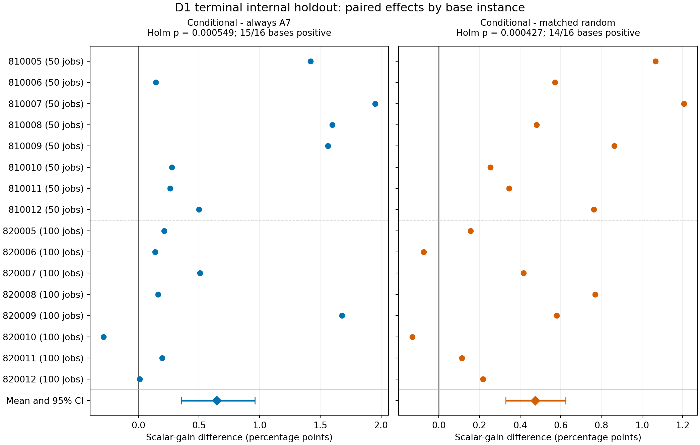

# D1 条件时序迁移：16实例终态内部留出验证（2026-10-04）

## 结论

第二步已完成实现、本地验收、真实三组执行、独立exact/重放和事前base统计。条件时序迁移通过本次内部留出质量筛选，支持继续验证“有正残余等待、实际MS相同且实际OS改变时迁移，其余新A7”的最小规则。当前完整MOEA/D默认算法未修改。原通用D1整体未优于新A7的首轮结论保持。

该结果限定于已参与P2的16个基础实例、F6终态来源和人工结构扰动。它不是新独立实例、早中晚来源或完整MOEA/D在线效果的确认；不把离线标量改善等同于HV/IGD+或电费下降。

## Material Passport 与冻结版本

Origin Skill: academic-research-suite / experiment-agent; Mode: run+validate. Verification Status: ANALYZED, independent exact/replay/statistical audit PASS. Version: D1_terminal_routing_holdout_v1.

- 运行源码：`78659c3e84c1c9a23efad90014a09fe401b50523`；canonical source SHA256：`389a2845f2940ce06d69a2a77e893a1e793dbac799092de90827ee60ca273647`。
- 发现规则的旧8base未进入正式确认矩阵；预跑4条来源也仅来自旧开发base。
- F6来源源码f6b7fba；冻结600/1200秒终态来源，与首轮D1的1800/3600秒阶段采样分别报告。
- [冻结协议](../experiments/d1_terminal_holdout.md)、[Draft PR #26](https://github.com/atlantic0423/geo-llm-scheduler/pull/26)、[运行源码双版本CI](https://github.com/atlantic0423/geo-llm-scheduler/actions/runs/37177770865)。PR基于main，包含未合并P2/D1前置实现，不表示默认分支已采用。
- [Notion实验记录](https://app.notion.com/p/3ef8878b8019816f99f6ca1f21f20592)。完整结果与复现包通过对应GitHub Release交付；Release说明记录资产清单和下载核验。

## 实验构成及配对

50job 810005–810012、100job 820005–820012，H/T×1101/2202/3303，96条完整来源运行。每run四个不同表型，按Flow/Balanced/Electricity与remainder抽样；384个来源各做OS/实例/区域的一作业和约10%作业扰动，2304个目标、6912次真实策略执行。缺失来源/未改变结构/失败任务均为零。来源有正等待220个，无正等待164个。

每个配对目标共用来源、实际目标MS/OS、来源索引自己的权重、SSGS底座和候选前冻结的归一化；A7路线用同一命名RNG。每组先选路线，再真正执行该路线；TRUE失败只回退底座。随机组在来源的全部六个改变目标中随机分配同样的TRUE次数，保留正等待前提。条件与随机各440次TRUE；随机分布OS/实例/区域147/148/145，条件440次均为OS。

每策略允许最多3新增exact及50/100job的1/3秒上限。共同源验证、SSGS/exact、目标生成分配、每次guard提取、投影/构造、失败及重复都保留成本；相同上限不表示实际成本相同。基线回退使各组标量改善非负，证据来自组间配对差异。

## 三组质量与实际成本

质量为相对共同SSGS底座、来源权重下的标量改善。先run内目标平均，再每base六run平均，最后16base等权。成功率和时间是目标调用的描述性汇总。

| 实际策略 | 标量改善 | 成功比例 | 边际时间/目标 | 加共同工作及分配 | 新增exact |
|---|---:|---:|---:|---:|---:|
| 始终新A7 | 4.1725% | 54.99% | 90.29 ms | 108.51 ms | 6,912 |
| 条件TRUE，否则A7 | 4.8176% | 54.60% | 86.19 ms | 104.41 ms | 6,833 |
| 同次数随机TRUE，否则A7 | 4.3426% | 52.99% | 85.64 ms | 103.86 ms | 6,823 |

| 事前主比较 | 差异（百分点） | 95% base bootstrap区间 | 精确符号翻转p | Holm p | 正向base |
|---|---:|---:|---:|---:|---:|
| 条件−始终新A7 | +0.6452 | [+0.3536, +0.9614] | 0.00054932 | 0.00054932 | 15/16 |
| 条件−同次数随机TRUE，否则A7 | +0.4750 | [+0.3286, +0.6254] | 0.00021362 | 0.00042725 | 14/16 |

50000次规模内base bootstrap；65536种完整base符号翻转；Holm只覆盖两个主质量比较。两项均为正均值、95%区间下界正且Holm p<.05，通过预定质量筛选。符号枚举的“精确”指穷举全部符号组合，依赖零假设下配对差异符号可交换；16个base的bootstrap区间为近似区间。

条件组比始终A7的含共同工作时间约少3.78%，比随机组略慢约0.53%；这些是本机四并发批次的描述性实测，不是受控微基准或等wall-clock在线收益。guard已包含：条件/随机分别17.375/17.268秒。条件成功率略低于A7，平均改善提高不能表述为成功更频繁。

## 归一化敏感性和实际目标

主上下文ideal取源population/archive最小值和目标底座最小值，maximum取源population最大值，在候选生成前固定。与当前线上MacroSearch会更新临时ideal的行为有区别。低于固定ideal的proposal记录A7/条件/随机为3/2/3（包括配对重复记录），不能静默忽略。

预定敏感性只对实际完成且可行、按时的候选，共同更新ideal并重新评分；不生成新候选，也不替代主检验。条件−A7为+0.6395个百分点，95%区间[+0.3471,+0.9566]；条件−随机为+0.4694，[+0.3218,+0.6216]，结论方向保持。

| 策略 | Flow相对底座改善 | Bill相对底座改善 |
|---|---:|---:|
| 始终新A7 | -0.6767% | +0.4249% |
| 条件TRUE，否则A7 | -0.6333% | +0.4663% |
| 同次数随机TRUE，否则A7 | -0.5696% | +0.4194% |

负Flow改善表示比SSGS底座慢。条件组是权重下的时延/电费权衡；4.8176%标量改善不是4.8176%节电，也不是两个目标同时改善。条件相对随机的Flow均值略差、Bill略好；未另做事后显著性门。

## 分层机制观察（描述性）

条件−A7：50/100job为+0.9633/+0.3270个百分点，H/T为+0.8376/+0.4527；OS为+1.9355，实例/区域均0。后两类按规则执行同一新A7，所以零差异是配对设计的结果，不是迁移对换实例/区域有效的证据。整体优势未依赖删掉其他两类目标；OS-only在所有目标中占1/3是人工设计比例，真实线上频率尚未知。

16个base中，820010对A7为负；对随机820006/820010为负，不隐藏反例或只选有利实例。后续不凭本轮结果重新调规则并再次把这组数据当确认集。

## 完整性、复现与资源

- 原P2 ledger 1041个文件与96来源completion/input hash逐项验证，未改原件；96新任务文件hash及冻结manifest通过。
- 20568条新增exact候选记录全部复核可行，late/overshoot/失败投影0；重复投影条件79、随机89次，少于3exact的真实成本保留。
- 独立audit重算384来源、2304目标底座、8866个去除同一目标重复后的proposal，共11554次GT复评；所有20568条proposal记录均核对，不把缓存命中说成独立计算。
- 48目标覆盖16base×三类扰动、变化大小与不同电价/种子，144策略的非时间字段、完整proposal starts/objectives/可行性/预算资格逐项重放完全一致；计时不要求位相一致。
- 独立统计脚本从raw重建run/base层级、50000重采样、用另一种枚举方式检查65536符号组合与Holm，主比较及成本完全一致。
- 正式四并发计算198.666秒（约3分19秒）；累计worker 649.512秒，峰值单worker 27.172MiB；最长策略441.375ms，无预算越界。
- 原96终态结果已存在，因此不用重跑F6阶段采集；不能与前一批10小时31分钟的新阶段采集混同。
- 本地285tests、ruff/format/mypy全部通过，overall86.08%/core96.80%；默认deterministic replay `aeb9824d2e671fe76771297ece91af40576124c930721193c18127cbdb814fa7`一致。双Python CI通过。

原始manifest/jobs/sources/input、完整候选starts与所有独立审计、分析表、图和协议保存在新独立campaign并进入完整Release包。运行source SHA始终为78659c3；报告提交另记录，不混为执行版本。Portable包仅将本机导入路径元数据替换成明确标注的portable派生件，科学raw文件保持字节一致。

## 十一项统计谬误审阅及附加检查

ARS指南的11项逐项检查如下，伪重复另列为第12项附加检查。本节及ops/fallacy_audit.json为实际审阅依据，补全自动分析报告的简写列表。

| 检查 | 事实及边界 |
|---|---|
| Simpson 分层反转 | 50/100与H/T的条件−A7均正；实例/区域组为零，OS组正。分层仅描述，整体采用事前等权。 |
| 生态推断 | 推断单位是16个base；不把2304目标、384来源或96seed/tariff运行视为独立实例，也不宣称每次调用都获益。 |
| Berkson 选择偏差 | 来源是经过F6搜索的可行终态，按偏好/唯一表型抽样；仅适用于这类终态条件分布，不推广至随机解或全部阶段。 |
| Collider 碰撞偏差 | 主比较包含所有目标，不按候选成功/获益筛除；正等待是事前源特征，随机组保留同一前提，不用执行后目标值决定路线。 |
| 基准率忽略 | 正等待来源220/384（57.29%），空等待164/384（42.71%）；迁移440/2304（19.10%）。成功率A7/条件/随机54.99%/54.60%/52.99%，条件组不因平均质量提高就被表述为成功更频繁。 |
| 均值回归 | 不按本轮差解/高收益选择源；以同一SSGS底座及同A7随机候选的两对照检验增量，而非仅声称各组相对底座非负。 |
| 幸存者偏差 | 96/96任务、384/384来源、2304/2304目标完整；缺失/未变化/失败投影/late全部为零。重复候选79/89次保留计数，未强行补满exact。 |
| Look-elsewhere 多重探索 | 只有两项事前主质量检验，Holm校正；规模/电价/扰动分层以及目标分量仅作描述，不以筛选最有利分组代替总体主比较。 |
| Garden of forking paths | 代码/协议在看正式质量前冻结78659c3；资源pilot只用旧开发base。主归一化及共同updated-ideal敏感性均预定，原8base事后规则仍归为发现证据。 |
| 相关性当因果 | 三组实际执行事前路线、来源/目标/权重/底座/A7 RNG配对，可比较固定离线实验的局部处理输出；不因此宣称线上HV、IGD+或普遍Pareto改善。 |
| 反向因果 | 源等待及实际MS/OS在候选目标评价前决定门控；随机分配同样先定，没有先运行TRUE和A7再挑优的oracle。 |
| 附加：伪重复与推断假设 | 六个seed/tariff run先在base内汇总，基础实例等权；符号翻转枚举要求零假设下base差异符号可交换，bootstrap区间仅16base、为近似区间。 |

## 尚未验证的部分

这一步支持最小门控在内部终态池的局部候选质量；既有通用D1未过整体A7门的结论不变。新实例、早中晚阶段及真实交叉/变异产生的目标、同位置新A7/随机对照和等总wall-clock下的线上HV/IGD+/覆盖/吞吐/多样性，仍是后续验证内容，本轮没有启动。当前算法框架只更新研究状态索引，不变更采用语义。
