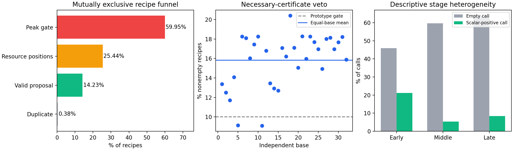

# D4 正式结果分析与 MOEA/D 后续安排（2026-10-07）

## 结论

**D4 通过了“值得开发证书门控原型”的事前筛查，但尚未验证在线节时或 HV 收益。** 非空 repair 的可否决比例按 32 个独立 base 等权为 **15.84%**，95% bootstrap 区间 **[14.85%,16.76%]**，下界超过预设 10%。本次全部 repair 仍照常执行，没有观察到错误否决；原 worker 的独立事件积分、fixed-tail、exact 审计全部通过。

当前更大的障碍是 **repair 后未通过全窗口削峰检查**：占全部 recipe 的 59.95%；资源位置搜索失败占 25.44%。证书只能提前排除其中一部分。原 A8 找到严格削峰候选时，几乎总能降低总电费，但只有约四分之一候选改善当前方向的标量目标。因此下一步要分别验证计算开销、重插质量、方向接受，不能把三个问题合成一个未经消融的大改版。

既有 D3 正在两台 CPU 运行，继续其原冻结矩阵；D1、D2、P2 的未通过晋级项不直接接入在线算法。D4 证书属于必要条件，当前不是已认证的创新贡献。

## 材料身份与完整性

- Material Passport：academic-research-suite / experiment-agent；Mode=validate；原实验与独立记录统计=ANALYZED/VERIFIED；在线节时、在线质量和新颖性=UNVERIFIED。没有重新采样或改变冻结阈值。
- 正式计算于 **2026-10-06 23:58:43（Asia/Shanghai）** 结束，耗时约 **15 小时 1 分钟**。192 source +192 probe，1728 panels、10368 A8 调用全部齐全；真实 worker=0，exit=complete，failure=0。
- 运行源码始终为 `cfeb369573b06229332827c73076bd5a73abcce5`，canonical source SHA256 为 `9102cf8419ae33b125c0844953f620d2df92d58b9d4d6605e46819e30d4ed467`。未合并研究 [PR31](https://github.com/atlantic0423/geo-llm-scheduler/pull/31) 不是默认 main。
- 本轮在原冻结 Linux checkout 实际执行原 validator，192+192 完成件、353 冻结输入、初始化/配置/协议/源码 hash 和同配对主机身份通过。全矩阵来自 `196ec6b261f1`，保留与 P2 共享物理 CPU 的背景。
- 原 worker 的 source 最终 exact 复验累计 **124161** 项，probe 的独立来源/修复/候选 exact 检查 **63934** 项。本轮核验了这些检查对应的原始文件 hash，没有把 summary 计数说成重新执行全部 exact。
- 完整 raw **5738 文件、2307308169 字节**，已完整回收到本地，每个 archive 成员和解包文件均按大小/SHA256 逐项验证；服务器原件保留。
- 完整 archive **153138420 字节**，SHA256 `92af9425ce11d00d6e0c4ed8ce4b1e0ace2b5001451cc668570d44534850ae17`；完整 manifest SHA256 `c387c982763f670ade6a9382277acb9a8c6021f087da8c817db0ecc543453665`。
- 原采样预算、重复表型、失败 recipe、空调用均保留，不把预跑或重复尝试纳入正式矩阵。本轮收藏器一次 exit 字段假设错误仅发生在只读验收，修正记录与 stderr 保留；没有重跑算法。

## 设计及分母

32 个全新 base：50-job 为 875001–875016，100-job 为 885001–885016；H/T 电价、三算法种子。50/100-job 来源预算 1800/3600 秒，共 144 source worker-hour。每源早/中/晚三个阶段、三个偏好、六邻域槽位。来源为 F6；probe 在固定来源上只观察原 A8，B=3，不做新门控或在线训练。

推断单位为 **base**。10368 次调用、60844 条 recipe、8659 个 exact 候选是三个不同层次，不能互换分母，也不能当作新增独立样本。全部 base 纳入，未根据成功率筛选。

证书适用的前提是至少一个未选工序固定原 horizon；非成员时序和指派冻结、A8 不延长原 horizon。按实例活动并集积分，所有固定 900 秒窗口包括尾窗，不能把重叠工序的功率相加。残余下界超过严格削峰阈值可否决；下界通过不能保证可行重插、无新峰或目标改善。全部尾工序被选时保守标不适用。

## 互斥失败漏斗

| recipe 终止阶段 | 数量 | 占全部 recipe |
|---|---:|---:|
| 重插完整，但全窗口削峰 gate 未过 | 36475 | 59.95% |
| 有限位置无法找到资源可行重插 | 15479 | 25.44% |
| 完整、不重复、严格削峰 proposal | 8659 | 14.23% |
| 严格削峰但候选重复 | 231 | 0.38% |
| 合计 | 60844 | 100% |

本批未出现 empty-members、precedence-bounds、empty-positions 或 final-feasibility 终止阶段。该零计数只适用于当前实例与有界原 A8，不证明这些错误类型永远不可能。

证书 deny 是额外标签，与上表执行阶段交叉，不能相加成另一套互斥漏斗。9633 个 deny 中，8180 条最终在峰 gate 失败、1453 条在资源位置失败；没有 deny 最后成为 proposal 或严格削峰 duplicate。

10368 次调用中 **5852 次为空，56.44%**；4516 次至少产生一个完整候选。不同新 base 与 D2 的 49.34% 不构成配对处理比较，不能宣布 A8 退化。60844/10368≈5.87 次 recipe/调用，接近 2B=6 的构造上限，说明相当多调用用尽有限尝试；仍不证明增加尝试就能获得净收益。

## 证书晋级门与成本

| 观察量 | 结果 |
|---|---:|
| 全部非空 recipe | 60844 |
| fixed-horizon 适用 recipe | 60258（99.04%） |
| 可否决 recipe | 9633 |
| 32-base 等权可否决率 | 15.8367% |
| 95% 等权 base-bootstrap CI | [14.8507%,16.7603%] |
| 单 base 可否决率范围 | 9.09%–20.41% |
| 观察到的错误否决 | 0 |
| 冻结下一阶段原型门 | **通过**：CI 下界 >10% |

独立分析脚本从完整 probe records 重新计算每个 base、全部阶段计数、成本和 20000 次 bootstrap（seed=2026100604），与原冻结 report 逐项一致。它另外检查 deny 适用前提与成功候选交叉；不能用零错误样本替代理论适用条件。

| 成本项（所有离线调用累计） | 秒 |
|---|---:|
| A8 构造，包括原 repair | 135.382 |
| 其中原 repair | 116.030 |
| 可否决 recipe 的原 repair | 21.484 |
| 事后证书计算 | 14.593 |
| 候选评价/保留 | 29.280 |
| 离线独立审计 | 194.464 |

仅作量级检查，若假想所有可否决 repair 都被省掉，而证书仍按当前实现逐次计算，净差约 **6.890 秒**，约原 repair 时间的 **5.94%**、原构造加候选评价的 **4.18%**。这个减法不是在线 benchmark：事后缓存、读取/支持段重建、调用顺序、RNG 消耗与独立审计不同，不能直接称运行加速。也不能把省掉 15.84% recipe 等同于节省 15.84% 总时间。

每个 source worker 峰值 RSS 最大约 0.0833 GiB、probe 0.0771 GiB，属于本批实测。未来在线长轨迹的 Archive 内存不能据此保证。

## 削峰、电费与方向接受

8659 个 exact 候选中，**8657 个降低总电费（99.98%）**，**2150 个改善当前归一化标量（24.83%）**。仅 **1208/10368 次调用（11.65%）** 至少有一个严格正标量收益候选。候选与调用的比例不能混用。

这批数据支持的判断是：原 A8 完整削峰成功后，电费通常随之改善；当前方向的 Flow–Bill 权衡可能拒绝候选。它不支持“局部拒绝的全部候选都对其他方向有用”，那需要按邻居 own-weight 和当时共同归一化上下文检查。默认 Archive 已能接收未被当前 scalar 接受的 exact 可行候选，因此不能把“再保存拒绝候选”当成新机制。

## 描述性分层

下表为池化描述比例，不是新主检验。三个阶段、三偏好及 seed 仍嵌套在 base 中。

| 分层 | 空调用率 | 可否决 recipe 率 | 正标量收益调用率 |
|---|---:|---:|---:|
| 50 jobs | 54.80% | 14.44% | 7.50% |
| 100 jobs | 58.08% | 17.24% | 15.80% |
| H 电价 | 56.04% | 15.28% | 11.63% |
| T 电价 | 56.85% | 16.39% | 11.67% |
| 早期 | 45.89% | 13.12% | 21.15% |
| 中期 | 59.64% | 16.54% | 5.41% |
| 晚期 | 63.80% | 17.80% | 8.39% |
| 偏好 p0 | 49.48% | 14.46% | 7.18% |
| 偏好 p1 | 55.09% | 15.37% | 11.52% |
| 偏好 p2 | 64.76% | 17.66% | 16.26% |

早期正收益调用较多，晚期证书可否决较多，值得在新开发数据中检查分阶段分配；不能据此直接关闭晚期 A8，因为成功候选、Archive 贡献和在线反馈都可能变化。50-job recipe 峰 gate 失败率 74.53%，100-job 为 45.28%，不宜只用一个总失败率设计新重插。

## 本批 MOEA/D 实验的综合判断

| 路线 | 当前证据 | 处理 |
|---|---|---|
| 原 P2：F6/CG/CT，720 次 | CT 对 CG 有收益，对 F6 整体 HV 无明确增益，IGD+ 变差 | 不用保留时间表作为整体已验证创新 |
| D1 通用投影及条件迁移 | 通用未整体胜新 A7；终态内部留出正面；全新真实结构路径条件−随机 Holm=.05197，净效果很小 | 事前联合门未过，暂停直接在线晋级；D2 已核查结构守卫成本 |
| D2 机会亲本 | 两主均负，Holm=.625；8 留出 base | 当前 ridge/表示不接入；不泛化成所有机会表示无效 |
| P2 四组，960 次 | RDIR−F6 平均配对 HV +2.565%，Holm=.00498；RDIR−RPERM 及 A7B−F6 均未过 | RDIR 信号保留，专属机制尚不足；A7B 不晋级 |
| D4 本轮 | 原 A8 漏斗和必要条件核查完成；证书原型门通过 | 开发成本/正确性门控原型有依据；还不是线上质量确认 |
| D3 | 48 新 base、32 开发/16 留出、288 source/probe 配对正在运行 | 继续原冻结运行，完成三主比较后再决定响应路由 |

这些观察共享 MOEA/D 问题背景，但不同 base、主机、预算和终点不合并成一个总 p 值，也不把离线标量收益与在线 HV 混为同一量。

## 原计划缺项与下一步

**原 D1–D4 机制观察均已启动；尚在计算的是 D3。** 2026-10-07 08:48 实查为186/288完整配对，两节点各8来源正在计算，源码2725e1d、实际supervisor6422/6707，心跳新鲜、无失败/OOM。保留原预计 **10月7日15:12–18:12** 计算结束，最终回收和统计另计。本轮不重复启动、不干扰旧 E15/E16。

尚未运行的 CT 低比例扫描属于辅助诊断，当前 CT/D1 强对照未给出稳定整体晋级依据，暂缓；原 P3 大规模新机制确认、D1 在线四组、D2 在线亲本、D3 在线响应路由均是有条件后续，不因列在旧讨论中就直接开跑。不能声称所有参数敏感性或论文最终实验都已完成。

### 1. D4 门控原型先过正确性和成本门

事前 10% 门已通过，下一步安排必要证书前置的独立原型，先做配对 replay/benchmark。缓存同次 invocation 的全部窗口支撑段，避免每条 recipe 重建；所有适用条件、fixed 900 秒尾除数、保守浮点裕量与 exact 回退保留。先检查原型开销是否低于真正省掉的 repair，记录冷/热缓存、失败尝试和 source 总成本。

**重要实现待确认项：** 原 repair 会消耗共享 RNG。跳过它会改变后续 recipe 和候选池，不能声称直接 skip 与旧算法逐轨迹相同。应先冻结 recipe 级独立随机流，并为有/无证书两组共同采用同一随机流版本；另外保留原 F6 对照。新的随机流本身也需独立对照，不能把其收益归给证书。此事项未在本轮擅自改成当前算法语义。

若配对 benchmark 没有净收益，停止把证书作为加速主线；保留其失败诊断价值。若成本门通过，再用新 base 做同 wall-clock 的在线 F6/共同新随机流/证书三组，最终看 HV、IGD+、覆盖、吞吐及 Archive 成本。长批次预算需先由原型预跑校准，不能拿 recipe 否决比例推算 ETA。

### 2. 把修复失败与峰 gate 失败分别处理

对必要条件通过、仍在全窗口峰 gate 失败的 recipe，优先研究有限关键位置的全窗口峰增量排序，与相同位置/repair 额度的随机排序比较；对 resource-positions 失败，单独研究有界两候选重插或不同次序，与相同成本的新随机次序对照。分别冻结单因素，不同时增大成员集合、位置数和重试次数。按 base、规模、阶段记录 Bill/scalar/可行率和构造成本。

这些是 D4 结果提出的待设计候选，不是已实现、已开跑或已确认创新。先用开发数据确认机制，再固定规则到新确认数据；D4 的32个base不能反复当未见确认集。

### 3. D3 结束后决定 MOEA/D 框架方向

D3 的 RESPONSE−BASE/RGAIN/SHUFFLED 三个主门都通过，才安排方向响应路由的在线消融；只胜随机或只在事后 oracle 有收益不够。若失败，优先把 RPERM 与 RDIR 的基础替换、覆盖和计算分配作为可检验机制，不靠叠加更复杂学习器绕过否证。

创新边界仍需逐项对照已有方法。[2024 MOEA/D-RD 的论文及作者记录](https://scholars.cityu.edu.hk/en/publications/moead-with-customized-replacement-neighborhood-and-dynamic-resour/) 已明确包含按子代定制替换邻域和动态资源分配；[MOEA/D 综述作者稿](https://arxiv.org/abs/2404.14571) 覆盖权重、选择和繁殖等组件。因此单独方向重排或预算自适应不足以声称首次。潜在贡献应来自本问题特有的活动并集、固定峰窗约束、可证否决与受控成本下的候选构造，并在最接近方法上展示差异。近期 demand-charge 论文当前可访问全文不足，本轮没有将它说成已精读，也没有补造中科院分区认证。

## 统计与推理检查（11/11）

1. Simpson/异质性：单列规模、费率、阶段和偏好；池化描述不替代base主门。
2. 生态谬误/伪重复：独立单位32base，recipe/call/候选不增加独立样本数。
3. 选择偏差：F6出生邻域、有界A8的样本范围，不外推全部可行调度。
4. collider：不按最终成功筛样本；否决和漏斗是不同标签。
5. 基率：空调用纳入call分母，全部非空repair纳入实用门，包括不适用证书。
6. 回归均值：本批为观察，不以选中高失败来源的改善作因果证据。
7. 幸存者偏差：全矩阵验真，保留失败阶段和旧运维证据。
8. 多重比较：只有预设单一bootstrap比例门；分层没有新增显著性筛选。
9. 分析分叉：seed/分母/10%门保持冻结，修复新假设另立开发确认。
10. 相关与因果：离线事后证书和成本减法不证明在线节时或HV收益。
11. 反向因果：候选产生后才计算的oracle或成功记录不能冒充事前预测特征。

## 复现和交付

完整 [D4 Release](https://github.com/atlantic0423/geo-llm-scheduler/releases/tag/d4-complete-20261007-cfeb369) 存放raw、逐文件manifest、校验和、冻结source bundle、分析源码与复现说明；发布完整性以独立回读receipt为准。报告/独立CSV和图走独立研究PR，正式运行仍是cfeb369。

报告批次本地质量门通过：331 tests、ruff/format/mypy、overall覆盖85.34%、core96.70%。新增两项测试检查分母/错误否决和base等权门；另沿用已在D3采用的局部变量改名，消除旧D2成本脚本中bool与dict共用`fast`名称的静态类型冲突，不改变任何运行算法。旧冻结cfeb369服务器及本地运行checkout未修改。首次质量门的类型失败和只读GitHub一次断连证据保留，修正后全门及实际GitHub资产重读通过；CI状态另以精确提交回读记录为准。

按复现说明，在冻结运行checkout执行原validator；在报告分支执行 `scripts/analyze_d4_results.py --root <raw/formal> --output <analysis>`。运行源码hash与报告源码hash分别记录，不能把报告提交倒灌为实验版本。原raw和服务器副本均保留。
