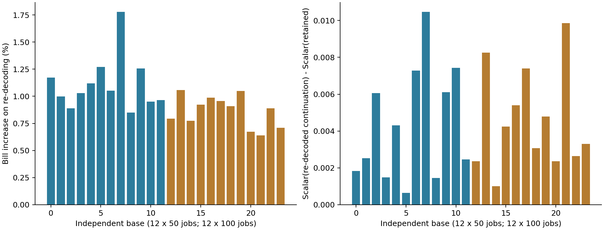
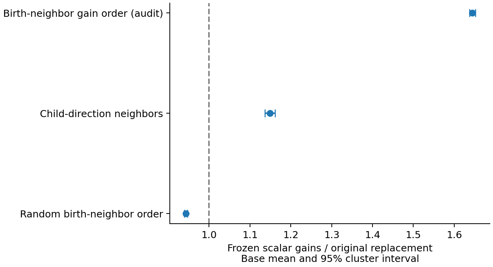
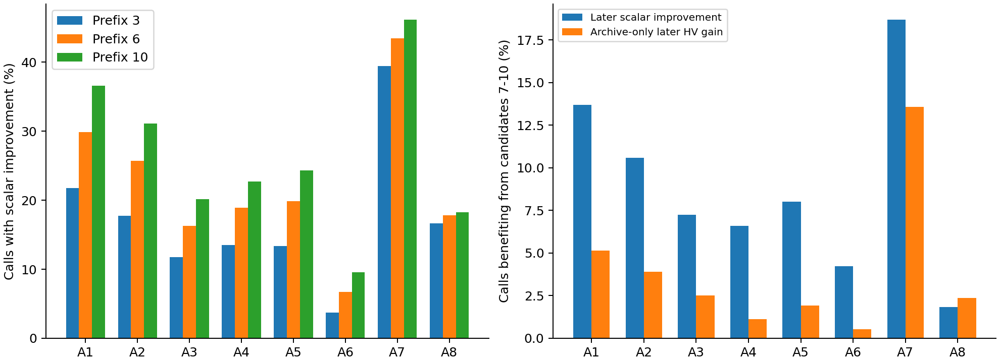

# MOEA/D P1 全量诊断结果与下一步改进建议

日期：2026-10-02。版本：p1_analysis_v1.0。研究对象：Geo-distributed LLM Prefill–Decode Scheduling，继续以 MOEA/D 为主干。

## Material Passport

- Origin Skill：academic-research-suite / experiment-agent。
- Origin Mode：validate。
- Verification Status：**ANALYZED**。480 条真实运行和完整诊断已读取；本报告属于探索性机制分析。初始化零差和完整性单列验收；未把离线反事实称为新算法在线验证。
- 冻结算法源码：`3ec2355fbc43993375daab06ec0ea39fb9d86991`，对应 [PR #19](https://github.com/atlantic0423/geo-llm-scheduler/pull/19)。分析脚本为独立结果报告分支，不改变这批实验的源码或算法行为。
- 分析 RNG seed：20261002；分层聚类 bootstrap：20,000 次。A7 同额随机遗漏样本审计另用 20261003。
- 已验证：P1 完成状态、冻结文件、初始化零差、实际采样/在线计数。
- 待实验：CT/CG、RDIR/RPERM、替换 gain 排序、A7 筛选变体、预算变体对最终 HV/IGD+ 的在线影响。

## 1. 建议先做什么

**优先验证时间表延续；其次验证 MOEA/D 的替换机制。A7 值得保留并做局部筛选改进，预算应按算子分别观察，暂不把统一早停作为首要创新。**

1. H1 信号最完整：1,716 个时间优化来源采样表型全部在重解码后涨账单，基础实例平均涨约 0.99%。配对时间延续后，保留表型胜出约 42.18%，重解码胜出约 21.05%。这支持做 CT/CG 在线对照，但尚不能保证 CT 提高最终 HV。
2. H2 有真实在线证据：F6 中可改善某个子问题的子代，有约 16.91% 被原出生邻域完全漏接；改用子代关联方向的邻域，离线漏接降至约 5.36%。不过随机顺序的在线审计 gain 比原规则低约 5.71%，不能简单认定“打乱顺序就更好”。
3. H3 是局部优化空间：约 16.63% 的采样点发现更好的遗漏 A7 raw 候选；F6 子样本约 19.90%。但已选 A7 候选中，每个采样点都至少有一个降费候选。问题在于漏掉更好的选择，并非 A7 整体没有效用。
4. H4 反对贸然统一早停：A7 在第 7–10 个候选仍有约 18.69% 调用获得新的 scalar 收益，另有约 13.58% 只有新增 HV 收益。A8 的相应 scalar 追加机会只有约 1.84%，且常常不足 10 个完整候选。

本轮只完成检查、分析、报告与结果回收，不启动 P2，不改当前正式算法。

## 2. 完成情况、矩阵和数据范围

P1 已全部完成：**480/480，失败 0；两节点各 240 条，均正常退出**。开始于北京时间 2026-10-02 03:01:53，最后一个节点于 10:56:42 完成，约 **7 小时 55 分钟**。这里包含调度与离线诊断收尾；120 worker-hours 是单次运行时间预算之和，不能理解为用户需要等 120 小时。

矩阵为 24 个基础结构实例（50/100 jobs 各 12）×H/T 两种 tariff×5 seeds×F6/M0 两个 arm。50 jobs 的 engine 时间为 600 秒，100 jobs 为 1200 秒。两机各 8 worker，合计 16。F6 使用完整 MOEA/D 模因算法、每步固定 B6；M0 为普通 MOEA/D。两者种群 100、邻域 20、nr=2，使用匹配实例/种子/初始化池。

| 数据项目 | 实际数量 / 状态 |
| --- | --- |
| 正式完成运行 | 480；每个 arm/规模均 120 |
| checkpoint | 1,440，预算 10%/50%/90% 后首个安全边界 |
| 计划表型采样槽 | 5,760 |
| 有效表型 | 5,755；F6 2,879，M0 2,876 |
| 缺失槽 | 5，均为分层抽中重复表型，非运行失败 |
| A1–A8 同源 B10 动作池 | 46,040 次调用；412,457 次 complete exact |
| A7 额外 raw exact | 222,546 |
| H1 重解码 / checkpoint exact 核验 | 各 5,755 |
| 配对时间延续 exact | 127,776；另有 277,136 次离线 Polish exact |
| 在线 exact | 32,582,358 |
| 完整在线替换事件 | 14,357,346 |
| 初始化控制 | 48,000 个记录，starts 和目标均零差 |
| 单 worker 最高采样/诊断进程 RSS | 0.1751 GiB；不等同节点总 cgroup 使用量 |
| 最大 engine soft-stop 超时 | 1.801 秒 |

这批正式运行未新增 OOM kill。节点 0 的既有 OOM 计数保持 556，不能误写成此次发生 556 次 OOM；节点 1 为 0。E15 暂停请求及 E16 开发版本保持原状态。

数据完整包约 17.865 GB（16.639 GiB），8,883 个成员文件，35 个最大 500 MiB 分卷。archive SHA256：`07893cdc4d756e7d210d68c2ccac1dc4c504244c634d6774cc044292387fcb31`。自动回收曾因两入口临时失联退出；本轮重新验证连接后恢复回收，随后两入口再次连接中断；保留全部服务器原件和本地部分分卷，不宣称完整结果已交付。交付验收状态见第 12 节。

## 3. 统计口径和判断边界

**独立统计单位为基础结构实例，共 24 个，而不是 5,755 个表型或上千万候选。** 在每个 base 内先汇总 H/T、seeds、时点和采样槽，再对 bases 等权平均；bootstrap 在 50/100 jobs 两层内分别重抽，各保留 12 个 base。条件比例先在 base 内计算，再平均。因此表中数字通常不同于把所有候选直接池化的比例。

采样按 Flow/Balanced/Electricity 三层各一表型，再从其余表型随机取一，偏好层并不按种群占比抽样。本报告中的“发生比例”指这一冻结采样设计下的诊断率，不能直接称为整个种群的总体比例。候选层面的 H2 分母、A7 的遗漏层份额均另行说明。

95% 区间是探索性 base 聚类区间，未进行 P3 预定的 Holm 显著性确认。这里只排序研究机会，不用大量分层观察挑选一个最小 p 值。bootstrap 描述本批 24 个生成结构的差异，对真实生产 workload 的外推仍待压力实例和独立实例确认。

H1 联合看 Flow、Bill 和 scalar；H2 所有子问题使用自己的权重；H3 sampled regret 是未全量评价 raw 池得到的**下界审计**；H4 前缀是同一个 B10 序列的离线模拟，不能替代自然 B3/B6/B10 的在线实验。

## 4. H1：时间优化成果确实可能在结构重建中丢失

### 4.1 控制和来源

48,000 个初始化记录全部重解码零差；M0 的 2,876 个有效样本也全部零差。F6 中非时间优化来源样本为 1,163 个，没有账单/Flow 重解码差异。这排除了“所有解码都发生数值漂移”这一解释。

F6 的时间优化来源共 1,716 个：Polish 1,421、A7 270、A8 25。来源是最后一次生成该表型的标签，并非完整因果历史。A8 只覆盖 16 个 base，样本较少，不应凭它的条件均值给 A8 排名。

重解码定义：保留同一 MS/OS，再执行 earliest-SSGS，重新 exact 评价。账单损失率为：

$$
L_{Bill}(x)=\frac{Bill(x_{dec})-Bill(x)}{\max\{Bill(x),10^{-9}\}}.
$$

| 观察（时间优化来源子样本） | 基础实例均值 [95% 聚类区间] |
| --- | --- |
| 重新解码后账单上升比例 | 100.00% [100.00, 100.00] |
| 账单相对变化 | 0.99% [0.92, 1.07] |
| Flow 相对变化 | -1.12% [-1.28, -0.97] |
| 原权重 scalar 变差比例 | 80.10% [77.84, 82.52] |
| 原权重 scalar 变好比例 | 1.69% [1.15, 2.26] |
| 配对延续后保留表型较好 | 42.18% [39.65, 44.96] |
| 配对延续后重新解码较好 | 21.05% [19.21, 22.93] |
| 延续 scalar 差：重解码−保留 | 0.00445 [0.00336, 0.00560] |
| 延续账单差：重解码−保留，相对保留 | 0.17% [0.11, 0.22] |
| 延续 Flow 差：重解码−保留，相对保留 | -0.09% [-0.21, 0.03] |

时间来源表型的账单增量，平均 TOU 为 4.41、Demand 为 32.34（均为模型费用单位）；总费用增量主要来自 Demand。这个分解是观察性汇总，不意味着所有个体的主要损失都来自 Demand。

**重解码平均降低 Flow 约 1.12%，同时提高账单约 0.99%。** 因而它确实有目标权衡：约 80.10% 样本原权重 scalar 变差，但也有约 1.69% 变好，其余在容差内不变。不能把“账单涨了”直接解释为每一个方向都退化。

### 4.2 延续反事实和偏好/阶段差异

两条延续从保留时间表和重解码时间表分别出发，使用同名 RNG 流、固定 A7/A8/A7/A8/A7、每步 B6，最后各 Polish 一次。合法候选池不同，所以同名流不保证两支移动序列相同。比较在共同 ideal（checkpoint 与两支最终目标的分项最小值）及同一个 population maximum 下进行。

保留分支在时间来源样本中较好约 42.18%，重解码较好约 21.05%，其余约 36.77% 在 scalar 容差内相同。重解码支最终账单平均高约 0.166%，但 Flow 差的区间跨零。部分初始损失能够被后续时间搜索追回，收益因此明显小于初始 0.99% 损失。

| 采样层 | 重解码账单变化 | 原权重 scalar 变差 | 延续保留更好 / 重解码更好 |
| --- | --- | --- | --- |
| Flow | 0.38% | 37.92% | 20.14% / 10.14% |
| Balanced | 0.47% | 49.03% | 23.75% / 11.67% |
| Electricity | 0.93% | 55.64% | 30.47% / 15.16% |
| 其余表型随机样本 | 0.52% | 47.08% | 25.97% / 12.50% |

10%/50%/90% 阶段中，F6 全部来源样本的重解码 scalar 变差率分别为 38.37%/49.06%/54.79%；保留延续胜率为 21.90%/24.17%/29.17%。中后期更值得观察表型延续。H/T 的平均账单损失约 0.624%/0.528%，两者都出现相同方向的信号。



图中每柱为一个 base；前 12 个 50 jobs，后 12 个 100 jobs。右图正值表示保留表型的延续 scalar 更小。

### 4.3 应改的位置

当前 population/archive **已经保留**完整 timing-only 表型；H1 没有发现“接受后立刻统一覆盖 starts”的 bug。丢失发生于后续结构复制/交叉/变异需要重新 SSGS 的通道。结构修改仍必须重建，不应把旧 starts 拼接到新 MS/OS 上。

下一步按原计划测 CG/CT：20% offspring 分支复制当前子问题 incumbent；CG 复制 genotype 后重解码，CT 复制完整表型并 exact 验证；其余 80% 保持结构搜索。首先比较 CT−CG，再看 CG−F6 和 CT−F6。若 CG 与 CT 都提升但彼此相近，收益只能归因 clone 通道；若 CT 优于 CG 才支持时间保留。仍须观察结构探索减少、Trigger 率、archive 重复和 Flow 端点风险。

## 5. H2：邻域失配有信号，方向与顺序需要分离

### 5.1 全量在线审计比共同候选池更接近实际瓶颈

每个在线子代，在当时 population 和 context 下分别算全部 100 个权重的改善集合。原策略仍是出生子问题的 20 邻域、own-λ、nr=2；其它策略只在冻结 population 上做离线审计，不改变本次运行。

| 在线替换指标 | F6：均值 [95% 区间] | M0：均值 [95% 区间] |
| --- | --- | --- |
| 子代能改善至少一个权重 | 33.10% [31.59, 34.63] | 14.82% [14.27, 15.40] |
| 可改善子代中，存在出生邻域外改善 | 60.74% [59.07, 62.46] | 43.57% [41.46, 45.84] |
| 可改善子代中，原邻域完全漏接 | 16.91% [16.33, 17.51] | 16.51% [15.58, 17.61] |
| 可改善子代中，nr=2 截断 | 57.43% [57.03, 57.81] | 45.88% [45.20, 46.53] |
| 可改善子代中，方向邻域完全漏接 | 5.36% [4.75, 6.01] | 4.55% [3.75, 5.50] |
| 随机顺序 / 原顺序：scalar gain 总和 | 0.943 [0.940, 0.947] | 1.019 [1.017, 1.022] |
| 子代方向邻域 / 原顺序：gain 总和 | 1.149 [1.137, 1.162] | 1.400 [1.388, 1.412] |
| 原邻域按 gain 排序 / 原顺序 | 1.644 [1.637, 1.652] | 1.607 [1.596, 1.616] |

F6 实际有 472,391 个子代能够改善至少一个子问题，其中 82,877 个被出生邻域完全漏接；按 base 汇总后漏接率为 16.91%。这些计数是 raw 总量，表中比例以 base 等权为准。

nr=2 的截断率约 57.43% 说明候选经常有多个可改善邻居，但**不能据此直接增大 nr**。替换更多位置可能加速扩散，也可能使不同方向过度复制同一表型。

按子代方向替换，把完全漏接降到约 5.36%；冻结即时 gain 总和平均为原规则的 1.149 倍。原邻域按 gain 排序约为 1.644 倍，是值得单独观察的顺序空间。gain 总和表示跨权重即时标量改善，绝不是最终 HV 提高 14.9% 或 64.4%。

### 5.2 一个重要反例：共同池中的好结果并非在线效果

F6 同源动作候选池中的随机顺序 gain 比原顺序约高 17.87%；但**实际在线子代**的对应比值只有 0.943，即低约 5.71%。共同池汇集未被学习/接受/Polish 选择的全部候选，候选分布与实际最终子代不同。这一反转说明不应仅按离线共同池结果安排上线。

RDIR 使用归一化目标向量关联到 Tchebycheff **倒数权重射线**，不是直接与权重向量比角度。不能因为看到邻域外改善就立刻改动态权重、mating 或 archive 回流；它们是不同层的干预。



横轴为替换标量改善总和相对原策略的倍数；区间按 24 bases 聚类。全部权重审计仅是机会观察，不能作为线上免费 oracle。

### 5.3 下一步对照

先做 F6/RPERM/RDIR，保持邻域大小 20、nr=2、Trigger、Q-learning、mating 和 archive 规则固定。RPERM 是顺序控制，不因当前审计较差就删除；线上搜索反馈可能改变结果。

可选补充 **RGAIN**：只在原 20 邻域内按当前 own-λ 改善排序再替换最多 2 个。它不同于对全部 100 权重挑全局最优，实施时额外 20 次 scalar 计算和排序计入时间。此 arm 为本报告的新建议，未加入既有冻结矩阵、未实现或采用。若准备纳入，先更新计划/manifest，不能在看过新运行结果后临时加组。

## 6. H3：A7 强于多数算子，但仍有可定位的筛选损失

### 6.1 分清“抽样漏掉更好的”与“当前选择失败”

每个采样表型原 A7 选择最多 10 个候选；对未选 raw 池另随机取最多 40 个做 exact。平均 raw 空间约 124.61 个、额外样本约 38.67 个。比较把原 incumbent、已选和抽样 raw 放在同一个 updated ideal 下。reported regret 是抽样发现的差值下界，不是整个 raw 池的真实最优 regret。

| A7 审计指标 | 均值 [95% 区间] |
| --- | --- |
| 至少一个抽样遗漏候选优于当前已选集合 | 16.63% [15.51, 17.74] |
| 抽样 regret：scalar 绝对差 | 0.00131 [0.00112, 0.00150] |
| 遗漏 raw 样本中，压缩代理正向但账单上升 | 12.75% [11.62, 13.70] |
| 遗漏 raw 中同候选数随机子集胜过已选集合 | 7.28% [6.67, 7.91] |

F6 采样点 regret 发生率为 19.90% [18.23,21.61]，M0 为 13.35% [11.99,14.80]。Electricity 层发生率约 19.92%，Flow 约 12.99%；两 tariff 几乎相同：H 16.58%，T 16.68%。这使“仅仅更改 TOU 候选排序”缺乏充分理由，Demand/整体 Bill 的代理更值得检查。

同额审计每个表型做 100 次固定种子的 k 个遗漏候选无放回抽样，k 等于原已选候选数（候选不足时用实际数）。平均胜过当前已选集合的概率约 7.28%。这削弱了“多看 40 个必然比看 10 个更好”的候选数混淆，但仍不是全 raw 池均匀抽样的在线 baseline：抽样对象限于已遗漏集合，且不是独立的 100 次实验。

原 A7 的正压缩 raw 样本中，约 12.75% 的真实账单反而上升。压缩 active 时间未保证 TOU/Demand/总账单同向。然而原 B10 已选集合对每个 F6 采样点都至少产生一个降费候选，scalar 成功率约 45.43%。因此“存在代理失配”不等于“现有筛选毫无作用”。

### 6.2 损失并非集中在唯一筛选层

| 遗漏位置 | 出现优于已选集合候选的采样点比例 | 占抽样更好遗漏候选的份额 |
| --- | --- | --- |
| 每工序代表筛选前 | 7.40% [6.76, 8.01] | 43.33% [40.73, 45.83] |
| 代表已保留，但全局 2B 池未保留 | 5.94% [5.61, 6.27] | 19.44% [18.23, 20.65] |
| 已在 2B 池，但最终随机 B 次未选中 | 10.58% [9.54, 11.70] | 37.23% [34.87, 39.65] |

三层的采样点比例有重叠，不能相加。份额是每个 base 中被抽到的更好遗漏候选数量占比，再对 base 平均；不是全 raw 池真实遗漏量。未采用逆概率放大全 raw 数量的原因是本文主问题为同表型 opportunity，而非总体 raw 数量估计；原始抽样概率已保存，后续可单独研究加权数量。

最多采样点在最终 2B→B 随机抽取处出现遗漏；按更好遗漏候选数量，则每工序代表层约占 43.33%，抽取层 37.23%，全局池层 19.44%。**本轮不能断言只有一层是根因。**

### 6.3 A7 改进先做廉价离线排序核验

第一步在现有 raw/代表/2B 池上，分别比较下列单层优先级，每次只替换一层：现行压缩代理、近似 ΔBill、近似 ΔBill 加原权重方向的目标权衡。检查 regret、Flow 极端候选、排序稳定性和构造成本；base 级划分开发/留出，避免在同一 24-base 数据上同时拟合和验证代理。

候选评分建议从**现有 active union、受影响 TOU 区间、原峰窗及并列峰覆盖**提取增量特征。峰窗代理只能预估，不能忽略新峰窗、horizon idle 或固定 900 秒尾窗分母。若评分实际算出了完整 exact Bill，就必须计入 exact 预算，不能把全 raw exact 偷渡为零成本筛选。

优先为代表层和最终抽取层做离线排序敏感性，再挑一层进入线上；保留原 generator、2B 上限、exact 预算和接受规则。既有 A7B 计划允许代表层或全局池单改动；若结果指向最终抽取层，应新写一个明确的 A7 draw 变体计划，而不是把它混进旧 A7B。在线自然 B6 候选池也必须重测，B10 的层损失不能直接代替它。

## 7. H4：预算的追加价值差异很大，不宜统一早停

### 7.1 归一化处理和共同池定义

一次 B10 从同一冻结 parent 生成最多 10 个候选，再分别模拟前 3/6/10 个。每个 prefix 独立更新已见 ideal 和 archive。计算“第 7–10 个是否提供新 scalar 收益”时，前 6 与前 10 **都放到 prefix10 的 context 重新打分**；3→6 也同理。这样追加候选造成的 ideal 改变不会被单独计作搜索收益。

HV 使用该父表型 archive 和完整 B10 池导出的固定描述范围；未来池信息只用于离线图表，不进入在线 controller。HV 增益率为发生至少一个非零追加 HV 的调用比例，不能把不同父表型的归一化 HV 直接当成同一全局质量单位。

| 算子 | B10 实际 exact / 空调用率 | 第 7–10 个带来新 scalar 收益 | 前3无收益但之后有 | 3有收益、4–6无追加、7–10有 | 第7–10个仅有 HV 收益 |
| --- | --- | --- | --- | --- | --- |
| A1 | 10.00 / 0.00% | 13.68% | 14.80% | 3.65% | 5.14% |
| A2 | 10.00 / 0.00% | 10.59% | 13.37% | 2.81% | 3.89% |
| A3 | 10.00 / 0.00% | 7.26% | 8.40% | 1.81% | 2.50% |
| A4 | 9.72 / 2.02% | 6.60% | 9.24% | 1.49% | 1.11% |
| A5 | 9.84 / 1.63% | 8.02% | 10.94% | 1.88% | 1.91% |
| A6 | 10.00 / 0.00% | 4.24% | 5.83% | 0.59% | 0.52% |
| A7 | 10.00 / 0.00% | 18.69% | 6.67% | 8.20% | 13.58% |
| A8 | 3.43 / 35.05% | 1.84% | 1.56% | 0.76% | 2.36% |

全表均为 F6 的同表型审计，分母包含空/不足额调用。不同候选数和自然预算生成机制仍需在在线验证时区分。



左图为各 prefix 在各自已见 context 下的成功率；右图 scalar 追加用共同 later context，archive-only 表示没有新 scalar 最优但 HV 有增量。右图两类并不覆盖全部可能状态。

### 7.2 对预算规则的影响

- **A7**：6→10 仍有 18.69% 的 scalar 追加机会；前 3 已改善、4–6 平台、7–10 再改善约 8.20% [7.05,9.31]。仅靠当前连续无改善早停，很可能放弃后段机会。另有 13.58% 只有 HV 追加，当前仅 scalar reward 难以体现，但不能据此直接更改 reward。
- **A1/A2**：前 3 无 scalar 收益但后段有的比例约 14.80%/13.37%。不能把“前三个失败”当作该算子没有希望。
- **A6**：B10 scalar 成功率约 9.48%，6→10 追加约 4.24%。这个结果支持把它作为探索型算子另查结构新颖性，而不是只按即时接受率删除。
- **A8**：平均只产生 3.43 个完整 exact，35.05% 调用为空。6→10 仅有约 1.84% scalar 追加。这里首先是候选机会不足/构造 gate，B6 或 B10 的标签不代表实际完成了相应数量。

后续预算实验先做 F3/F6/F10/SEQ 的自然在线生成池和等时间对照，按 action 报告收益与真实成本。若希望提出更有问题依据的预算规则，应加入 action-specific 边际成功、是否仍有合法动作、构造成本和 archive-only 信号；不要只把 B3/B6/B10 重新命名成创新。参数先冻结，避免边看结果边更改 early-stop。

## 8. A6、A8、Q-learning 和成本：哪些值得改，哪些尚无证据

### 8.1 在线动作表现

| 算子 | 在线调用份额 | 在线 scalar 接受率 | 在线空调用率 | 每调用实际 exact | 每调用搜索时间，秒 | 不被接受但当批新增 archive 成员 |
| --- | --- | --- | --- | --- | --- | --- |
| A1 | 17.37% | 32.44% | 0.00% | 6.00 | 0.100 | 7.18% |
| A2 | 13.12% | 25.49% | 0.00% | 6.00 | 0.119 | 7.95% |
| A3 | 7.74% | 16.28% | 0.00% | 6.00 | 0.191 | 3.07% |
| A4 | 8.36% | 19.58% | 0.67% | 5.94 | 0.100 | 9.05% |
| A5 | 10.33% | 23.01% | 0.51% | 5.97 | 0.101 | 11.78% |
| A6 | 6.48% | 10.99% | 0.00% | 6.00 | 0.100 | 1.95% |
| A7 | 30.58% | 40.34% | 0.00% | 6.00 | 0.122 | 9.58% |
| A8 | 6.02% | 17.90% | 32.51% | 2.45 | 0.084 | 8.12% |

这些是在 controller 实际选中的状态下发生的观察，不是随机分配 action 的因果比较。比较各算子时，结合前面的同 parent 离线表；A7 的高在线调用份额和成功率，支持优先保留它。archive 当批新成员可能后来被淘汰，不能叫最终 Pareto 贡献。

A3 每次构造约 0.0929 秒，占其平均搜索时间约 48.6%；A2 构造约 0.0197 秒，A7 约 0.0453 秒。结构 relocate 的合法位置构造、A7 的有限时刻重复工作有优化机会。任何缓存/快速路径必须保持 exact/资源诊断等价并做前后 benchmark；新版本等时间实验统一重跑 anchor。

A6 线上 scalar 接受约 10.99%，调用份额约 6.48%，空调用为零。没有证据支持它主要卡在可行性。只看到 checkpoint 的 A6 来源表型 6 个，也不能据此认为其结构探索无效；应检查 destroy/reinsert 的资源阻塞组命中、新 MS/OS、后续结构改善和最终目标贡献，再设计资源阻塞组 LNS 对照。

### 8.2 A8 的可观察漏斗，以及记录缺口

F6 的 B10 同源 A8 平均 singleton 尝试 7.74、coalition 尝试 11.98；不是“固定只做两个 singleton”，因为 singleton 成功后实现会继续该通道。平均 repair success 14.38、严格原峰下降 3.84、完整 exact 3.43；约 73.3% 已 repair 的尝试没有通过严格峰下降 gate。并列峰数平均 1.55。

因此眼下最值得观察的是**全绑定峰的联合覆盖及重插后的新峰**，而非把 attempts 上限直接翻倍。可以研究有限 2–3 个目标位置的 look-ahead，但应先记录空支撑组、成员 cap、合法窗不足、资源重插失败、原绑定峰 gate、新峰、去重、账单/标量无益的互斥主原因。

本次实现保存 recipe、repair 和 strict-peak aggregate，但**没有冻结计划要求的全部细粒度互斥原因**。repair 失败不能再拆成上述各子原因；不得把这一数据缺口冒充完整漏斗已经验证。下一次只补 instrumentation 先做等价性，再由证据决定改哪个阶段。

### 8.3 不急着加复杂学习器

F6 每条运行平均访问约 16.74/42 个 state；平均处理约 60 代。状态未全覆盖可以来自实例中相关条件少，并不能自动证明分类阈值或 Q-learning 有 bug。当前源码已经按**实际时间预算进度**衰减 epsilon；不能因 generations=1,000,000 就误判它没有退火。

先做 state/action 访问与收益/成本的审计，以及既有 Bandit、Random、固定组合对照，再考虑新 state、cost-aware reward 或 contextual bandit。H1/H2 已有更直接的机制信号；不建议此时同时重写 controller、Trigger 和算子。

### 8.4 诊断日志开销使 P1 不适合宣布 F6 对 M0 的等时间优势

| 运行 arm / 规模 | 平均 offspring | 平均在线 exact | observer 占 engine 时间 | archive 占 engine 时间 | 离线诊断秒数 |
| --- | --- | --- | --- | --- | --- |
| F6 / 50 | 7925.05 | 78477.36 | 7.56% | 6.92% | 14.09 |
| F6 / 100 | 4155.54 | 85278.33 | 2.90% | 7.61% | 42.78 |
| M0 / 50 | 46857.63 | 46957.63 | 35.47% | 38.08% | 18.64 |
| M0 / 100 | 60706.33 | 60806.33 | 23.46% | 21.31% | 28.55 |

M0 的 observer 开销比 F6 大得多，尤其 50 jobs 平均占 35.47%；F6 为 7.56%。P1 observer 对每个在线子代额外审计全部 100 权重，因此 M0 更多 offspring 带来更大相对负担。表中的 observer 时间含读取/记录/审计，并非纯磁盘 I/O；archive/exact/构造计时存在嵌套，不能把所有栏目直接相加当作不重叠时间分解。

固定代数 P0 证明观察不改变对应搜索随机流/数学决策，并不能证明附加 observer 对等时间两 arm 没有差别。故本报告不发布 F6−M0 的主胜负、最终 HV 提升或性能冠军结论。下一批筛选使用统一、较轻日志，F6 与所有新 arm 一起重跑；M0 正式基线也在独立确认批统一运行。不会把 P1、旧 E15 或新日志版本混合成同一等时间对照。

## 9. 2024–2026 相关文献给出的思路和创新边界

本轮做机制导向的补充检索，实际核对出版社/作者记录/原论文来源，非穷尽系统综述。出版年份按正式卷期核实，不凭 DOI 中的 2023/2024 判年。全文受限处明确标注阅读深度。

| 文献与核对范围 | 对本项目的用途 | 不能直接作出的声明 |
| --- | --- | --- |
| Li 等，**MOEA/D with customized replacement neighborhood and dynamic resource allocation for solving 3L-SDHVRP**，Swarm and Evolutionary Computation 85, 101463，2024；出版社摘要/引言、作者机构记录已核对。[出版社](https://www.sciencedirect.com/science/article/pii/S2210650223002353)、[作者机构](https://scholars.cityu.edu.hk/en/publications/moead-with-customized-replacement-neighborhood-and-dynamic-resour/) | 子代关联位置与固定邻域失配、替换邻域和资源分配已有直接近邻。应参考其设计/代码，再做本项目 own-λ、nr、表型延续条件下的单项对照。 | “按子代方向替换”本身不宜声称首次提出；也不能直接照搬其车辆路径结果当作 LLM 调度证据。 |
| Li、Zeng、Huang、Cheung，**HK-MOEA/D: A historical knowledge-guided resource allocation for decomposition multiobjective optimization**，EAAI 139, 109482，2025；出版社摘要/章节介绍已核对。[论文](https://www.sciencedirect.com/science/article/abs/pii/S0952197624016403) | 当前表现与历史表现联合评价 subproblem 潜力，为后续“机会/成本驱动局部搜索分配”提供近邻。 | 历史学习、adaptive operator 或 archive 引导不是天然创新；其 archive 更新语义不能未经研究决定替换当前全 exact phenotype-aware archive。 |
| Basseur、Liefooghe、Tari，**MOW-P: A Simple yet Efficient Partial Neighborhood Walk for Multiobjective Optimization**，CEC 2024；作者列表/IEEE DOI/作者上传稿核对，出版社正文访问受限。[IEEE](https://doi.org/10.1109/CEC60901.2024.10611767)、[作者记录](https://sites.google.com/site/arnaudliefooghe/publications)、[作者上传稿](https://www.researchgate.net/publication/382977846_MOW-P_A_Simple_yet_Efficient_Partial_Neighborhood_Walk_for_Multiobjective_Optimization) | 分解子问题上有限邻域采样、候选数和协作值得作为清晰的比较维度。 | 该方法采用可接受不改善邻居的非精英 walk，与我们保留 incumbent 的 best-of-B 接受不同；不能说两个算法等价。 |
| Basseur、Liefooghe、Tari，**Adaptive Sampled Walk: A Simple and Efficient Autonomous Local Search**，Evolutionary Computation，2026，DOI 10.1162/EVCO.a.382；作者机构、作者发表清单、PubMed 摘要核对，HAL/出版社全文受限。[作者机构](https://lisic-prod.univ-littoral.fr/author/basseur/)、[摘要](https://pubmed.ncbi.nlm.nih.gov/41666298/)、[DOI](https://doi.org/10.1162/EVCO.a.382) | 滑动窗口与轨迹距离驱动邻域采样数量，为“不要只看最近几次无收益”提供方法方向。 | 自适应候选数量已有工作；本项目若采用，应明确峰窗机会、构造成本、scalar/archive 双视角的增量证据。 |
| Geng、Liu、Wu，**A reinforcement learning based memetic algorithm for energy-efficient distributed two-stage flexible job shop scheduling problem**，Scientific Reports 14, 30816，2024；开放原论文已读取。[原论文](https://pmc.ncbi.nlm.nih.gov/articles/PMC11680858/) | 两阶段分布式调度、TOU、Q-learning 选择局部搜索和节能后处理已经是密切近邻。 | 不能只以“MOEA/D + Q-learning + 多算子 + 节能”为核心新意；其 makespan/能耗费用与我们的 Total Flow Time、15-min Demand/KV/累积资源模型不同。 |

据此，更有潜力的论文论点是：**在 MS/OS 与可行时间表分离的 MOEA/D 中，结构继承会损失已优化的能源表型，而最终子代还可能被固定出生邻域漏接；分别修复这两个环节，再检验互补作用。** 这是由 P1 引出的待验证研究叙事，不是本轮已证明的创新或优越性。

若 CT 不优于 CG，就放弃“时间表延续有效”的强主张；若 RDIR 不优于控制，也不为了凑创新硬加动态邻域。若两者均有效，P3 用 F6、A、B、A+B、M0、N0 做独立确认，交互以差中差判断。已有近邻也要求明确我们新机制的形式和适用条件，而非堆叠已有模块。

## 10. 下一批实验的具体顺序

### 第一步：验收和冻结轻日志版本

清除 P1 的全量 per-offspring 100 权重 observer 成本，保留统一低频恢复 checkpoint、候选完成时间、T 时 archive、complete/hash、资源与真实成本。这里的“清除”指新实验入口；原 P1 文件/源码必须保留。任何日志性能修改均做旧新固定代数 semantic replay、exact 等价、RSS/吞吐 benchmark、完整质量门与 PR/CI。

T 前 archive 要按候选完成时间保存，不能直接把 soft-stop 最终 archive 作为等时间主结果。新的 F6 anchor 与所有变体在相同版本、负载、时限重跑。

### 第二步：最优先的时间保留筛选

| arm | 唯一干预 | 必要比较 |
| --- | --- | --- |
| F6 | 原完整算法，B6 | 新日志版本的共同 anchor |
| CG | 20% current-incumbent genotype clone，重解码且 exact | clone 通道自身作用 |
| CT | 同 20% 分支保留 phenotype，exact 验证 | CT−CG，时间保留额外作用 |

沿用开发 24 bases×H/T×5 seeds，三组共 **720 条**。600/1200 秒 engine 预算对应 **180 worker-hours**；合计 16 worker 的日历除法下界 **11.25 小时**。P1 的实测排队/诊断比除法下界约多 5.5%，但新日志和变体改变成本，不能把 11.9 小时称为已测 ETA。先做最小正确性与资源 pilot，再给可信完成时间。

对照同一 MS/OS、完整时间可行性、Exact validation、clone 触发/重复、Flow/Bill 两端点及 T 时 HV/IGD+。CT 不超过 CG 时，保留失败结论，不继续投入复杂显式 starts 基因。

### 第三步：分解替换筛选

冻结后做 F6/RPERM/RDIR 三组 **720 条**；若决定加入 RGAIN，则 **960 条**，分别 180/240 worker-hours，16 worker 的下界 11.25/15 小时。与前一批共享 F6 数据必须满足同版本/预定匹配块/相同负载的完整协议；否则重跑，不能事后随意拼接。

若一次统一跑 F6/CG/CT/RPERM/RDIR，合计 1,200 条、300 worker-hours，下界 18.75 小时。建议研究顺序仍先检查 CT−CG，再检查替换。服务器资源充足不改变 independent-base 统计口径，也不免除 32 GiB/cgroup 和临时节点到期审查。

当前实际到期时间尚未由平台核实，继续遵守此前较早迁出目标 2026-10-04。长块启动前须核实期限和交付缓冲；这里是下一批设计，**不代表已申请、已启动或能在旧容器有效期内完成**。

### 第四步：只补确实影响排序的诊断

1. A7：现有池离线单层重排，按 base 留出核验；若收益明确才实现一个筛选变体。预算不足以全 raw exact 的事实必须保留。
2. A8：补互斥失败日志，区分原绑定峰 gate 与新峰/账单失败；先不改算子。只有重复出现在多数 base 的根因，才触发有限 look-ahead 原型。
3. H4：F3/F6/F10/SEQ 自然池筛选延后；重点检查 A7 后段机会与 archive-only 损失，不能把各算子统一减到 B3。
4. A6：新结构/资源阻塞组命中诊断；保留探索控制，避免依据即时接受率误删。

这些多数可以从已回收数据继续分析或用小 pilot 验证，不必一次启动所有九组上限。

### 第五步：筛选规则与独立确认

开发筛选沿用原计划：平均相对 HV≥0.5%、至少 60% bases 正向、IGD+ 平均相对劣化≤2%，并检查两规模/H/T 反转。阈值是筛选工程规则，不是统计显著性。列出所有未通过 arm，不强迫挑选两个组件。

入选至多两个组件后，用新的 40 bases 独立确认；根据开发 base 方差做功效模拟，40 并非已证明足够。确认的主要对比与 Holm 家族在运行前冻结；若不足，开跑前调整到 60/80 bases。P3 时限至少以原 T50=2095、T100=5122 秒为下限，并由独立资源 pilot 统一核实。

## 11. 实验设计风险检查

| 检查项 | 本批处理 / 留下的限制 |
| --- | --- |
| 公平比较 | P1 只作机制诊断；observer 成本不对称，拒绝将 F6/M0 作为正式等时间优越性证据 |
| 显著性 | 不把非零区间、多候选或高胜率替代 P3 多重校正确认 |
| 效应大小 | 同时给账单比例、scalar 绝对差和 base 区间；不把即时 gain 比值称为最终 HV 改善 |
| 多重检验 | 所有主要分层保留，探索性不择最小 p；P3 按预定家族 Holm |
| 功效与样本量 | 24 bases 是诊断规模；独立确认需提前功效模拟 |
| 独立性 / 伪重复 | base 为单位；种子/表型/action/raw 候选不是新增独立样本 |
| 缺失和幸存偏差 | 五个重复采样槽列出，480 运行无失败，不挑成功算子表型 |
| 调参与测试泄漏 | P1 仅开发诊断；A7 proxy 开发/留出按 base 划分，P3 使用新 bases |
| 参考与归一化 | H2 冻结原 context，H3 共同 updated context，H4 追加比较共同 later context；HV 范围只离线使用 |
| 因果 / 消融 | H1 固定动作延续、H2 冻结替换均不是在线 ablation；origin 和 archive 插入不证明因果贡献 |
| 可复现与选择报告 | 冻结 source/inputs/seeds，raw/member hashes、完整零结果、脚本与 base 表；A8 漏斗缺口明确记录 |

额外限制：B10 自然池与 B6 在线池不同；A7 只抽最多 40 个未选候选；A8 来源表型很少；真实业务外推、连续时间扰动和 Demand-rate 压力尚未完成；无确认集上的组合交互结果。

## 12. 文件、复现和交付验收

- 统计与完整 base 表：`research/p1/analysis_20261002/statistics.json`、`base_metrics.csv`。所有区间和表中的未取整数字均可回查。
- 图表：同目录 `h1_bases.png`、`h2_online.png`、`h4_budget.png`。
- 分析入口：`research/p1/reduce.py`、`online_reduce.py`、`analyze.py`、`figures.py`；四个基础统计/上下文/迁移反例测试位于 `tests/test_p1_analysis.py`。
- 全量 compact 诊断与报告：[P1 analysis Release](https://github.com/atlantic0423/geo-llm-scheduler/releases/tag/p1-analysis-20261002)。包含六个诊断/在线聚合流、manifest、报告、统计表、图和脚本，可独立复现本文。原算法预跑：[P1 preflight Release](https://github.com/atlantic0423/geo-llm-scheduler/releases/tag/p1-preflight-20261002)。
- **完整 raw 交付尚未闭环**：本轮已校验并保存 17/35 分卷，8,912,896,000 bytes；剩余 18 个分卷尚未完整回收。部分下载文件另留存，不充当已交付数据。两 SSH 入口再次断连后，停止传输；未删除或覆盖服务器原件，完整 raw Release 尚未发布。当前不能称三端同步完成。
- 本地完整验收：215 tests passed，core coverage 96.32%，overall 86.19%，lint/format/mypy 通过；deterministic replay 通过。独立重算的统计 JSON 和逐 base CSV 与报告版逐字节一致。三图已目视核验。

从 compact analysis evidence 重现统计：

```powershell
$env:PYTHONPATH = 'src'
python -m research.p1.analyze --input outputs/p1_analysis_20261002/reduced --output outputs/p1_reanalysis
python -m research.p1.figures outputs/p1_reanalysis
```

从完整 raw 重做压缩诊断：先逐卷验证 `SHA256SUMS`、依次拼接 tar、核对 archive SHA256 和每个成员的大小/hash，再解包到独立目录。两 campaign 和 control 名称原样保留。运行：

```powershell
$env:PYTHONPATH = 'src'
python -m research.p1.reduce --base PATH_TO_EXTRACTED_ARCHIVE
python -m research.p1.online_reduce --base PATH_TO_EXTRACTED_ARCHIVE
```

compact gzip 的压缩头时间会变化；科学复现应比较逐行 JSON 内容和统计输出，不要求重新压缩后的 gzip 字节 hash 与此次相同。发布的 compact 文件用 manifest 校验原件。

**本报告最强的结论是研究优先级：先 CT/CG，再替换方向/顺序，之后才是单层 A7 和算子相关预算。最终是否采用任何组件，仍以新的等时间在线实验和独立确认结果为准。**
