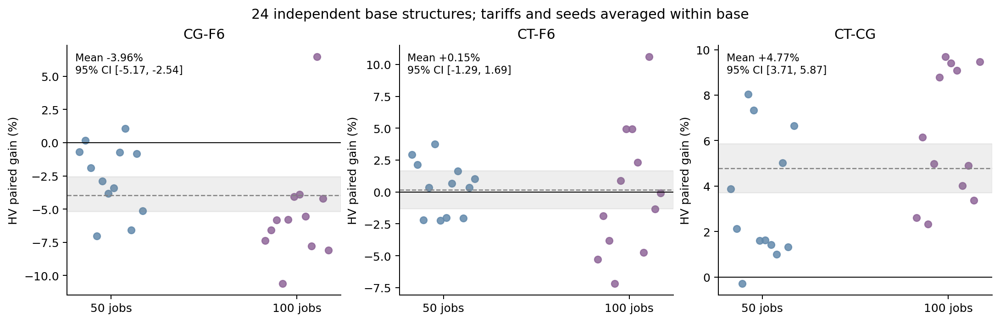
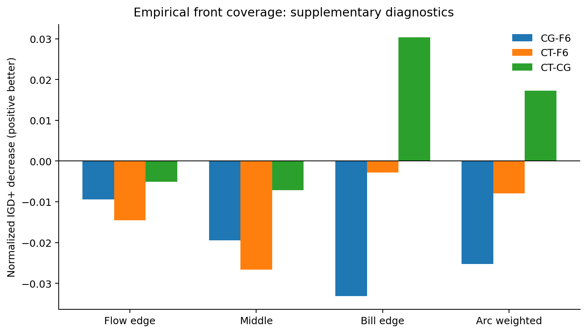
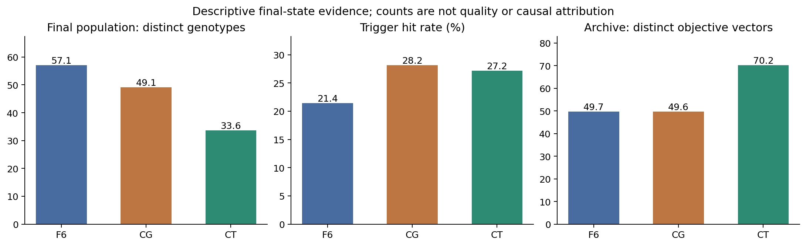
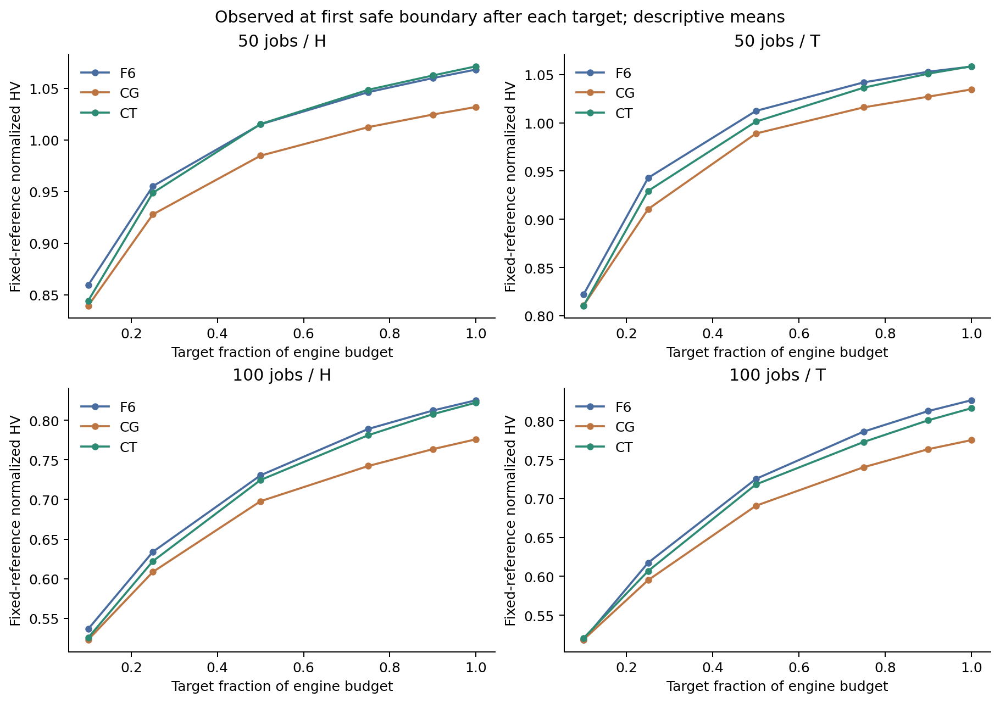

# P2 F6／CG／CT：720 次实验质量分析与下一步建议

**建议继续保留 F6 为改进基线。CT 的完整时间表延续，相比普通复制 CG 有明确的 HV 改善；但当前 20% 随机复制方式尚未证明整体优于 F6，且 IGD+ 显示前沿覆盖损失。下一步应先解决结构探索与时序强化之间的预算分配，再考虑将时间表延续发展为 MOEA/D 的框架机制。**

这批实验的价值，是把 P1 的“重解码可能丢失时序成果”信号推进到了在线对照：保存时间表有用，但怎样安排再次强化的机会仍需改进。低电费端收益、探索吞吐和覆盖损失必须同时判断。

## 1. 材料身份与分析范围

| Material Passport 项目 | 本次实际材料 |
| --- | --- |
| 状态 | **ANALYZED**：正式实验已执行完成；本次读取完整产物并分析，不重新运行优化器 |
| 数据 | 24 个 development 基础实例 × H／T 电价 × 5 个算法种子 × F6／CG／CT，共 720 次、240 个三组块 |
| 基础实例 | 50 jobs：810001–810012；100 jobs：820001–820012 |
| 算法种子 | 1101、2202、3303、4404、5505 |
| F6 | 原 offspring 路径 |
| CG | 20% 基因型复制后 SSGS 重建；80% 原 offspring 路径 |
| CT | 20% 基因型及完整可行时间表延续；80% 原 offspring 路径 |
| 配对 | 同一实例、初始种群、算法种子和主机；组内六种执行顺序均衡；唯一研究配置差异为 offspring policy |
| 预算 | 50／100 jobs 分别 600／1200 秒，种群 100，软时间停止；三组统一轻日志 |
| 冻结运行源码 | f6b7fbaf8eaf3362db45fd02ba1bb2b23e8911ce；研究 PR #23 尚未合并 |
| 分析源码 | 本报告所在 PR #24 的分析脚本及统计模块；与运行版本分开标识 |
| 本次验真 | 原 validate_complete 再次 720／720 通过；888 个输入、5,760 个发布文件哈希一致；Archive 目标分解与 objectives.csv 逐项一致 |
| 暂停历史 | 589 个暂停前 complete 标记保持；16 个中断旧尝试保留并排除；正式三组块全部同机 |
| 计算复现 | 两次独立读取、计算并重采样，9 个派生 CSV／JSON 文件字节完全一致；没有重跑优化器 |

原始矩阵 manifest SHA256 为 2b32aa2342d84270eca997c9b4bfd2451b897f87cfb3146c43abb9ebef9ff7a5。规范化运行源码 SHA256 为 8dfe06321a4421e27f0ae7d97f4f5710b67bb1cbb8efc4d0f01182b5bd848e4e。

完整执行与安全续跑证据见 [完成验收报告](p2_completion_20261003.md)，原始数据与运行源码见 [原始结果 Release](https://github.com/atlantic0423/geo-llm-scheduler/releases/tag/p2-f6-cg-ct-720-20261003-f6b7fba)。本次派生数据、参考集、报告、图表和分析源码另存于 [质量分析 Release](https://github.com/atlantic0423/geo-llm-scheduler/releases/tag/p2-analysis-20261003)，不会覆盖原始结果。

## 2. 指标与统计口径

两个目标均最小化：Flow 和 Electricity Bill。Bill 从 exact evaluation 的 TOU 与各区域 Demand Charge 之和重建，未将 TOU 单独当作电费。

每个“基础实例 × 电价”固定一个共同离线尺度：汇总该条件下 3 组 × 5 种子的最终 Archive，以整个目标并集的逐维最小值和最大值归一化。此尺度对三组、五种子和所有阶段相同；它只用于结果分析，没有改变优化器内部动态归一化。

$$
\widetilde f_j(x)=\frac{f_j(x)-L_j}{U_j-L_j}
$$

主 HV 参考点为 (1.1, 1.1)；IGD+ 参考集为上述最终并集去除精确目标重复后的严格非支配集，每个条件 32–123 个点。这是共同的**经验参考前沿**，不是已知全局真实 Pareto 前沿。IGD+ 使用最小化方向的单侧距离：

$$
IGD^+(A,R)=\frac{1}{|R|}\sum_{r\in R}\min_{a\in A}\sqrt{\sum_{j=1}^{2}\max(a_j-r_j,0)^2}
$$

该定义及弱 Pareto 相容性见 [Ishibuchi 等的 IGD+ 原论文](https://ci-labo-omu.github.io/assets/paper/pdf_file/multiobjective/GECCO_2015_Final_Camera_Ready.pdf)；本次向量计算还在 48 个 F6 条件上与项目原标量实现交叉验证。

先在同一三组块中计算差值，再对每个基础实例内的五种子平均、两个电价等权平均，最终对 **24 个基础实例**等权汇总。算法种子与电价不是额外独立实例，不能把 240 个配对运行当作 240 个独立样本。

按 50／100 jobs 分层进行 20,000 次基础实例 bootstrap，报告逐项 95% 区间；主分析进行 100,000 次基础实例符号翻转，三种比较的 HV 绝对差和 IGD+ 绝对改善共六项，进行 Holm 校正。符号翻转需要独立基础实例差值在零假设下可交换符号的假设；不把它描述为已证明的随机标签分配检验。Monte Carlo 尾部采用加一修正，最小可报告 p 约 0.00001，不能写成零。[符号翻转与 Monte Carlo 方法说明](https://docs.scipy.org/doc/scipy/reference/generated/scipy.stats/permutation_test.html)、[Holm 方法说明](https://www.statsmodels.org/stable/generated/statsmodels.stats.multitest.multipletests.html)。

主指标和重采样配置在计算质量值前固定于 [analysis_plan.json](p2_quality_20261003/data/analysis_plan.json)，但实验已经完成，**本次仍是探索性分析，未预注册，也不是新实例上的独立确认实验**。95% 区间没有做同时区间校正；Holm 只适用于上述六个主检验。

## 3. 整体质量：CT 弥补了 CG 的一部分损失

表中 HV 差为“候选 − 对照”，越大越好；IGD+ 改善为“对照 − 候选”，越大越好。数值为共同离线尺度下的绝对量。

| 比较 | HV 差 [95% CI] | Holm p | IGD+ 改善 [95% CI] | Holm p |
| --- | --- | --- | --- | --- |
| CG − F6 | −0.04012 [−0.05148, −0.02780] | 0.000080 | −0.02056 [−0.02553, −0.01540] | 0.000060 |
| CT − F6 | −0.00248 [−0.01482, +0.01012] | 0.70749 | −0.01473 [−0.01971, −0.00965] | 0.000120 |
| CT − CG | +0.03764 [+0.02847, +0.04720] | 0.000060 | +0.00583 [+0.00183, +0.00997] | 0.02470 |

**CG 的当前方案不值得优先继续投入。** 相对 F6，其 HV 平均配对相对变化为 −3.96%，95% CI 为 [−5.17%, −2.54%]；24 个基础实例中 21 个 HV 绝对差为负，22 个 IGD+ 变差。普通复制占用了结构生成机会，同时仍要 SSGS 重建，没有保住原时间表成果。

**CT 相对 CG 的改进有依据。** HV 平均配对相对提升为 +4.77%，95% CI 为 [+3.71%, +5.87%]；23／24 基础实例 HV 改善，172／240 配对运行 HV 改善。主经验参考集下 IGD+ 也改善，但后面的留种子参考集检查显示这一项证据较弱，不能说所有覆盖维度都更好。

**CT 相对 F6 尚未显示整体优势。** HV 绝对差区间跨零，24 个基础实例正负各半；平均配对 HV 相对变化为 +0.15%，区间 [−1.29%, +1.69%]。绝对差平均略负、相对变化平均略正，来自两种汇总的分母权重不同，均不足以证明整体增益。区间跨零也不等于证明两者等效，本次没有预设等效界值。

F6／CG／CT 的描述性平均 IGD+ 分别为 0.05635／0.07692／0.07109。CT 相对 F6 的 IGD+ 损失在 22／24 基础实例上出现，覆盖损失不能被接近持平的 HV 掩盖。

这里不以“平均 IGD+ 百分比改善”作为主要结论：部分运行的对照 IGD+ 接近零，百分比会被极小分母放大。CT−CG 的绝对改善为正，而平均逐运行百分比竟为负，正说明这个汇总口径不稳定。全部原始百分比仍保留在派生 CSV 中以便审计。

## 4. 收益位置：低电费端更好，中间覆盖更差

各次 Archive 内的最小电费与最小 Flow 是两个独立极端指标，不保证来自同一个解。

| 比较 | 最小电费平均配对降低 [95% CI] | 最小 Flow 平均配对降低 [95% CI] |
| --- | --- | --- |
| CG − F6 | −1.77% [−2.44%, −1.09%] | +0.152% [+0.065%, +0.255%] |
| CT − F6 | +1.97% [+1.36%, +2.59%] | +0.128% [+0.040%, +0.235%] |
| CT − CG | +3.60% [+3.02%, +4.21%] | −0.024% [−0.069%, +0.022%] |

CT 的低电费极端点有收益，Flow 极端变化很小，尚不能说用户关心的任意折中点都更优。为定位损失，把经验参考点按 Flow 排序、等数量分成三段。它们只是前沿位置诊断，不是预设偏好区间，也没有按获胜结果筛选实例。

| IGD+ 改善：正值更好 | Flow 端 | 中间段 | Bill 端 |
| --- | --- | --- | --- |
| CG − F6 | −0.00939 | −0.01947 | −0.03317 |
| CT − F6 | −0.01449 | −0.02663 | −0.00282 |
| CT − CG | −0.00510 | −0.00716 | +0.03035 |

CT 相对 CG 的主要覆盖收益集中在 Bill 端，Flow 端与中间段的 IGD+ 仍变差；相对 F6，中间段的缺口最大。CT 相对 F6 的 Bill 端区间跨零，因此“最小电费更好”也不意味着整个 Bill 端都覆盖更好。

经验前沿点密度可能影响普通 IGD+。补充采用相邻归一化弧长的一半作为实际参考点权重，CT−F6 的改善仍为 −0.00793，95% CI [−0.01509, −0.00046]。这项检查只给已有可行参考点加权，没有插入或声称存在额外可行调度点；属于事后诊断，不能单独升级为确认结论。

## 5. 搜索账本：强化了时序，也压缩了结构探索

| 描述性均值，每组 240 次 | F6 | CG | CT |
| --- | ---: | ---: | ---: |
| 完成处理的 offspring／run | 2,552.94 | 1,976.92 | 1,907.00 |
| exact evaluations／run | 35,897.76 | 35,723.64 | 36,555.71 |
| Trigger 命中比例 | 21.40% | 28.16% | 27.16% |
| Trigger 命中次数／run | 549.08 | 559.62 | 511.82 |
| 命中后的标量成功比例 | 83.01% | 81.93% | 75.05% |
| 最终种群不同基因型 | 57.10 | 49.10 | 33.62 |
| 最终种群不同开始时间向量 | 53.87 | 52.35 | 47.60 |
| 最终 Archive 成员数 | 131.00 | 120.53 | 222.47 |
| 最终 Archive 不同目标向量数 | 49.69 | 49.65 | 70.25 |
| Archive 最后生成来源为 A7／A8／Polish | 69.27% | 71.24% | 83.53% |
| clone 直接新增 Archive 成员／run | 0 | 0 | 0 |

CT 相对 F6 的 offspring 吞吐降低 **25.05%** [−27.00%, −23.08%]，而 exact 吞吐提高 **2.37%** [+0.93%, +3.82%]。如果只看 exact 数量，会得出偏乐观的结论：它执行了更多评价，但处理的子代更少，且其中约 20% 为复制路线。

以“处理的 offspring 减去 clone 路线次数”作为结构探索机会代理，CT 相对 F6 降低 **40.04%** [−41.67%, −38.43%]。这是**非复制结构生成路径的处理量**，没有统计这些子代是否真正产生了新的不同基因型，不能写成“新基因型数减少 40%”。最终种群基因型多样性同时下降约 23.48 个，种群规模仍为 100。

Trigger 命中比例上升也有分母效应：CT 的命中率更高，但每次运行命中次数反而少于 F6。它不是获得了更多总局部搜索机会。命中后的标量成功率下降，并且标量接受本来就不能替代 Pareto 前沿质量。

Archive 总成员数与不同目标向量数都增加，IGD+ 却变差，说明它更密集地积累了一部分时序解，整体几何覆盖仍存在缺口。不能把全部额外成员称为重复点，也不能把“不同目标点更多”当作覆盖更均匀。

CG／CT 的直接 clone Archive 插入均为零，这符合复制点已在现有搜索材料中的情况。后续 A7／A8／Polish 仍可能从它继续改进；零直接插入不能证明复制无间接价值。来源标签只记录最后生成者，无法重建完整祖先链或计算因果贡献。

这些现象共同支持一个**待验证机制解释**：随机重入已有时间表，使算力更偏向时序强化，并增加相同基因型在种群中的集中，牺牲了结构多样性及中间折中区域。当前日志没有按 clone／structural 路线细分 Trigger 与后续改善，因此还不能把每一项损失直接归因于某一操作。

## 6. 分层、过程与敏感性检查

### 规模与电价

| 条件，12 个基础实例／60 对运行 | CG−F6 HV 相对变化 | CT−F6 HV 相对变化 | CT−CG HV 相对变化 | CT−F6 IGD+ 改善 |
| --- | ---: | ---: | ---: | ---: |
| 50 jobs／H | −3.25% | +0.47% | +3.96% | −0.01613 |
| 50 jobs／T | −2.04% | +0.25% | +2.67% | −0.01360 |
| 100 jobs／H | −5.74% | +0.02% | +6.53% | −0.01663 |
| 100 jobs／T | −4.80% | −0.12% | +5.93% | −0.01258 |

CG 的 HV 损失在 100 jobs 更明显；CT 弥补普通复制损失的幅度也更大，但 CT 相对 F6 的 HV 在四个条件中仍接近零。四层 IGD+ 方向一致变差，CT 最小电费方向一致改善。规模交互尚未作为独立预设假设检验，不能据这些均值宣称正式交互成立。

### 搜索过程

保留 10%、25%、50%、75%、90% 和最终六个快照，共 4,320 个。每个快照是在预算目标之后首次到达安全边界时记录，最大延迟 18.19 秒，因此下面是描述性过程曲线，不能视为严格同步时刻的配对检验。

CT 在 50 jobs／H 的后段接近或略高于 F6；另外几个条件多在前期落后、后期缩小差距。单纯延长预算是否能反超尚无证据；本批没有连续的等 exact-budget Archive 曲线，不能重建一个并不存在的等评价数对照。

### 参考点、参考集与暂停时段

| 参考敏感性，24 个基础实例 | CG − F6 | CT − F6 | CT − CG |
| --- | ---: | ---: | ---: |
| HV 绝对差，参考点 1.01 | −0.03659 | −0.00742 | +0.02917 |
| HV 绝对差，主参考点 1.1 | −0.04012 | −0.00248 | +0.03764 |
| HV 绝对差，参考点 1.5 | −0.05581 | +0.01949 | +0.07530 |
| 留一个算法种子后的 IGD+ 改善 | −0.01900 | −0.01509 | +0.00390 |

CT−F6 的 HV 方向随参考点变化，反映了低电费端收益与前沿其他部分的取舍，不能挑选 1.5 的结果宣布整体成功。CT−CG 的 HV 改善方向在三种参考点下保持。

留种子检查的 IGD+ 参考集排除当前种子的全部三组，使用其余四种子，仍保留共同冻结归一化；这不是完全独立外部参考集。CT−F6 的覆盖损失方向保持。CT−CG 虽仍有正均值，但符号翻转 p 约 0.072，95% bootstrap 区间下限接近零，说明该覆盖收益对参考集较敏感；主分析的 p=0.02470 不能被泛化为所有参考口径都显著。

191 个块在暂停前完成、39 个在续跑后完成、10 个跨两个时段。排除跨时段块后的 230 个块仍显示 CG 损失、CT−F6 HV 接近零而 IGD+ 变差、CT−CG 有改善。暂停前子集覆盖 24 个基础实例，续跑后子集覆盖 21 个；分别分析也保持主要方向。时段子集的实例、电价与种子数量不均衡，结果只是稳健性检查，不能证明负载完全相同或估计暂停的因果影响。

## 7. 结论边界与统计误读检查

| 检查类型 | 本次处理及剩余限制 |
| --- | --- |
| Simpson 悖论 | 同时报告 50／100 jobs × H／T；主比较按基础实例内电价等权，避免不平衡权重掩盖方向 |
| 生态谬误 | Archive 数量、触发比例是组级诊断，不能推断每个解或每次调用都受益 |
| Berkson／选择偏差 | 使用全部 720 次正式产物；不只选命中 Trigger、被接受或最终获胜的运行 |
| Collider 偏差 | 没有以“被接受／进入 Archive”筛选性能样本；来源统计不作为因果归因 |
| 基率误读 | 同时给出触发率和命中总量、成功率与吞吐；率升高不等于总机会增加 |
| 均值回归 | 24 个 development 实例用于诊断；不把观察后选择的 CT／参数在同批上的效果当作独立确认 |
| 幸存者偏差 | 完成矩阵逐项验真；16 个中断尝试保留但不算正式结果，不选 OOM 幸存子集 |
| 多重搜索 | 六个主检验 Holm 校正；分段、弧长、时段、参考点检查明确为补充分析 |
| 分析路径自由度 | 保存计算前分析配置，承认未预注册；不按结果切换到更好看的 HV 参考点或 IGD+ 百分比 |
| 相关与因果 | 三组对照支持整个配置变化的观察比较；多样性／吞吐与质量之间的中介关系还需实验隔离 |
| 反向因果 | 更多 timing 来源也可能由已选解的结构特点导致，不能仅凭最终来源比例断言它制造了全部质量变化 |

数据只覆盖冻结版本、两种规模、两种电价、当前 development 实例和本机预算。不能据此推断所有实例、真实在线负载、更长预算或服务器环境下的收益；也没有完成新机制的近年文献创新性判定。

## 8. 下一步：先找可持续的时序强化额度

### 优先一：较低复制比例，隔离探索机会损失

建议下一批统一新观察器做 **F6／CT-5%／CT-10%／CT-20%** 的配对比例实验。先回答：降低随机复制比例后，能否保留低电费收益，同时恢复结构生成吞吐、种群基因型多样性和中间前沿覆盖。

观察器至少按结构路线与复制路线分别记录：处理次数、Trigger 命中次数、实际 local-search 时间／exact 数、标量接受、Archive 新增及区域覆盖变化。计数必须有界，统一计入各组引擎时钟。不能给新组增加日志成本，却复用旧 CT-20% 或旧 F6 当等时间对照。

若仍用当前 24 个 development 基础实例、H／T、5 种子，四组为 960 次，名义预算为 240 worker-hours；16 并发下理想计算下界 15 小时，实际需按新观察器预跑校准。**这只是后续设计建议，本轮没有开跑。**

筛选时同时看 HV、IGD+、Bill 端与中间段、多样性及结构路径吞吐；不能仅因电费极端更好就入选。HV 接近零而 IGD+ 明显变差，应继续判为整体改进不足。

### 优先二：有条件的时间表重入，作为 MOEA/D 框架候选

有价值的研究问题是：**哪个分解方向上的哪个现有时间表，值得再次分配时序搜索预算？** 可以让停滞信息、TOU／Demand 改善机会、最近的强化收益共同决定重入资格，并给每个子问题设置有限额度；种群基因型多样性过低时，减少重入、优先结构探索。

先用一个可解释的门控与同总额度的随机 CT 比较，隔离“如何分配机会”带来的收益，再考虑更复杂的学习分配。门控、额度和多样性阈值需要在 development 实例选择，之后冻结，进入全新基础实例确认；不能在同一批上反复调到获胜。

任何重入只允许继续使用**未发生 MS／OS 变化的完整可行时间表**。结构改变后仍按当前规则 SSGS 重建；跨结构迁移时序意图是另一项尚未验证的研究，不能直接复制旧 starts。

该方向可与 MOEA/D 的分解方向、资源分配和局部搜索协作结合，但“保存 phenotype”“自适应局部搜索”“历史收益分配”本身不宜作为创新声明。需要与已有多表型、重编码和资源分配研究做具体差异核查；本报告提出可检验候选，没有声称首次提出或改为当前采用。

### 后续确认

只有候选在 development 筛选中同时改善或保持整体质量，且预算／多样性代价可控，才进入新实例的独立等时间确认。保留原算法对照、固定主指标与参考口径，并设置有研究意义的收益或非劣界值。既有 RDIR／RPERM／A7B 继续作为备选，避免同时混入多项变化使解释失焦。

## 9. 可复现产物

版本管理内容包括本报告、PNG／PDF 图表、[完整统计摘要](p2_quality_20261003/data/summary.json)、[补充诊断](p2_quality_20261003/data/supplementary_diagnostics.json)、[72 行基础实例效果](p2_quality_20261003/data/base_effects.csv)、分析配置和计算复现清单。

质量分析 Release 另含 720 行 run metrics、720 行三种 paired contrasts、4,320 行 anytime metrics、operator totals、48 个参考集、逐运行产物哈希证据、逐文件大小／SHA256、分析源码 Git bundle 和复现说明。运行源码仍固定 f6b7fba，分析源码版本由 Release 的 tag 与 source identity 记录，二者不可混称。

从分析源码环境运行 scripts/analyze_p2_results.py，参数为 --campaign 指向已校验原始 campaign、--output 指向 campaign 外的独立目录；随后运行 scripts/diagnose_p2_fronts.py 和 scripts/plot_p2_results.py。原数据目录受只读输出边界检查保护。完整命令、依赖、分析随机种子、校验步骤见 Release 的 REPRODUCE.md。

本地完整质量门通过：218 项测试，ruff／format／mypy 通过，overall coverage 86.06%、core coverage 96.32%。新增测试包含单侧 IGD+ 距离、等坐标支配／去重、HV 参考盒外点、时段子集电价等权，以及分层 bootstrap、符号翻转与 Holm 校正反例。本批 GitHub CI 的具体结果记录于 PR #24 和 Notion 09。工程检查用于确保分析程序及交付可复现，不替代算法收益的统计证据。
