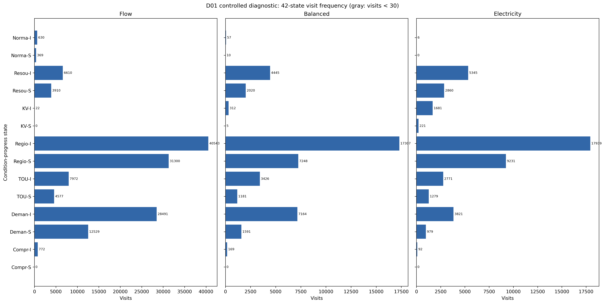
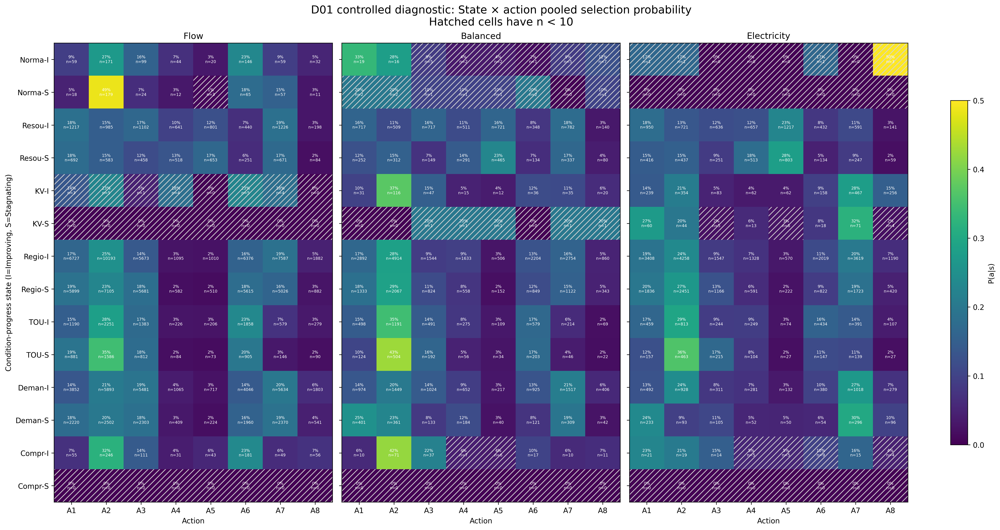
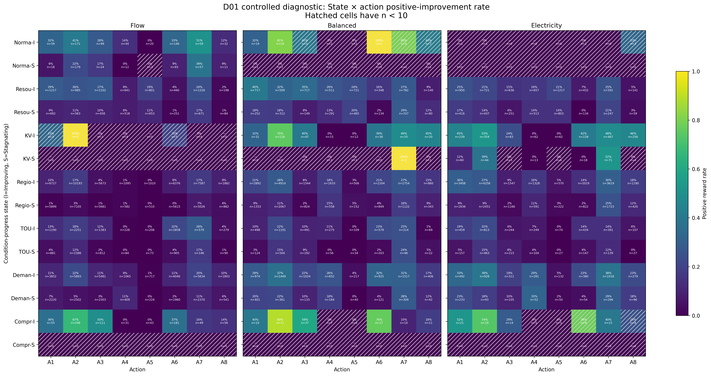
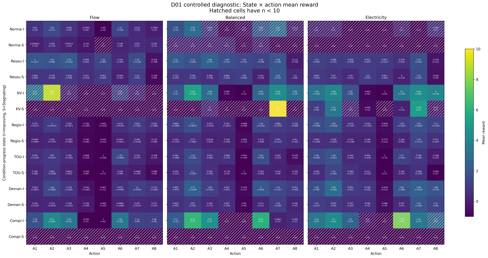
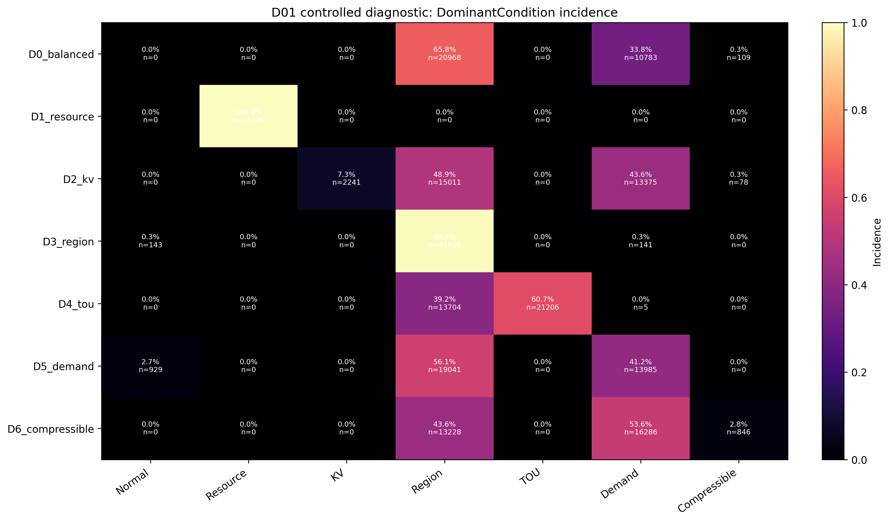
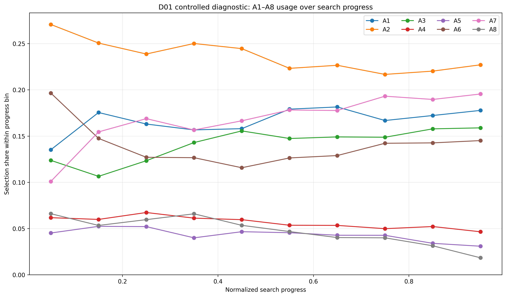

# Q-learning Diagnostic Heatmaps

状态：**D01 diagnostic / preliminary behavioral visualization**。D01 是 controlled diagnostic scenarios；结果不构成正式论文性能结论。

## 数据与计算

- 完整主诊断：63/63 runs，7 scenarios × 3 instance seeds × 3 algorithm seeds，每条 30 generations。
- Scale、pilot、stress 与 D02 mixed 数据均未进入 D01 aggregation。
- Selection probability 在全部 D01 runs 上先累计计数，再计算：

$$
P(a\mid s)=\frac{\sum_{runs}N_{run}(s,a)}{\sum_{runs}N_{run}(s)}.
$$

- Heatmap 显示 cell 样本量；$n<10$ 使用斜线标记。

## 图表

每张图同时保存同名 PDF；PNG 为 300 dpi。

## 诊断摘要

- State coverage：37/42。
- 稀疏状态：4(Flow/KV/Improving), 15(Balanced/Normal/Stagnating), 19(Balanced/KV/Stagnating), 28(Electricity/Normal/Improving)。
- 未访问状态：5(Flow/KV/Stagnating), 13(Flow/Compressible/Stagnating), 27(Balanced/Compressible/Stagnating), 29(Electricity/Normal/Stagnating), 41(Electricity/Compressible/Stagnating)。
- A1–A8 实际调用：A1, A2, A3, A4, A5, A6, A7, A8。
- 总 RL steps：228,885。

- D1_resource → Resource: 100.0%
- D2_kv → KV: 7.3%
- D3_region → Region: 99.3%
- D4_tou → TOU: 60.7%
- D5_demand → Demand: 41.2%
- D6_compressible → Compressible: 2.8%

- Archive final size ≥1,000：10/63 runs；最大值 3969。
- Archive size 与 elapsed correlation：0.5998850855089961。

Archive 第一版不裁剪，接近或超过 1,000 members 是 dominance check、内存与序列化风险信号；本报告只记录，不自动修改算法。

## Controlled vs Mixed validation

D02 是独立 mixed random validation instances，不是 D01 的第八个场景。两套 count 从未合并。对比结果见 [qlearning_mixed_validation.md](qlearning_mixed_validation.md)。
