# Q-learning Mixed-instance Validation

状态：**D02 mixed random validation / preliminary behavioral visualization**。D02 使用冻结后不再校准的普通综合随机实例；不构成正式论文性能结论。

## 数据边界

- D02：5 instance seeds × 3 algorithm seeds = 15/15 runs，每条 30 generations。
- D01 是 controlled diagnostic scenarios；D02 是 mixed random validation instances。
- 两套数据只并列比较，不合并 count，不生成总热力图。
- D02 selection probability 同样先累计 count，再计算 $P(a|s)$；低样本 cell 显示 $n$ 并加斜线。

## D02 图表

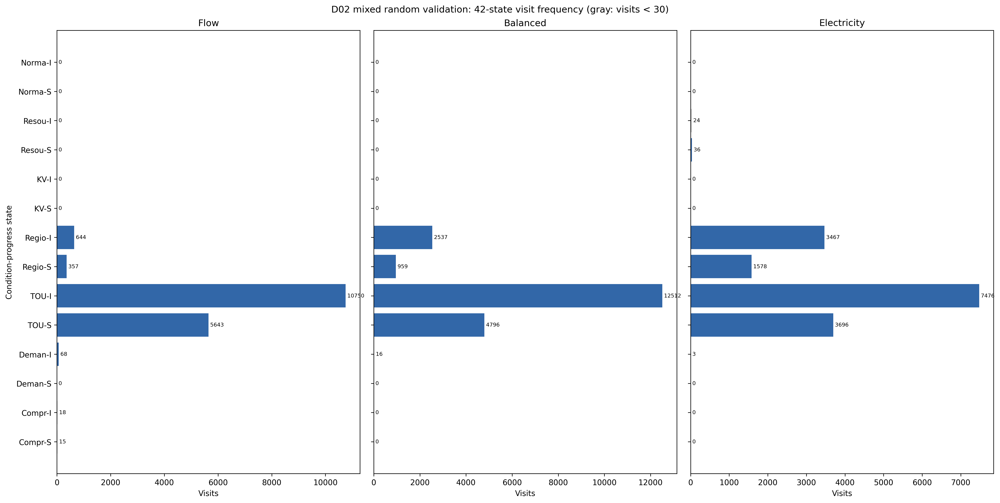

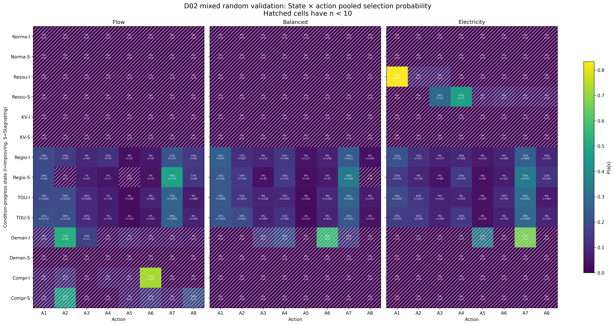

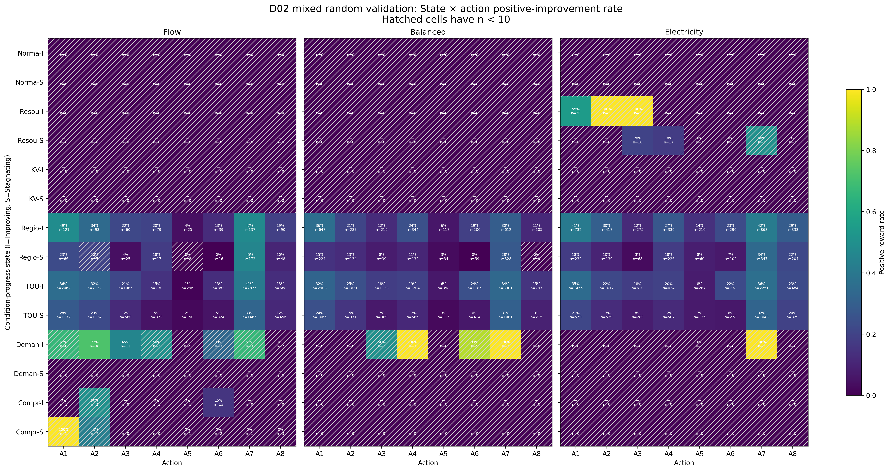

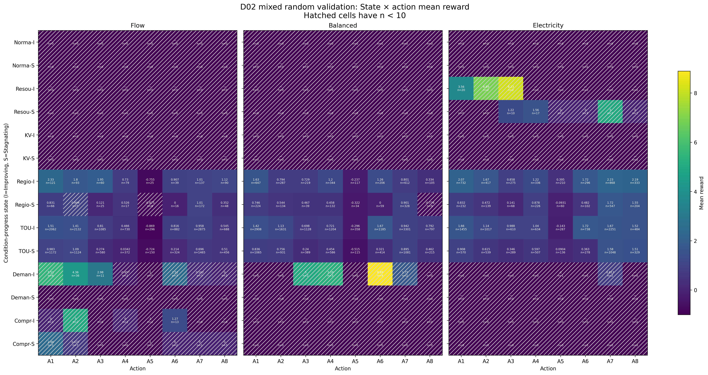

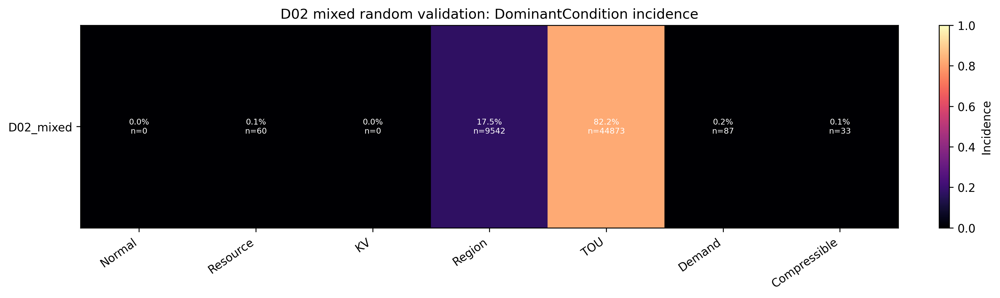

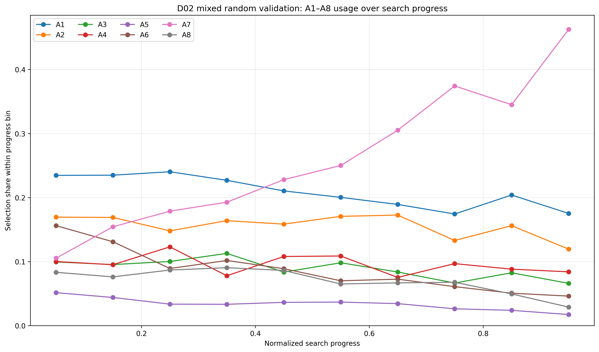

## Controlled vs Mixed 图表

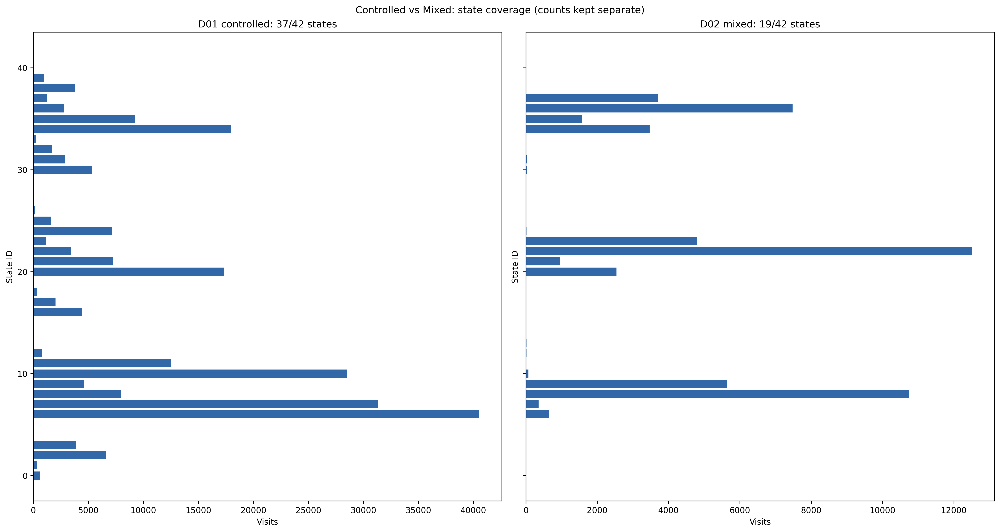

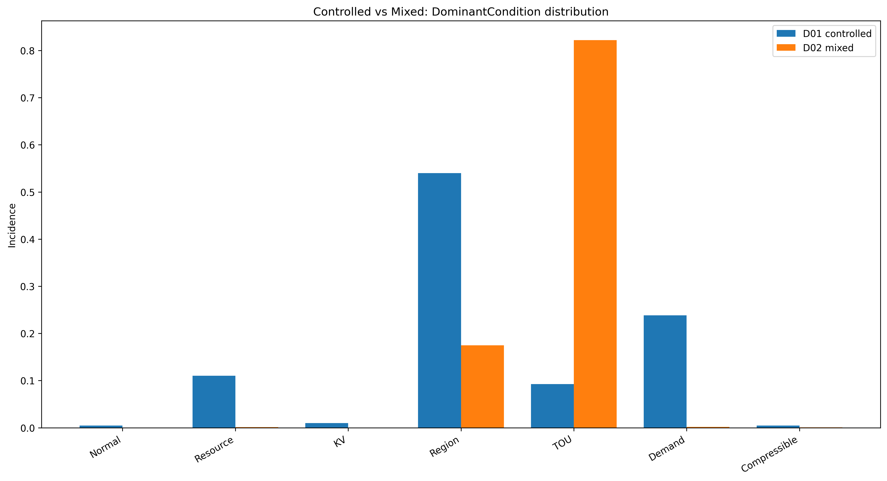

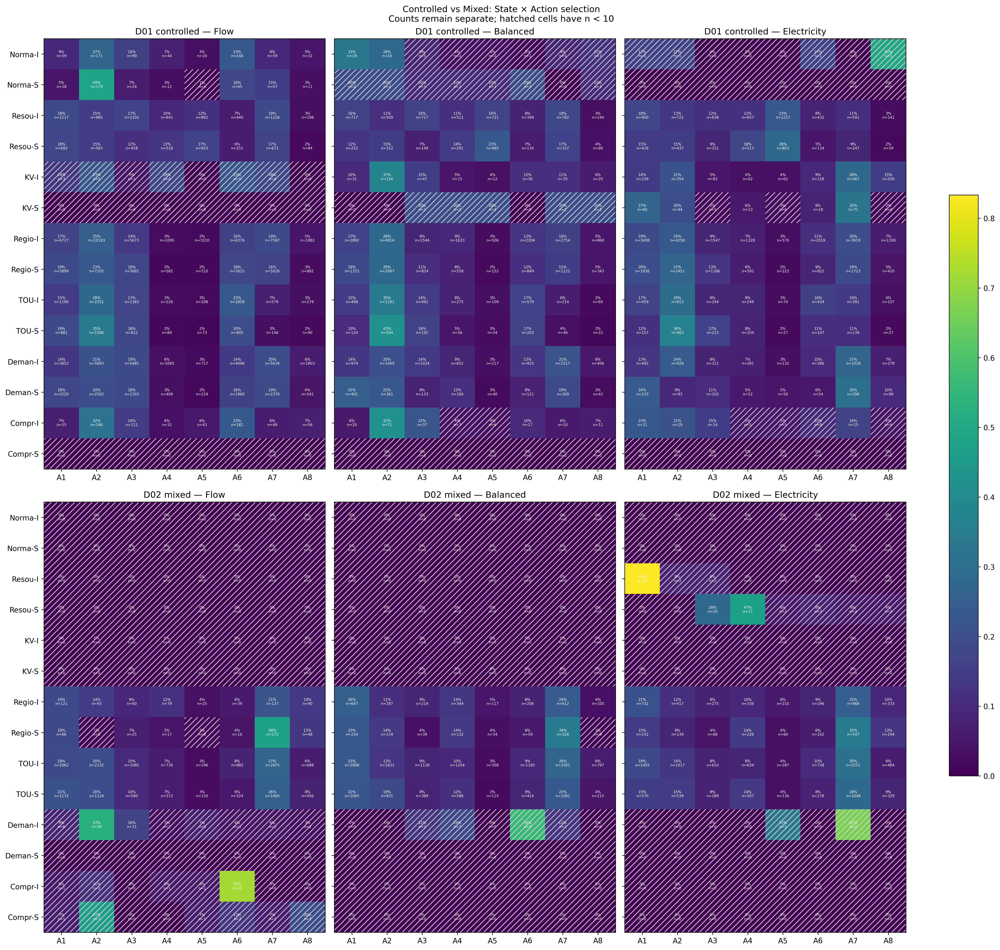

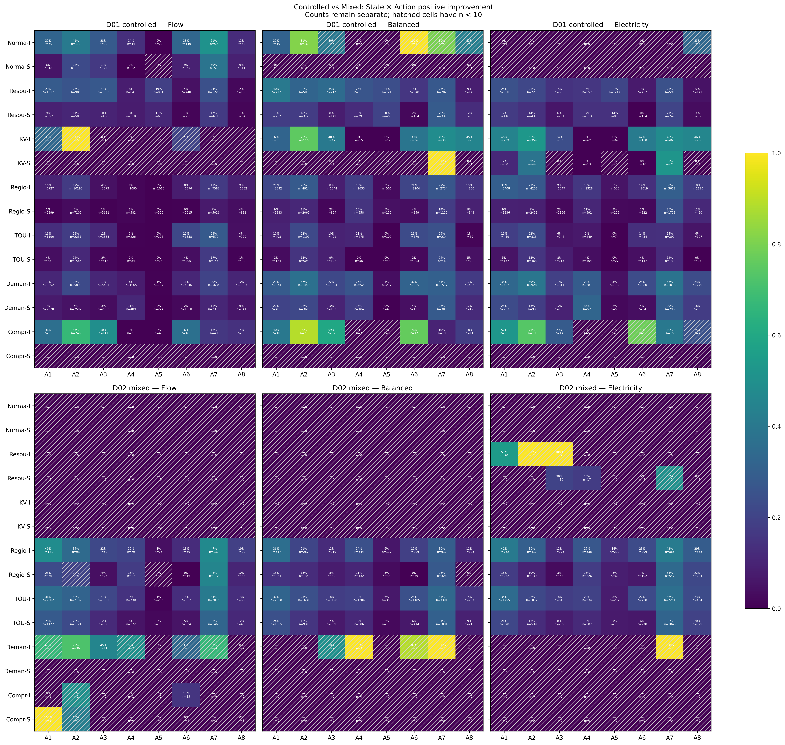

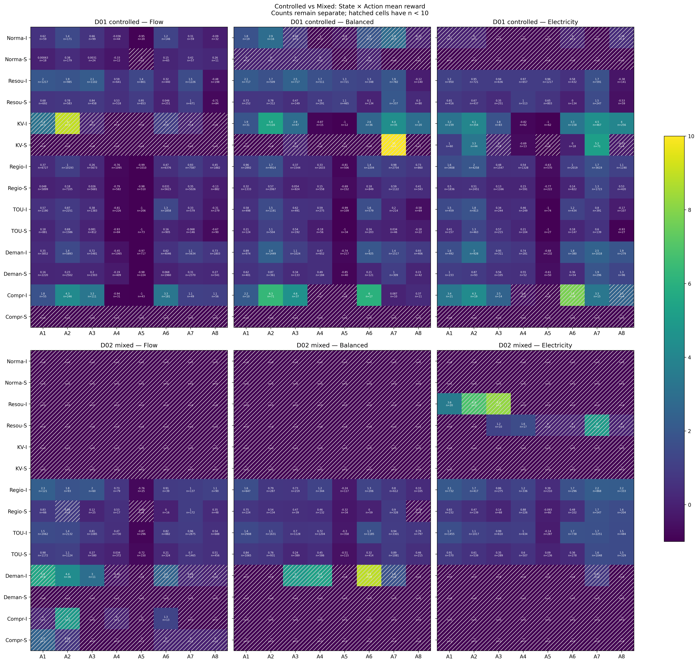

## 结果摘要

- D02 state coverage：19/42。
- D02 稀疏状态：12(Flow/Compressible/Improving), 13(Flow/Compressible/Stagnating), 24(Balanced/Demand/Improving), 30(Electricity/Resource/Improving), 38(Electricity/Demand/Improving)。
- D02 未访问状态：0(Flow/Normal/Improving), 1(Flow/Normal/Stagnating), 2(Flow/Resource/Improving), 3(Flow/Resource/Stagnating), 4(Flow/KV/Improving), 5(Flow/KV/Stagnating), 11(Flow/Demand/Stagnating), 14(Balanced/Normal/Improving), 15(Balanced/Normal/Stagnating), 16(Balanced/Resource/Improving), 17(Balanced/Resource/Stagnating), 18(Balanced/KV/Improving), 19(Balanced/KV/Stagnating), 25(Balanced/Demand/Stagnating), 26(Balanced/Compressible/Improving), 27(Balanced/Compressible/Stagnating), 28(Electricity/Normal/Improving), 29(Electricity/Normal/Stagnating), 32(Electricity/KV/Improving), 33(Electricity/KV/Stagnating), 39(Electricity/Demand/Stagnating), 40(Electricity/Compressible/Improving), 41(Electricity/Compressible/Stagnating)。
- D02 A1–A8 实际调用：A1, A2, A3, A4, A5, A6, A7, A8。
- D02 DominantCondition：Normal=0.0%, Resource=0.1%, KV=0.0%, Region=17.5%, TOU=82.2%, Demand=0.2%, Compressible=0.1%。
- D01/D02 共同充分采样状态：14；top-selected action 一致：1/14。
- Selection profile correlation：0.31029606847005003。
- Positive-improvement correlation：0.6192581902365073。
- Mean reward correlation：0.6248564388043369。

D01 与 D02 的 action preference 存在明显差异，当前不宣称 mixed-instance 行为复核。

该结论只描述本轮合成诊断行为。无论一致或不一致，都不据此修改 mixed generator、42-state、Q-learning、A1–A8、Trigger 或 MacroSearch。
