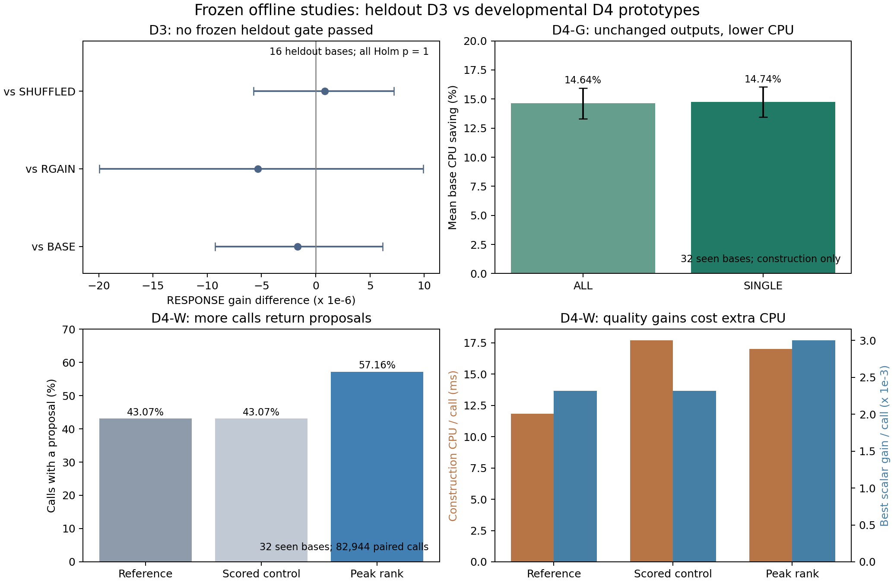

# D3、D4-G、D4-W：完整分析与下一步研究判断

2026-10-07。三项计算、原冻结 validator、完整本地回收和独立统计复核均已完成；源码仍分别冻结于 D3/2725e1d 和 D4 原型/46bcb33，研究分支未合并，默认 MOEA/D 未改变。最终 GitHub/CI/Notion 回读见 [DELIVERY.md](DELIVERY.md)。

## 主要判断

| 实验 | 实际回答的问题 | 结果 | 研究处理 |
|---|---|---|---|
| D3 | 固定候选池上，机会×权重响应能否提供额外前瞻选择增益？ | 三项主比较均未通过，Holm p 全为 1 | 停止 RESPONSE v1 在线晋级；保留“目标进入候选构造”的不同假设 |
| D4-G | 必要证书实际门控能否保持输出并净省构造时间？ | SINGLE 平均省 14.738% CPU，32/32 base 为正，输出一致 | 继续工程提速验证；尚非整程提速、质量创新 |
| D4-W | 相同有限采样额度下，全窗口峰值位置排序能否改善候选？ | 非空率 +14.084 个百分点；平均 scalar gain +29.508%；构造 CPU +47.369% | 最值得继续的候选构造机制；先降成本，再做等时间新 base 在线实验 |

[D3 详细报告](D3.md)、[D4-G 详细报告](D4-G.md)、[D4-W 详细报告](D4-W.md) 分别列出冻结设计、全部比较、完整性、效果量、区间、分层、成本与限制。不能将 D3 的标签数值与 D4 的 caller scalar 数值直接比较，二者定义和单位不同。

图中 D3 区间来自 16 个全留出 base 的原冻结分析；D4 来自 32 个已见 base 的开发性描述。重复调用与时序循环不被当作独立 base。

## 为什么现在应转向构造，而不是继续加响应模型

D3 的机会交互项与已有控制相比差异接近零；更关键的是，当前动作生成不接收方向信息，只能在同一个 B3 池中改保留。事后同池 oracle 对 BASE 的平均空间也仅 5.45e-05，达不到冻结 0.001 门槛。门槛尺度需为未来新协议校准，但不事后修改本次结论。

D4-W 实际改变修复位置，从而改变最终候选池。在不扩大六位置/成员/尝试额度的条件下，峰值失败减少，可用 proposal 增加，并带来同 caller weight 下正标量收益。这比只调整保留方向更直接触及已观测瓶颈。这里支持的是当前开发来源上的构造机制；“创新”仍须近期文献最接近方法对照、独立留出和在线消融验证。

D4-G 提供独立的工程抓手。它可以跳过有证据必然无效的修复，保持候选与 RNG；但不增加候选，也不提升单次质量。它和 D4-W 分别单独测试，尚未测试组合，不能假定成本节省直接叠加。

## 成本与目标权衡决定下一步

D4-W 的单次 gain 增加约 29.5%，构造 CPU 按每 base 比例平均增加 47.4%。等权 base 均值的 gain/构造 CPU 代理下降 9.97%，探索性 CI [-12.53%,-7.11%]。这不是整程等时间 HV 的结论，但足以说明必须看实际时间预算。

离线 caller 最佳正标量候选更偏向 Bill 收益，同时平均 Flow 牺牲更多；不能只看需求峰下降就宣称 Pareto 前沿改善。后续必须保留 HV、IGD、端点与覆盖检查。

## 下一步建议，尚未启动

1. **成本定位与等价优化。** 对证书缓存、资源检查、全窗口积分、位置扫描及完整 exact 分开计时；在空闲 CPU 验证首次调用/进程冷启动与重复调用。尝试固定基线窗口缓存、局部区间更新，但必须逐位置对当前完整积分验真，并保留 idle、尾窗、未插回 Decode 等反例。若不能保持结果等价，按新研究处理而不是性能优化处理。
2. **新 base 在线消融。** 建议 LEGACY、同新流 REFERENCE、GUARD_SINGLE、PEAK_RANK、GUARD+PEAK 五组；每个同 base/电价/seed 五组块固定同 host，随机臂顺序，统一初始化、exact、Archive、日志和时间预算。预先冻结 scalar/HV/IGD 主次指标、统计单位、多重校正及实用效果门槛。24 个全新 base（50/100 各12）×H/T×3 seed×5组=720 次；1800/3600 秒来源预算合计540 solver-hour。若资源 pilot 支持总32–48槽，纯采样下界约16.875–11.25小时；真实ETA必须以目标环境 pilot、内存和完整调用成本校准，不能将下界当完成承诺。
3. **成本选择性投入，作为后续待验证想法。** 若全量 PEAK_RANK 的等时间效果不足，可研究依据前置残余证书、窗口负载、偏好、阶段决定是否承担完整位置评分。当前分层只能生成假设，不能用同批最好分层调参再宣称验证。新触发门槛须在独立开发数据上冻结，再用新留出测试。
4. **创新性审查。** 为完整方案建立“数学证书/全窗口构造/时间分配/分解目标接口”与近期最接近方法的逐项差异表。普通峰值排序或缓存本身不自动构成新颖性；当前报告不宣称已经完成文献创新判定。若时间预算验证有收益，再围绕实际成立的机制做集中文献审查和更强方法对照。

本批没有启动这些新实验。上述是基于三项完整结果的研究安排建议，区别于当前已冻结与已验证行为；需要先实现、冻结、完整质量门、双 Python CI、目标资源 pilot，再开正式矩阵。

## 完整性与复现材料

三项总计 **52146 文件、19389283613 原始字节**；各自 tar.gz 均逐成员、逐本地文件大小/SHA256 验真，完整原件保留。D3 288 source/probe pairs；D4-G/W 各192 key、分别6912/13824 unit。所有退出 complete、无活跃 worker、无实际算法失败/OOM。原 worker exact/RNG 证据与本批重新验证标签/哈希严格区分。

报告工具只做离线分析，不改运行源码。`scripts/analyse_d4_results.py` 保留空调用、平均计时循环、按 base 聚类，独立恢复 Flow 与 Bill=TOU+Demand 并重算 scalar。`audit_d3_csv.py`、`audit_d4_csv.py` 提供独立 CSV 汇总复核；使用原源码验证时必须将 PYTHONPATH 指向相应冻结 runtime/src。`plot_results.py` 从已发布的小型 JSON 重建 PNG/PDF。

每个正式源/输入/配置/协议 hash、全文件清单、源码 bundle、raw 与复现说明由 Release 交付；适合 Git 的报告、JSON、科学图与分析程序走独立 PR。完整验收和交付限制集中在 DELIVERY.md。
