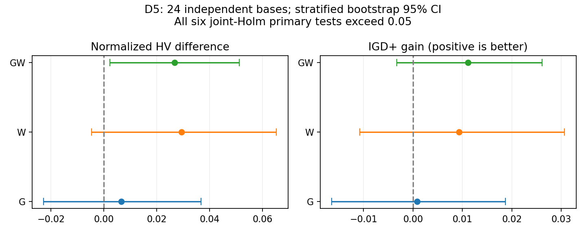
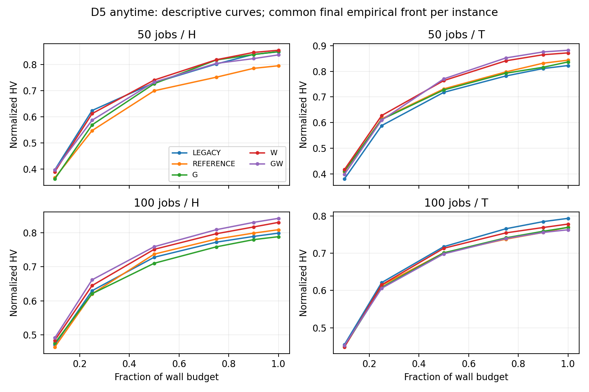

# D5 五组在线等时间结果分析（2026-10-08）

D5 的 480 次正式运行已全部完成、验真并完整回收。W 和 GW 值得继续独立确认，但本批没有证明任何一组稳定优于同随机流对照或当前 F6。G 是有限的工程节约；这次结果不支持把 G 的构造节约解释成整程显著提速，也不支持马上设计更复杂的在线状态控制器。

## Material Passport

- Origin Skill: academic-research-suite / experiment-agent
- Origin Mode: validate
- Origin Date: 2026-10-08
- Verification Status: ANALYZED（全量产物已验真，统计独立复算；未重跑全部随机搜索）
- Version Label: D5-analysis-v1

## 1. 执行和数据完整性

- 运行 source 固定 `3a1342cef98dae4b09cd370f40417a119efb4703`，canonical hash `592cf56992cfd0079f7dd9f3e581efdf01215af4cbe5f6d66ccba443cdd9e2d9`；研究 PR38 尚未合并，默认 F6 未升级。
- 24 全新独立 base：50 jobs 的 995001–995012、100 jobs 的 1005001–1005012；每 base 的 H/T、seed1101/2202、五组，共480 runs/96块，每组96次。五组在同一主机使用同一实例、初始群体和 seed；组序循环均衡。
- 50/100 jobs 的 engine wall budget 为1200/2400秒，240 nominal solver-hour。两当前 CPU 节点各24 solver，共48；00:16:47启动，05:17:31计算结束，约5小时1分钟，满足本轮八小时计算要求。
- 两节点 status/exit complete、全 `/proc` 扫描 worker=0、原 supervisor 已退出；无 failure/stop/OOM。全部原 P2 与 D5 validate_complete、八项产物hash、输入/初始化/配置/种子/source和同host核验通过，本地冻结入口再次验明480次。
- 231,532个最终 population/Archive 解在原 worker 发布前逐解独立 exact 复验；本轮由已校验产物hash支持该证据，没有声称重新评价这231,532个解。
- 完整回收5,874文件、1,906,492,462逻辑字节；tar.gz 122,913,964字节，SHA256 `80b9b27c9cd2842e81eec82b2f705f92b894cdcc3c42bfcc3a923a33eba73024`；全manifest SHA256 `521f89fd68d904208d8c5087f9f5a6428fcbb59a1479ee8dd7dfee769849e01a`。每archive成员与本地文件size/SHA256通过。服务器原件与旧实验历史保留。

## 2. 五组分别回答什么

| 组 | A8 行为 | 要区分的问题 |
|---|---|---|
| LEGACY | 原PeakCoalition/F6 | 当前实际基线 |
| REFERENCE | 每recipe独立选择/repair随机流，仍用首个可行位置 | 随机流变化本身的影响 |
| G | REFERENCE + GUARD_ALL必要条件证书 | 构造成本能否转成等时间收益 |
| W | REFERENCE + L=6有限位置全窗口峰评分 | 额外构造投入是否划算 |
| GW | ALL证书与窗口评分组合 | 两机制是否互补 |

本次G是ALL，不是旧D4成本实验的SINGLE。W采用逐位等价事件缓存，旧development配对的构造CPU减少20.16%是工程证据；本批线上timings使用 `perf_counter`，是墙钟耗时，不能与旧CPU比例直接相减。full、B6、population100、trigger、sharedQ、Polish、Archive/exact保持。

## 3. 统计规则和解释边界

同一base/电价的五组两seed最终Archive构造共同经验非支配union，以其ideal/nadir归一化；HV参考点$(1.1,1.1)$。IGD+和普通IGD使用同一经验前沿；它不是已知真实Pareto前沿。弱支配coverage采用归一化$10^{-12}$容差；超HV参考矩形的点不贡献面积，距离不裁剪。完整前沿/参数随references.json保存。
先对每base的H/T与两seed四个配对差平均；独立推断单位24base，按50/100规模分层bootstrap20,000次。双侧sign-flip100,000次，统计RNG seed2026100805；该检验假定独立、对称的零假设base差值，不能称严格随机标签分配的因果检验。保存108项统计，另一个实现从CSV复算全部mean/CI/p及六项Holm一致。
冻结协议指定HV/IGD+与三项主要比较，但未精确定义跨指标校正家族。本分析在读质量结果前补充分析规则：同时报告每指标三项Holm及六项联合Holm，主要解释采用后者。不靠选择家族寻找显著性。未设事前最小有效差或等价界，因此不设事后晋级门、不把未显著称为等价。
HV相对百分比是逐配对比例再等权平均，并非总体均值之比；两者权重不同。主检验仍是HV绝对差，不能用相对百分比的正区间替换未通过的绝对差检验。所有次要指标与子组CI均未同时校正，视为探索性。

## 4. 主要结果：三组都尚未通过确认

| 对REFERENCE | HV绝对差 [95%CI] | 配对HV相对差 | HV Holm三项/六项 | IGD+ gain [95%CI] | IGD+ Holm六项 | 正HV base |
|---|---:|---:|---:|---:|---:|---:|
| G | +0.006516 [-0.022744, +0.036699] | +2.491% | 0.701283 / 1.000000 | +0.000865 [-0.016410, +0.018717] | 1.000000 | 12/24 |
| W | +0.029392 [-0.004587, +0.065250] | +7.013% | 0.251097 / 0.627744 | +0.009330 [-0.010756, +0.030670] | 1.000000 | 15/24 |
| GW | +0.026661 [+0.002220, +0.051152] | +5.609% | 0.156598 / 0.313197 | +0.011117 [-0.003244, +0.026099] | 0.669233 | 15/24 |

G的HV/IGD+区间宽且跨零，HV恰好12正/12负。不能由“证书逻辑安全”推出这轮等时间搜索必然更好；不同吞吐与截至时刻仍会改变搜索轨迹。
W的平均配对HV相对差+7.013%，绝对差+0.029392的区间跨零、原始p=0.12555；IGD+也未确认。这是有前景但不稳定的信号，不能称已提升7%。
GW的HV bootstrap区间为正，但原始sign-flip p=0.05220，Holm三项0.15660、六项0.31320；IGD+区间仍跨零。CI和sign-flip来自不同统计构造，不保证严格反演一致。不能把正bootstrap区间单独当作通过确认。

### 对当前F6实际基线的补充比较

| 对LEGACY | HV绝对差 [95%CI] | 配对HV相对差 | IGD+ gain |
|---|---:|---:|---:|
| REFERENCE | -0.011494 [-0.040014, +0.014330] | +0.805% | -0.001022 |
| G | -0.004977 [-0.026322, +0.015758] | +1.054% | -0.000157 |
| W | +0.017898 [-0.016217, +0.056188] | +5.562% | +0.008308 |
| GW | +0.015168 [-0.016851, +0.048195] | +4.627% | +0.010094 |

这些比较全部HV区间跨零。REFERENCE对LEGACY也未确认，不能视为严格等价。因此W/GW只与REFERENCE比较还不足以支持替换原F6；当前默认保持。

## 5. 场景异质性和覆盖

| 场景（各12 base） | G HV差 / 相对差 | W HV差 / 相对差 | GW HV差 / 相对差 |
|---|---:|---:|---:|
| 50_H | +0.054150 / +11.96% | +0.059350 / +15.19% | +0.041614 / +9.09% |
| 50_T | -0.006877 / -0.20% | +0.028415 / +7.81% | +0.038646 / +8.87% |
| 100_H | -0.020435 / -2.32% | +0.021589 / +2.95% | +0.033404 / +4.50% |
| 100_T | -0.000772 / +0.52% | +0.008213 / +2.11% | -0.007018 / -0.02% |

W四个场景的平均HV差都为正，但100-T差很小；GW在100-T为负。W/GW的增益主要在50-job实例。子组每规模只有12独立base，不在事后删100-T或只报告50-H，也不以子组结果直接设计已验证选择器。
两个主机上W/GW的平均HV差均正；G主机0负、主机1正。base子集与主机绑定，两容器共享物理CPU；同块五组串行、组序近似均衡，仍不能排除负载/时序干扰。没有把主机观察作为硬件因果效应。

| 对REFERENCE | C(处理,对照)−C(对照,处理) [95%CI] | 普通IGD gain | 最小Flow gain | 最小Bill gain |
|---|---:|---:|---:|---:|
| G | -0.058593 [-0.197215, +0.074462] | -0.000600 | -0.106% | +0.218% |
| W | -0.058853 [-0.157698, +0.039814] | +0.007338 | -0.121% | +0.776% |
| GW | +0.008834 [-0.113745, +0.128646] | +0.011001 | +0.031% | +0.706% |

双向覆盖净差区间都跨零；W的最小Flow略差，最小Bill方向较好但不稳，两个极值未必属于同一个解，不能拼成“两目标同时支配”的代表方案。完整双向coverage在配对CSV中，不能用HV均值取代覆盖结论。

anytime在预算10/25/50/75/90/100%保存，实际采样最大迟到3.151秒。曲线仅描述均值，统一使用最终经验前沿，不能称每个精确时刻的显著优势；没有记录连续时间轨迹。

## 6. 成本：G节约有限，W额外投入很小

| 组 | 平均A8构造占整程 | 平均每call构造ms | proposals/call | 对REFERENCE的配对每call成本变化 [CI] | exact吞吐变化 | 子代吞吐变化 |
|---|---:|---:|---:|---:|---:|---:|
| LEGACY | 0.866% | 27.534 | 2.135 | — | — | — |
| REFERENCE | 0.822% | 27.637 | 2.092 | — | — | — |
| G | 0.772% | 25.563 | 2.133 | -5.591 [-7.579, -3.781]% | 0.599% | -0.473% |
| W | 1.259% | 32.129 | 2.938 | +18.951 [+15.755, +22.158]% | 0.98% | 2.51% |
| GW | 1.189% | 29.817 | 2.940 | +10.960 [+8.469, +13.343]% | 1.877% | 5.609% |

G每次A8构造的配对成本−5.59%，但REFERENCE的A8构造仅占整程0.822%；G整程该项差约−0.0499个百分点。即使消除全部A8构造也只有很小的直接时间上限，旧SINGLE的14.738%不能套成整程速度。G保持轻量工程候选，但不宜把它作为论文主要质量创新。
加速后的W每call成本仍高约18.95%，整程A8构造占比1.259%，只比REFERENCE多0.436个百分点；GW为1.189%，相对W每call约少5.55%。因此当前的核心不确定性已经是在线质量是否稳定，而非构造成本过大。两组整体exact/子代吞吐与搜索状态访问不同，不能由单项时间推断端到端因果提速。
W/GW每call proposal比REFERENCE多约0.85，A8平均调用数约666/668，对照约518；Q在不同轨迹上自行改变使用频率。这可以解释“机制有活动”，不能证明更多调用是净收益，也不能把全部差别归于窗口排序单因素。

### 偏好条件统计（探索性）

| 偏好 | 组 | calls | 构造ms/call | proposals/call | 接受率 | reward/call |
|---|---|---:|---:|---:|---:|---:|
| Balanced | REFERENCE | 17954 | 25.27 | 2.068 | 11.33% | 0.317 |
| Balanced | G | 18163 | 23.35 | 2.190 | 10.95% | 0.297 |
| Balanced | W | 24632 | 28.70 | 3.098 | 12.80% | 0.529 |
| Balanced | GW | 23781 | 27.34 | 3.117 | 12.82% | 0.515 |
| Electricity | REFERENCE | 14241 | 26.00 | 1.980 | 16.49% | 0.960 |
| Electricity | G | 13258 | 24.48 | 1.952 | 16.24% | 0.924 |
| Electricity | W | 16545 | 29.87 | 2.995 | 18.39% | 1.247 |
| Electricity | GW | 17374 | 27.61 | 2.876 | 18.54% | 1.241 |
| Flow | REFERENCE | 17554 | 24.21 | 2.486 | 11.02% | 0.290 |
| Flow | G | 18310 | 23.33 | 2.581 | 11.80% | 0.316 |
| Flow | W | 22721 | 28.09 | 3.473 | 12.43% | 0.464 |
| Flow | GW | 22965 | 26.62 | 3.359 | 12.78% | 0.484 |

这张表按被访问call汇总，不是base等权效应，也不是同源同状态反事实；Resource/TOU等条件与Improving/Stagnating进展完整行另存a8_state_metrics.csv。状态访问分布是算法结果，条件化可能引入选择/collider偏差。reward受共享Q、接受状态及标量尺度影响，不能直接定义新调度器的训练标签。

## 7. 下一步怎么做（建议，未启动）

1. 先继续MOEA/D/A8这条路线，保留原F6和独立随机流REFERENCE。W是主要研究对象；GW可保留确认，但本次GW对W的HV差−0.002730，区间跨零，没有证据证明组合优于W。暂不采用新默认算法。
2. 下一批优先增加全新独立base数量，再考虑增加同base重复seed。两seed已经暴露明显base差异，重复本批base或只延长预算不能自动解决外推问题。建议独立48–64base确认LEGACY/REFERENCE/W/GW，保留50/100与H/T，固定分析家族、目标效应和总预算，先用本批base方差做功效/精度模拟；这只是设计建议，不在本批自动派发。
3. 为判断W对长预算是否仍有效，可在独立protocol中同时设短/长预算并保持相同初始群体/主机对照。预算是新实验因素，不能拿本批短预算与旧D4离线收益或旧P2长预算直接比较。先固定主检验和每组预算，不事后调到有利截止。
4. 状态自适应仍有研究必要，但暂不直接实现复杂预测器。先做独立同源、同偏好、同有限候选额度的REFERENCE/W paired replay，记录包含proposal和exact在内的总新增成本与所有受益方向的净收益；按base开发/完全留出分割，测试搜索前可用状态能否预测“值得投入W”。在线访问累计表用于提出假设，不能代替此反事实。
5. 只有跨base预测及独立等时间质量都支持状态区分，再把“是否做W/做几次W”纳入MOEA/D子问题预算分配；保留固定W、相同频率随机开关、现有Q三个对照。明确共享Q是否重复学习同一决策、计算预算与Archive规则，然后查新。当前尚未证实最近文献中不存在同类方法，不将工程cache/必要证书称为已证新颖性。

这轮并非“仅G/W存在价值”或“其他方向永远失败”的证明。它更具体地支持：G的直接性能上限有限，W的构造机制仍值得确认；在线状态创新要建立在可预测的净收益证据上。没有自动启动下一批。

## 8. 统计谬误检查与可复现性

共11/11项检查，质量结论标记CAUTION；执行/产物验收通过不等于算法优势或外部新颖性已验证。

| 检查项 | 本批处理 |
|---|---|
| Simpson | 分列规模/电价与主机，保留GW在100-T的负结果 |
| 生态谬误 | 24base是推断单位，不推到单call净收益 |
| Berkson/选择偏差 | 全480正式矩阵，无质量挑选；生成实例不代表所有实际业务 |
| Collider | 状态表只描述访问分布，不当作状态机制因果证据 |
| 基率忽略 | 调用/接受都列分母，不以少数成功call推广全部调用 |
| 回归均值 | 新base独立于开发数据，不因旧高收益选择测试base |
| 幸存者偏差 | 全480完成，失败为0；保留所有正式run |
| 多重搜索 | 全三比较/两主指标报告，六项Holm；子组探索不晋级 |
| 多分析路径 | 规则在质量分析前固定；归一化/校正家族补充明确公开 |
| 相关与因果 | 区分干预组差、轨迹状态关联、CPU负载与端到端机制 |
| 反向因果 | Q使用频率可能响应已产生的收益，不称频率导致所有收益 |

原始搜索是wall-clock依赖且未重跑；本报告的ANALYZED不冒充完整算法REPRODUCIBLE。已独立复算108项cluster统计与jointHolm、48实例REFERENCE IGD+标量实现、原validator和全文件hash；复现实验须另立campaign。源码/输入/最终解与anytime原始产物全部随Release保留。

## 9. 文件与交付

- `analysis_plan.md`：在读质量结果前明确的分析细则。
- `data/report.json`、run/paired/base/anytime/state CSV、references.json及独立复算receipt：可审查的统计。
- `figures/primary_effects.*`、`figures/anytime_strata.*`：PNG/PDF两组静态科研图。
- 完整raw、逐文件manifest、校验和、冻结运行bundle与独立分析bundle、复现说明、执行/本地/CI/Release验收：单独完整Release。
- 报告和分析工具走独立 `research/d5-results-20261008` PR；运行source保持3a1342c，PR38及报告PR均不自动合并。
- 完整Release固定地址：[D5 complete](https://github.com/atlantic0423/geo-llm-scheduler/releases/tag/d5-complete-20261008-3a1342c)。真实最终发布/CI验真见对应delivery receipt，发布前该链接不代表资产已存在。
