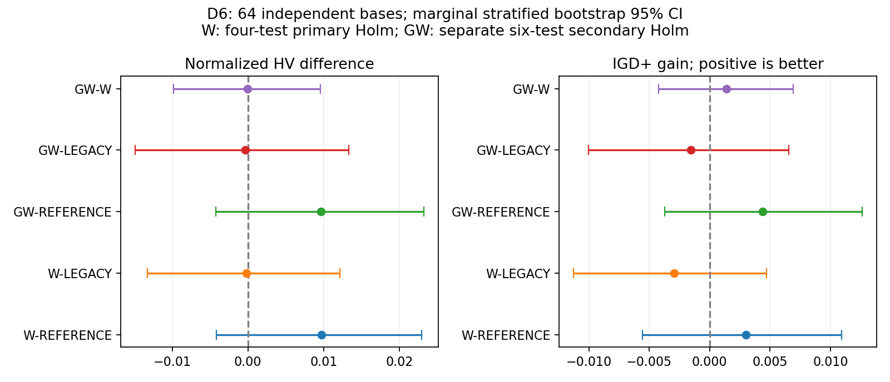
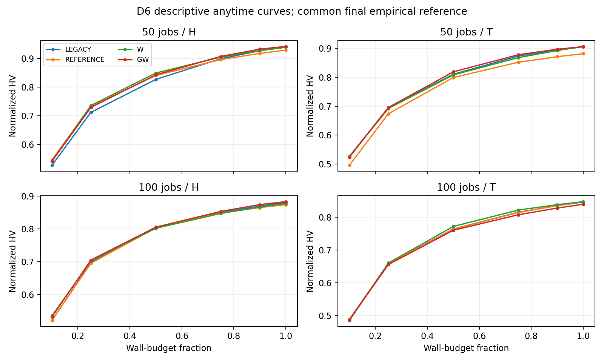

# D6 四组独立在线确认结果分析（2026-10-08）

正式1024次/256个同主机块已完成、全量回收并验真。本报告采用事前冻结的64个独立base与主/次Holm家族，质量分析由用户在原数据回收后明确恢复授权；运行源码和原始数据保持不变。

## 结论先读

**D6没有确认当前W或G+W已优于原算法；当前版本不应晋级默认算法。** 四项W主确认和六项GW次级确认均未通过。W相对同随机流REFERENCE的平均配对相对HV为+2.369%，但事前主指标normalized HV差的Holm p为0.700313，IGD+为1；相对原算法LEGACY，平均normalized HV差为−0.000229，IGD+ gain为−0.002921，两者都没有确认改善。

这也不是证明W无效或与原算法等价。区间仍容许正负效应；本批能得出的结论是：D5的小样本积极信号，在独立64base上没有得到预定口径的确认。W仍是可研究的候选构造机制，G是有成本证据的工程组件，二者都不是已经成立的MOEA/D创新成果。

本轮最有用的机制线索是：W平均每次调用生成的候选从2.179增加到3.051，配对子代吞吐平均+6.113%，但最终质量没有相应得到确认。应优先解释“候选增加为什么没有转化为解集收益”，而不是继续原样扩样等待显著。

## Material Passport

- Origin Skill: academic-research-suite / experiment-agent
- Origin Mode: validate
- Origin Date: 2026-10-08
- Verification Status: ANALYZED（数据完整性通过，统计独立复算；未重跑全部wall-clock搜索）
- Version Label: D6-analysis-v1

## 1. 数据与比较含义

- 完整1024/1024运行、256/256同host四组块、64新base，50/100 jobs各32；每base含H/T、seed1101/2202、四组。每组256次，独立推断单位为64base。
- 四组：LEGACY为原F6/PeakCoalition；REFERENCE为recipe与repair独立随机流、仍取首个可行位置；W在同流对照上用L=6有限位置完整固定窗口评分；GW为GUARD_ALL与W。单独G本批未跑。
- MOEA/D/full、fixedB6、共享Q、Trigger、Polish、Archive均保持；50/100 jobs wall预算1200/2400秒。08:56:19启动，19:37:55完成，约10h42。
- 运行source固定3a1342cef98dae4b09cd370f40417a119efb4703，canonical592cf56992cfd0079f7dd9f3e581efdf01215af4cbe5f6d66ccba443cdd9e2d9；真实worker/supervisor退出、exit complete、failure/stop/OOM0。
- 原P2/D5 validator及本地原冻结入口全部通过；输入/初始化/配置/source/seed/每块host与八项产物hash一致。12562文件、4367630002字节每个tar成员与本地文件size/SHA通过。545341最终解为原worker独立exact证据，本轮未fresh重评全解。

## 2. 冻结统计口径

每实例四组/两seed共同经验非支配union定义ideal/nadir，使用共同归一化与HV参考点(1.1,1.1)。经验union不是已知真前沿；IGD+小为好。先按base内H/T与两个seed平均配对差，再按规模分层对base做20000次bootstrap和100000次双侧sign-flip，seed2026100806。

主家族仅W−REFERENCE和W−LEGACY各HV、IGD+共四项联合Holm；GW三对六项另作次级Holm，不能补救W主确认。95%bootstrap区间是逐项区间，不是同时置信区间。sign-flip使用配对差对称/可交换零假设；未做等价/非劣检验，未显著不能理解为效果为零。固定64base不根据结果追加或筛选，D5/pilot不混入。

HV差为处理减对照，IGD+ gain为对照减处理；正值均代表处理方向较好。相对HV均值是各base配对百分比平均，和均值之比不同。

## 3. 四项主确认

| 比较 | 指标 | base配对均值 [95%CI] | 原始p | 主四项Holm p | 正/负base | 配对标准化效应 |
|---|---|---:|---:|---:|---:|---:|
| W-REFERENCE | hv_diff | +0.009723 [-0.004170, +0.022928] | 0.175078 | 0.700313 | 37/27 | +0.172 |
| W-REFERENCE | igd_plus_gain | +0.003025 [-0.005551, +0.010928] | 0.487455 | 1.000000 | 41/23 | +0.088 |
| W-LEGACY | hv_diff | -0.000229 [-0.013254, +0.012156] | 0.972550 | 1.000000 | 33/31 | -0.004 |
| W-LEGACY | igd_plus_gain | -0.002921 [-0.011257, +0.004720] | 0.499355 | 1.000000 | 36/28 | -0.088 |

## 4. GW次级家族与完整对照

| 比较 | HV差 [95%CI] | HV相对变化 [CI] | HV次级Holm p | IGD+ gain [CI] | IGD+次级Holm p |
|---|---:|---:|---:|---:|---:|
| GW-REFERENCE | +0.009640 [-0.004223, +0.023258] | +2.496 [+0.441, +4.985]% | 1.000000 | +0.004405 [-0.003735, +0.012633] | 1.000000 |
| GW-LEGACY | -0.000313 [-0.014878, +0.013323] | +0.550 [-1.140, +2.131]% | 1.000000 | -0.001540 [-0.010021, +0.006538] | 1.000000 |
| GW-W | -0.000083 [-0.009850, +0.009562] | +0.559 [-0.626, +1.757]% | 1.000000 | +0.001381 [-0.004212, +0.006908] | 1.000000 |

REFERENCE−LEGACY：HV差-0.009953 [-0.023328, +0.003015]，相对HV-0.540 [-2.137, +0.999]%；该比较是探索性随机流背景，不是等价性证明。

## 5. 场景、覆盖与目标端点

| 场景（每规模32独立base） | W−REFERENCE HV差/相对% | W−LEGACY HV差/相对% | GW−REFERENCE HV差/相对% | GW−W HV差/相对% |
|---|---:|---:|---:|---:|
| 50_H | +0.010496 / +1.902% | +0.000618 / +0.664% | +0.012952 / +2.258% | +0.002456 / +0.415% |
| 50_T | +0.025119 / +6.377% | +0.001123 / +0.512% | +0.024307 / +6.870% | -0.000812 / +1.675% |
| 100_H | +0.003401 / +0.805% | -0.003611 / +0.186% | +0.009143 / +1.395% | +0.005741 / +0.767% |
| 100_T | -0.000123 / +0.394% | +0.000952 / +0.544% | -0.007842 / -0.540% | -0.007718 / -0.622% |

所有子组完整保留，表内是描述均值，不事后挑有利规模或电价、不替代主家族。两host各分配32base；共享物理CPU，同块串行且组序均衡，剩余时间负载不能由这张表排除。

| 比较 | 双向覆盖净差 [CI] | 普通IGD gain [CI] | 最小Flow改善% [CI] | 最小Bill改善% [CI] |
|---|---:|---:|---:|---:|
| W-REFERENCE | -0.023245 [-0.111114, +0.063668] | +0.005252 [-0.003138, +0.013238] | +0.042 [-0.027, +0.112] | +0.561 [+0.085, +1.035] |
| W-LEGACY | -0.024599 [-0.095340, +0.046089] | -0.001903 [-0.009633, +0.005023] | -0.002 [-0.072, +0.068] | +0.319 [-0.117, +0.754] |
| GW-REFERENCE | +0.011148 [-0.068440, +0.089831] | +0.006903 [-0.001169, +0.014923] | +0.061 [-0.038, +0.167] | +0.637 [+0.151, +1.117] |
| GW-LEGACY | -0.012000 [-0.084068, +0.058458] | -0.000252 [-0.008528, +0.007680] | +0.018 [-0.058, +0.096] | +0.389 [-0.109, +0.868] |
| GW-W | +0.037585 [-0.034828, +0.109873] | +0.001651 [-0.003638, +0.006946] | +0.018 [-0.043, +0.078] | +0.039 [-0.279, +0.353] |

覆盖净差为C(处理,对照)−C(对照,处理)，完整双向值随paired CSV公开。两个目标极值通常来自不同解，不能拼成同一个两目标支配方案。上述CI和辅助p均探索性，不把单项有利结果当全面胜出。

anytime保存10/25/50/75/90/100%附近快照，最大观测迟到7.627s；这里使用共同最终经验参考前沿，曲线是描述性均值，未做精确时刻显著性推断。

## 6. 构造成本、调用与整程吞吐

| 组 | A8构造占整程% | 构造ms/call | A8 calls/run | proposals/call | exact/s | offspring/s |
|---|---:|---:|---:|---:|---:|---:|
| LEGACY | 0.804 | 24.249 | 622.04 | 2.150 | 93.469 | 8.212 |
| REFERENCE | 0.804 | 24.461 | 616.36 | 2.179 | 93.720 | 8.215 |
| W | 1.271 | 28.611 | 820.81 | 3.051 | 95.129 | 8.397 |
| GW | 1.171 | 26.470 | 807.59 | 3.061 | 94.394 | 8.364 |

| 比较 | 配对构造ms/call变化% [CI] | 整程A8占比差pp [CI] | exact吞吐变化% [CI] | 子代吞吐变化% [CI] |
|---|---:|---:|---:|---:|
| W-REFERENCE | +18.850 [+17.270, +20.474] | +0.467 [+0.428, +0.506] | +2.139 [+0.617, +3.667] | +6.113 [+2.968, +9.274] |
| GW-REFERENCE | +10.713 [+9.057, +12.385] | +0.367 [+0.325, +0.409] | +1.615 [+0.022, +3.237] | +6.031 [+2.314, +9.808] |
| GW-W | -6.555 [-7.623, -5.478] | -0.100 [-0.135, -0.066] | +0.102 [-1.072, +1.286] | +1.134 [-0.903, +3.230] |

### 被访问的偏好状态（探索性）

| 偏好 | 组 | calls | ms/call | proposal/call | 接受率% | reward/call |
|---|---|---:|---:|---:|---:|---:|
| Balanced | LEGACY | 60138 | 20.783 | 2.167 | 10.11 | 0.2487 |
| Balanced | REFERENCE | 59941 | 20.754 | 2.207 | 9.97 | 0.2508 |
| Balanced | W | 78776 | 24.214 | 3.234 | 11.65 | 0.4721 |
| Balanced | GW | 79695 | 22.645 | 3.280 | 11.42 | 0.4524 |
| Electricity | LEGACY | 41056 | 21.678 | 1.907 | 15.32 | 0.8453 |
| Electricity | REFERENCE | 40668 | 21.864 | 1.911 | 14.68 | 0.7829 |
| Electricity | W | 52847 | 25.656 | 2.855 | 18.01 | 1.1767 |
| Electricity | GW | 52898 | 23.782 | 2.896 | 17.87 | 1.1734 |
| Flow | LEGACY | 58049 | 20.030 | 2.661 | 10.87 | 0.2956 |
| Flow | REFERENCE | 57178 | 20.651 | 2.681 | 11.03 | 0.3064 |
| Flow | W | 78505 | 23.368 | 3.710 | 11.93 | 0.4547 |
| Flow | GW | 74151 | 21.650 | 3.696 | 11.75 | 0.4434 |

这张表按被访问call汇总，不是base等权处理效应，也不是同源状态反事实；Q、轨迹、dominant condition和进展相互影响，状态访问属于干预后的结果。接受率/reward只能提出机制假设，不能直接训练或确认“哪个状态应该开W”的预测器。G单独组未测，本批不能推断全部G代码收益或GUARD_ALL的独立贡献。

## 7. 解释边界与11项检查

| 项目 | 本批处理 |
|---|---|
| Simpson | 完整分列四场景/两host，保留方向不一致 |
| 生态谬误 | 64base推断，不推到单call净收益 |
| Berkson/选择偏差 | 全1024矩阵，合成实例的外部推广仍有限 |
| Collider | 不将被访问状态条件表当因果证据 |
| 基率忽略 | 调用/接受均列分母 |
| 回归均值 | 全新base，不因旧D5高收益选择样本 |
| 幸存者偏差 | 全部1024完成，未舍弃失败/低质量运行 |
| 多重搜索 | 四项主Holm、六项次级Holm；辅助72项统计不替代确认 |
| 多分析路径 | 沿原冻结协议，不混D5/不追加至显著 |
| 相关与因果 | 组干预差与轨迹状态/共享负载关联区分 |
| 反向因果 | Q使用频率可能响应已有收益，不归因成频率导致提升 |

11/11已检查。原始搜索未再次运行，本报告ANALYZED不冒充随机wall-clock轨迹完全可重现。独立CSV复算72项mean/CI/signflip、主四项/次六项Holm与全部1024次HV面积一致；128组REFERENCE IGD+与另一标量实现交叉检查。数据完整性不证明算法优势或文献新颖性。

## 8. 这些结果怎样改变下一步安排

### 8.1 同流对照与原算法必须同时保留

REFERENCE−LEGACY的平均normalized HV差为−0.009953，区间跨零。W−REFERENCE约+0.009723，而W−LEGACY约−0.000229。从均值关系看，W主要补回了本批同流对照相对原算法的差距；这是一种描述，不证明拆分随机流必然造成退化。只展示W相对REFERENCE的+2.369%会高估对最终原算法的实际价值。

相对百分比的逐base平均CI为[+0.424%, +4.599%]，但主normalized HV差CI跨零，二者并不矛盾：各base用自己的对照HV作分母，低HV实例的相对变化权重更大；它们估计不同量。相对百分比属于本批探索指标，不能事后替换已冻结的主检验。W−LEGACY相对百分比均值+0.477%而绝对差略负，也适用这一解释。

### 8.2 当前成本优化空间不是主要瓶颈

W构造ms/call相对REFERENCE配对平均增加18.850%，但构造占整程仅从0.804%到1.271%。GW−W的构造ms/call配对平均减少6.555%，对应构造时间占比仅下降0.100个百分点；全整程exact吞吐变化CI跨零，HV/IGD+也未确认更好。G可保留为独立工程候选，不宜作为论文质量创新的主要支撑；本批不同轨迹成本不是同源状态下的纯净节时量。

W的候选/调用、调用次数和子代吞吐都增加了，但原算法的HV与IGD+并未被稳定超过。由此更值得检查候选对当前子问题标量目标、其他邻居和Archive覆盖的实际贡献。生成候选数、exact次数、接受率或最终A8来源计数，均不能直接替代在线解集质量。

### 8.3 场景信号可以提出假设，不能筛选结论

50-T的W−REFERENCE相对HV描述均值为+6.377%，而W−LEGACY只有+0.512%；100-T的GW−W平均HV差为−0.007718、IGD+ gain为−0.008114。这提示收益可能依赖规模、电价结构和轨迹位置，但本批没有冻结子组确认，也不能只留下50-T作为成功案例。anytime均值同样没有展示对原算法的持续、普遍优势。

W−REFERENCE最小Bill改善约+0.561%，最小Flow仅+0.042%，覆盖净差约−0.023245且区间跨零。它更像偏向局部峰/电费的构造，尚不能据此称两目标全面改善。这是后续研究“构造评分与MOEA/D偏好方向是否错位”的依据，不是已经验证错位的因果结论。

### 8.4 我建议的下一批先回答一个机制问题

**优先问题：在同一来源状态、同一recipe和同一个有限位置池里，峰值排名、首可行位置与当前子问题方向的排名究竟差在哪里？** 下一批先做同源反事实观察，再决定是否实现新的在线控制器。以下均为建议，未冻结、未启动，也未修改默认算法。

1. **同源位置选择观察。** 对独立新来源轨迹做事前固定采样，覆盖50/100、H/T、搜索进展和Flow/Balanced/Electricity偏好。每个来源固定assignment、recipe、有限L6位置与显式RNG，完整修复并用exact计算两个目标；记录首可行、当前peak-rank及同池当前标量最优的完整结果。多成员逐步插入与完整修复结束的指标分别记录，不把中间局部评分当完整候选目标。训练/开发与留出按base隔离，不能把当前访问状态行随机拆分当独立样本。
2. **冻结可改进空间与成本门。** 同池标量最优只是付出完整评价成本后的事后oracle，不能冒充可在线获得的预测收益。观察Bill改善、Flow损失、主方向与邻域标量改善、Archive新增非支配解、错误否决和全构造/评价成本。先冻结有实际意义的最小净收益/成本门和留出验收，若同池空间本身很小，就停止这条位置打分路线，不再靠加样救当前版本。
3. **根据观察开发一项改动。** 若存在稳定、留出可验证的方向错位，可研究“方向响应的位置选择”：使用当前MOEA/D权重和既有归一化，显式权衡峰值/电费与完成时间，或保留有限位置中的非支配候选供多个邻居比较；不得增加候选额度或偷用免费的exact。若收益只在部分事前状态出现，再研究何时值得投入完整窗口评分的成本控制，特征只能使用决策前信息。先做逐步消融，避免同时更改Q、邻域、Archive和算子导致无法解释。
4. **最后才做独立在线确认。** 冻结实现与成本口径后，用全新base同时保留LEGACY、同流REFERENCE、原W和一个新策略，比较等时间HV/IGD+/覆盖与anytime；如新策略使用更多exact，另列等exact预算的辅助对照。主比较、最小效应、样本量/功效与多重校正事前确定，不混本批D6、不根据结果追加至显著。G是否加入单独做工程消融，不把GW混成唯一新组。

这条建议是在MOEA/D方向与算子构造之间寻找联系，并没有放弃MOEA/D。D3旧结果只否定了当时特定的方向响应原型/同池空间，不足以否定这里不同的A8位置选择问题。是否有论文新颖性仍需另做近期原始文献检索与逐项对照，本报告未进行新的文献检索，也不保证建议已经具有新颖性。

## 9. 文件与交付

- 本报告、PNG/PDF图、data内run/paired/base/anytime/state CSV、参考前沿、report JSON和独立审计receipt随分析交付。
- 原冻结协议：[D6独立确认](../../docs/experiments/d6_independent_confirmation.md)。
- 完整raw与校验/运行bundle：[正式原始数据Release](https://github.com/atlantic0423/geo-llm-scheduler/releases/tag/d6-formal-raw-20261008-3a1342c)，其“分析暂缓”保留数据交付时点历史，后续分析独立发布。
- 分析工具/报告使用独立research/d6-analysis-20261008分支与PR，运行source不动、默认不合并、不自动新增实验。最终PR/CI/Release验真另附receipt。
