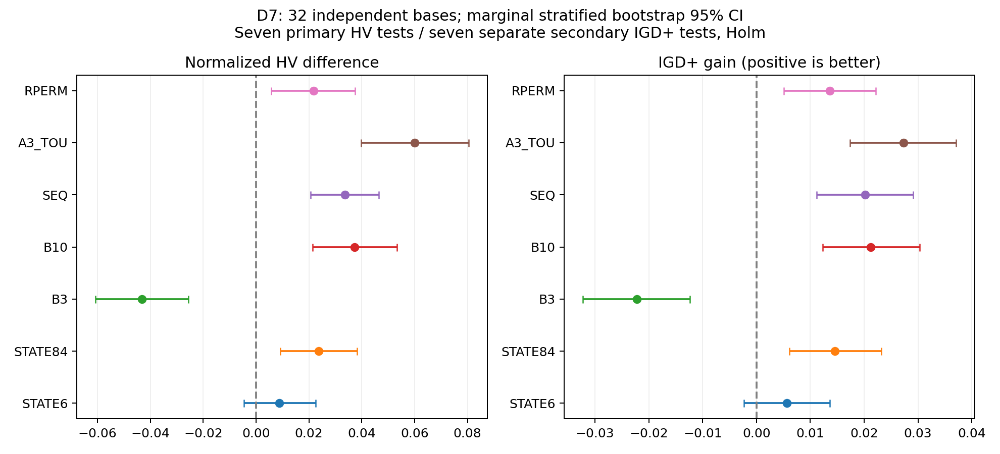
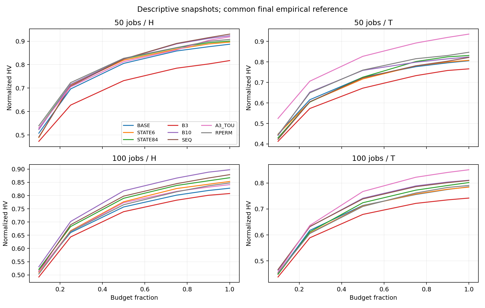

# D7 八组状态、算子、预算与替换实验分析报告

实验日期：2026-10-09；分析整理：2026-10-10（北京时间）。

**本批终于得到有重复性检验支持的改善方向。** 32个独立base上，STATE84、B10、SEQ、A3_TOU、RPERM相对BASE的HV提升均通过事前七项Holm校正，IGD+七项次级校正也支持同一方向。STATE6尚未确认优势；B3在两个指标上明显变差。A3_TOU平均相对HV增幅最大，但额外数值审计发现其同价H场景存在浮点近零排序扰动，必须修正后独立确认，不能把当前全部收益直接归因于电价匹配。

当前是单因素筛选结果：不直接合并默认算法、不把五项收益相加、不自动启动组合实验。运行源码和已完成原始数据保持冻结。

## Material Passport

- Origin Skill: academic-research-suite / experiment-agent
- Origin Mode: validate
- Origin Date: 2026-10-10
- Verification Status: ANALYZED（原数据全量验真、统计独立复算；未重新执行全部在线搜索）
- Version Label: D7-analysis-v1

## 1. 运行和数据是否可靠

- 正式1024/1024run、128/128同host八组块全部完成；32个新base，50/100jobs各16，H/T电价、seed1101/2202，每组128run。真实worker与supervisor均退出、exit complete，failure/stop/OOM为0。
- 2026-10-09北京时间08:09:47启动，2026-10-09T16:11:07.627704+08:00最终完成，约8小时1分钟。50/100jobs每run900/1800秒，两个节点各24solver。
- 冻结运行commit：f01b1417cf6be1cb5e1f375dbc710eb575c06123；canonical：6e4385dd639db34aec25f526943eda84bb66bb9961ca12252ef138d7888da114。原P2/D5 validator在服务器及本地原冻结入口全部通过，八项产物/input/init/config/source/seed/host一致。
- 完整12,434文件/3,769,303,573字节已逐文件size/SHA回收到本地；压缩tar248,520,032字节，SHA256：a3b83c6256e3a48d94d0e8b715e865d377ec645097d17f5c2c9469d1e51f08e0。完整manifest SHA256：4a43adca27a6038b9337ed91e84089b66e5c6c728b622e00245cbbb359fe2d30。服务器和本地原件均保留。
- 最终456,272个解的独立exact检查由原worker完成，已通过完整产物hash绑定；本轮没有fresh重评全部解。384次技术pilot完全分开，不进入以下统计。

## 2. 八组分别改了什么

| 组 | 单一变化 | 本批结论 |
|---|---|---|
| BASE | 原42状态、固定B6、出生邻域替换、原A8 | 配对基准 |
| STATE6 | 仅保留Preference×Progress，删去条件 | 尚未确认优势；不是等价证明 |
| STATE84 | 原42状态再加“至少两项超阈值”共存位 | HV和IGD+均通过筛选 |
| B3 | 固定候选预算3 | 整体质量明显变差 |
| B10 | 固定候选预算10 | HV和IGD+均通过筛选 |
| SEQ | 现有3→6→10顺序投入 | HV和IGD+均通过筛选 |
| A3_TOU | 仅A3先按原开始时间电价曝光代理排序 | 效果最大；同价近零数值扰动待修正确认 |
| RPERM | 随机邻域替换顺序 | HV和IGD+均通过筛选 |

A8仍为原版，没有W/GW。SSGS、exact、Archive、共享Q、五步轨迹、reward、触发和Polish均保持。STATE6/84改变Q共享关系，各组相同主seed与初始群体用于配对，不能称在线随机路径逐步相同。Williams八序列确保每组位置和一阶前序均衡，同base所有tariff/seed在同host。

## 3. 冻结统计方法

每个base/tariff的八组、两个seed共同经验非支配union定义参考前沿；按ideal/nadir归一化，跨度≤1e-12的轴除数为1。HV参考点(1.1,1.1)，只对HV排除超参考点，IGD+/IGD不裁剪。经验前沿不是已知真最优。先平均base内部H/T和两个seed的配对差，再以32base独立推断；不把1024run或状态调用当独立样本。

按照冻结协议，七个variant−BASE的HV组成主Holm家族，七个IGD+另作次级家族；20,000次按规模分层base bootstrap和100,000次双侧sign-flip，seed2026100907。sign-flip依赖配对零假设下符号可交换/差分对称条件；CI为逐项95%区间，不是同时置信区间。辅助指标和全部子组仅描述，不用于替换主检验，也没有事后加样或挑实例。

正的HV差与IGD+ gain均为处理更好；相对HV为各base内部配对百分比再平均，不是两个总体均值的比值。

## 4. 主结果：七组完整比较

| 相对BASE | HV差 [95%CI] | HV平均相对变化 | HV主Holm p | IGD+ gain [95%CI] | IGD+次Holm p | HV正/负base |
|---|---:|---:|---:|---:|---:|---:|
| STATE6 | +0.008835 [-0.004576, +0.022600] | +1.594% | 0.221458 | +0.005637 [-0.002363, +0.013612] | 0.184128 | 18/14 |
| STATE84 | +0.023754 [+0.009163, +0.038311] | +3.537% | 0.011730 | +0.014594 [+0.006108, +0.023188] | 0.006510 | 23/9 |
| B3 | -0.043215 [-0.060769, -0.025589] | -4.473% | 0.000650 | -0.022194 [-0.032242, -0.012365] | 0.000560 | 7/25 |
| B10 | +0.037345 [+0.021330, +0.053257] | +5.412% | 0.000650 | +0.021216 [+0.012270, +0.030336] | 0.000560 | 25/7 |
| SEQ | +0.033663 [+0.020665, +0.046534] | +4.982% | 0.000070 | +0.020215 [+0.011151, +0.029081] | 0.000560 | 27/5 |
| A3_TOU | +0.060090 [+0.039731, +0.080506] | +8.645% | 0.000070 | +0.027354 [+0.017325, +0.037116] | 0.000560 | 26/6 |
| RPERM | +0.021725 [+0.005778, +0.037505] | +3.588% | 0.030980 | +0.013594 [+0.005061, +0.022115] | 0.012380 | 22/10 |

五项正方向均通过两家族筛选，B3是显著负方向，STATE6区间跨零。这里检验的是各组对BASE，**没有冻结A3_TOU对B10、B10对SEQ等候选间胜负检验**；A3_TOU数值最大不等于已证明它比其他候选显著更好。独立确认与更广实例分布仍待。

## 5. 四类场景、目标端点和覆盖

| 组 | 50-H HV差 | 50-T HV差 | 100-H HV差 | 100-T HV差 |
|---|---:|---:|---:|---:|
| STATE6 | +0.009012 | +0.002050 | +0.025427 | -0.001147 |
| STATE84 | +0.013533 | +0.025575 | +0.039529 | +0.016378 |
| B3 | -0.069767 | -0.039584 | -0.020137 | -0.043372 |
| B10 | +0.036252 | +0.018151 | +0.069762 | +0.025215 |
| SEQ | +0.043167 | +0.015925 | +0.051234 | +0.024326 |
| A3_TOU | +0.031391 | +0.129817 | +0.013513 | +0.065641 |
| RPERM | +0.020532 | +0.041247 | +0.019946 | +0.005174 |

每个规模16独立base。STATE84、B10、SEQ、A3_TOU、RPERM的四场景描述均值全部为正；B3四场景全部为负。A3_TOU在跨区域异价T场景更明显，尤其50-T；这只是机制线索，不能把事后子组结果替代整体推断。两host完整表和两个seed原始配对均在完整分析包中。

| 组 | 最小Flow改善% [CI] | 最小Bill改善% [CI] | 覆盖净差 [CI] | 普通IGD gain [CI] |
|---|---:|---:|---:|---:|
| STATE6 | +0.013 [-0.072, +0.095] | -0.003 [-0.575, +0.578] | +0.089853 [-0.011786, +0.194927] | +0.006200 [-0.001773, +0.014183] |
| STATE84 | +0.031 [-0.071, +0.132] | +0.415 [-0.163, +1.012] | +0.129389 [+0.012139, +0.242469] | +0.014556 [+0.006064, +0.023164] |
| B3 | -0.053 [-0.159, +0.052] | -1.555 [-2.366, -0.768] | -0.197381 [-0.294289, -0.104236] | -0.022384 [-0.032640, -0.012399] |
| B10 | +0.062 [-0.031, +0.169] | +0.838 [+0.186, +1.472] | +0.230057 [+0.138698, +0.320206] | +0.020609 [+0.012221, +0.029414] |
| SEQ | -0.028 [-0.146, +0.095] | +0.605 [-0.108, +1.329] | +0.169625 [+0.079436, +0.263196] | +0.018668 [+0.009821, +0.027438] |
| A3_TOU | -0.082 [-0.208, +0.034] | +2.308 [+1.489, +3.159] | +0.174133 [+0.082403, +0.263864] | +0.026953 [+0.016773, +0.036983] |
| RPERM | +0.100 [-0.008, +0.211] | +0.474 [-0.250, +1.227] | +0.095399 [+0.004815, +0.193041] | +0.013702 [+0.005074, +0.022303] |

A3_TOU的Bill端点平均改善约2.31%，Flow端点约−0.08%；不是两目标同时按8.65%改善。两个端点通常来自不同解，不能拼成同一个支配解。Coverage为C(处理,BASE)−C(BASE,处理)，完整双向值公开。辅助CI和未校正p只作解释。

anytime在10/25/50/75/90/100%附近保存，最大观测迟到2.956s。图按目标预算比例分组，但快照发生于实际elapsed；不能称严格同一时刻比较，也未对每个快照作显著性检验。

## 6. 固定6是否还最好：吞吐与投入

| 组 | exact吞吐配对变化% [CI] | 子代吞吐变化% [CI] | 构造占整程% | Polish占整程% | Polish占exact% |
|---|---:|---:|---:|---:|---:|
| BASE | 基准 | 基准 | 15.706 | 15.743 | 41.644 |
| STATE6 | +0.813 [-0.883, +2.593] | +1.679 [-2.244, +5.664] | 15.795 | 15.811 | 41.489 |
| STATE84 | +1.331 [-1.040, +3.655] | +5.442 [+1.106, +9.673] | 16.041 | 15.444 | 40.895 |
| B3 | -16.067 [-18.067, -13.936] | +8.754 [+4.430, +13.495] | 18.469 | 17.819 | 52.266 |
| B10 | +14.715 [+12.284, +17.174] | -9.694 [-13.354, -5.917] | 13.398 | 13.488 | 32.918 |
| SEQ | -10.947 [-12.842, -9.047] | +13.379 [+8.594, +18.563] | 18.640 | 16.848 | 48.056 |
| A3_TOU | -1.245 [-3.209, +0.694] | +0.251 [-3.290, +4.062] | 15.667 | 16.054 | 41.843 |
| RPERM | +0.840 [-1.135, +2.835] | +3.337 [-1.072, +7.686] | 15.764 | 15.840 | 41.544 |

**本批已不支持“固定6在所有新场景仍最好”。** B10的子代吞吐约−9.69%，总exact吞吐却约+14.71%，同时质量变好；SEQ总exact吞吐约−10.95%，子代吞吐约+13.38%，质量也变好。两者通过不同投入方式得到收益，不能只以exact/s或子代/s选算法。B3虽多处理约8.75%子代，但exact少约16.07%、质量变差，便宜调用没有补偿候选质量损失。

SEQ的既有规则是：先评价3个；前三个相对incumbent有严格标量改善才继续到6；新增到6后相对前三个进一步严格改善才继续到10。它不是“前三个失败则给更多预算”。日志requested=10记录上限，effective记录实际评价；包括A8在内，部分构造仍会先生成上限候选，因此不能称减少了全部构造成本。

| 组 | 请求上限均值 | 实际完整评价/call |
|---|---:|---:|
| BASE | 6.000 | 5.801 |
| B3 | 3.000 | 2.915 |
| B10 | 10.000 | 9.652 |
| SEQ | 10.000 | 3.692 |

BASE约41.64%的全部exact来自Polish，约15.74%整程墙钟在Polish；总exact增长不能直接当MacroSearch收益。时间分类可能嵌套，不能相加当精确整程分解；构造占比仅汇总construction键。

## 7. 状态设计：有证据，但不要越过因果边界

STATE84相对BASE平均HV约+3.54%，主Holm p=.011730；共存信息的整程版本通过筛选。STATE6约+1.59%，主Holm p=.221458，不能确认删除条件能改善，也不能证明与42状态等价。

| 组 | 每run平均实际访问state数 | 配置state数 |
|---|---:|---:|
| BASE | 16.875 | 42 |
| STATE6 | 6.000 | 6 |
| STATE84 | 25.828 | 84 |

BASE访问中TOU约43.67%、Resource约30.29%，KV约0.011%；STATE84共存位=1约36.36%。并非84个状态全部被充分访问，Normal+共存位等槽还存在不可达结构。当前KV访问稀少不等于A2无用，因为A2同时处理资源路径。STATE6仍计算原severity，所以这组主要测试Q共享，不能当“省掉状态计算”的性能实验。

本批支持有限共存信息作为候选，但尚未证明哪一类状态应配哪一个算子。state×action调用、reward和接受率都受Q策略选择和各自搜索轨迹影响；高reward未必说明动作在同一个来源状态上优于另一个动作。下一步若要设计机会状态，应在冻结同源状态池对全部动作、候选预算做反事实回放，并按base开发/留出，而不是从线上相关性直接指定动作。

## 8. A3电价排序：最有希望，也有必须先处理的数值问题

A3_TOU仅把固定原开始时间、active-minus-idle功率和TOU积分构成的迁移代理放到排序第一位。它忽略迁移后重排、active union重叠、批次终点和demand，因此不是exact边际Bill；完整SSGS和exact仍决定接受，最终目标值的真实性未受排序问题影响。

| A3观察 | BASE | A3_TOU |
|---|---:|---:|
| calls | 97632 | 96787 |
| 构造ms/call | 75.628 | 79.381 |
| 接受率% | 11.297 | 11.764 |
| reward/call | 0.3454 | 0.3947 |

这是实际轨迹中的描述，不能称相同状态上接受率净提高。构造每call约贵5%，整程总吞吐没有明显下降，说明简单排序比继续增加复杂构造更值得确认。

**额外同价审计发现：** 原实现用连续左结合的“目标P+目标D−原P−原D”计算代理差；在数学上各region完全同价且功率相同的H实例中，差应为0，但浮点相消会产生极小非零数。这些值放在排序第一位，能改变不同Job之间的受限候选池。此处是事后只读数值审计，不是事前主质量检验，也没有修改/重跑正式算法。

| 电价 | 第一初始解来源数 | 等价曝光存在非零舍入的来源 | top12顺序改变来源 | top12集合改变来源 | 最大等价曝光差绝对值 |
|---|---:|---:|---:|---:|---:|
| H | 64 | 64 | 62 | 62 | 1.776e-15 |
| T | 64 | 0 | 64 | 64 | 0.000e+00 |

每个正式块只取第一个冻结初始genotype；H/T合计128来源。审计范围不能代表整个线上访问池，但已足以否定“同价H一定保持原A3排序”的解释。H场景观察收益不能全部归因于电价；T场景也可能同时含有真实曝光排序与近零 tie 扰动。整体统计显示的是**冻结实现的效果**，不是对纯电价机制的无混杂确认。

建议先用稳定的分项差（目标P−原P）+（目标D−原D），并按明确的费用数值容差保留原负载/索引tie顺序；先做同价候选池与RNG等价、异价边界/近零反例与exact语义验收，再在全新base确认。该修正尚未实施，不能把修正后的版本与当前结果混称同一算法。

## 9. 基准八个动作的成本与收益观察

| 动作 | 记录calls | 构造ms/call | 完整exact/call | 接受率% | reward/call |
|---|---:|---:|---:|---:|---:|
| A1 | 207303 | 0.832 | 6.000 | 23.866 | 0.7897 |
| A2 | 168948 | 14.890 | 6.000 | 17.869 | 0.6311 |
| A3 | 97632 | 75.628 | 6.000 | 11.297 | 0.3454 |
| A4 | 103469 | 0.202 | 5.930 | 12.440 | 0.3492 |
| A5 | 122278 | 0.296 | 5.964 | 17.436 | 0.5125 |
| A6 | 81425 | 1.168 | 6.000 | 6.961 | 0.4805 |
| A7 | 435418 | 33.677 | 6.000 | 34.222 | 0.7361 |
| A8 | 66767 | 21.273 | 2.355 | 13.564 | 0.5569 |

A7的接受率和访问量高，A8实际完整候选约2.35/call，低于B6；A3构造每call相对贵。这些观察有助于设计action×budget与机会特征，但不能依接受率删掉A6或只保留A7：随机结构跳跃、最终Archive贡献和长期交互不等于单步reward，动作访问选择存在偏差。完整八组action、预算和状态数据均随分析包提供。

## 10. 下一步建议：缩小到有证据的几项

1. **先修正A3近零排序，再独立确认A3。** 这是最直接的算子匹配方向，也最先需要排除数值扰动；先保证H控制真实保持排序，再解释T场景效果。保留原SSGS/exact与同一受限池额度，暂不增加复杂峰窗构造。
2. **预算优先保留B10与SEQ，停止B3作为全局主候选。** 两者均在本批改善质量，但并未证明彼此优劣；用全新base直接配对确认原B6、B10、SEQ。未来若做action×budget，应观察不同动作新增第4–6/7–10个候选的收益与成本，而不是仅依当前severity给预算。
3. **STATE84继续，STATE6降优先级。** 保留有限共存信息，先确认，之后用同源状态×动作回放判断需要哪种机会特征；不直接继续膨胀维度。
4. **RPERM是成本小的框架候选。** 它在本批两指标改善，可保留在独立确认，但不是已证明创新，也没有证明它能与其它组收益相加。
5. **组合需单独验证交互。** 在单项确认后优先做BASE/修正A3/SEQ/修正A3+SEQ的2×2设计，解释排序与资源投入是否互相帮助；STATE84或RPERM另分阶段加入，不直接四项堆叠。所有组合、修正和新实例实验本轮均未启动。

相比D5/D6，这批变化更直接涉及构造候选、每call投入与状态共享，已经出现可检验的在线质量改善。但不同批次的实例、wall预算与经验归一化不同，不能把D7绝对HV与旧批次相减，也不能据本批声称MOEA/D已经优于NSGA-II。

## 11. 验证、统计误用检查与交付

- 独立工具不导入主分析实现，复算84项base均值/bootstrap区间/sign-flip及两个完整Holm家族；1024次HV独立实现一致。64个BASE/seed1101的IGD+与项目另一个实现交叉一致。
- 新增6项统计反例测试；本地452tests/full gates通过，overall84.92%/core96.92%。原默认replay、D03历史发布、wheel和source-pinned CLI通过。早期操作入口误写及局部验真工具的截取范围已修正并保留历史日志；没有改运行算法或统计协议。
- 11/11统计误用检查：四场景/两host完整保留以检查聚合反转；推断单位只到base；样本选择边界明确；不条件化线上state作为因果控制；诊断率不当分类器精度；不选极端实例追涨；正式零失败且无丢失；七项家族完整校正；预先冻结口径与事后数值审计分列；轨迹相关性不当因果；成本和访问变化不当收益原因已证。未发现需要剔除正式数据的完整性问题，A3机制解释仍待修正确认。
- 筛选后的优胜方向仍需全新独立样本确认；未显著不等价，未做非劣/等价检验。查新与官方一区分区认证本轮未执行，不声称新颖性。
- 原运行source保持冻结，统计和报告走独立交付分支，PR未合并。全raw/manifest/checksum、运行及分析bundle、完整统计/图/复现说明上传新正式Release；最终uploaded/size/digest回读和抽样download证据以Release的closure为准，报告撰写时不能冒充发布完成。

复现步骤见 [REPRODUCE_D7.md](REPRODUCE_D7.md)。完整84项统计见 [report.json](data/report.json)；base效应、action/预算/状态和anytime汇总在data目录。原始逐run和逐state×action大表在完整分析ZIP，不能用这些事件表扩大独立样本数。
