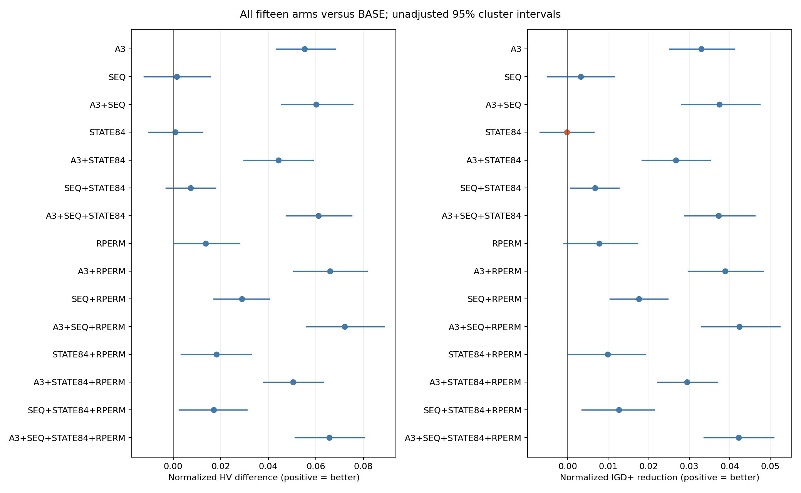
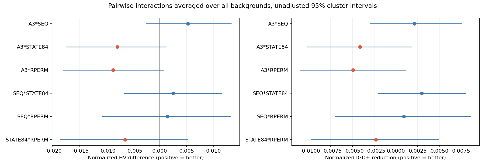
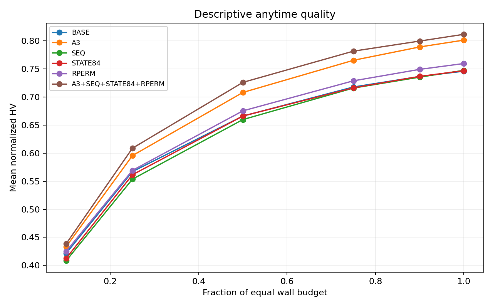

# D8 四因素确认：A3稳定获益，四项全开尚未优于A3

日期：2026-10-11。状态：4096/4096正式运行、256/256完整配对块执行验收、全量本地回收、冻结分析与独立复算均通过；默认main/F6/原A8未晋级。

## 核心判断

本轮有明确的正结果：数值修正后的A3单独开启，归一化HV平均增加0.055352，95%未校正cluster CI为[0.043239,0.068084]；平均配对相对HV增加10.11%。IGD+下降0.032975。两项主确认联合Holm均为0.000080；HV在58/64独立base为正、IGD+在54/64为正。不是只有描述均值上升。

SEQ、STATE84、RPERM的单项优势在D8未确认，不能沿用D7筛选时的显著性当本轮独立确认。四项全开比BASE有优势，但ALL−A3的HV/IGD+ Holm分别0.895851/0.501095，尚未证明加上另外三项优于A3。A3+SEQ−A3两项也未确认。

建议下一阶段把单A3作为简洁研究参考线，保留原BASE共同报告，优先改善初始化费用端和折中覆盖；固定6、原42状态和原替换顺序继续作为隔离初始化改动的设置。这是后续实验建议，尚未修改默认算法或把未显著解释成等价。

## 完整性与执行阶段

正式64全新独立base：50任务1305001–1305032、100任务1315001–1315032；每base H/T两版本、1101/2202两seed、16因素组，4096次/256同host块；每次900/1800秒。四个因素按A3/SEQ/STATE84/RPERM二值完整交叉，原100成员初始化、SSGS/exact、原A8/Archive等保持。

原四容器停用后，100任务128完整块/2048正式结果按原host保留；50任务128部分块整体quarantine后在新两host重跑2048正式结果。896旧完成partial及128attempt和旧运维历史保留，不算正式重复。50任务现有host为b518ece5cd01/878be0fed7b0；100任务原host为550708f8d937/196ec6b261f1/087e7b68475d/2470a7141593。所有同base的组、H/T和seed仍同host。规模子组与执行阶段/资源条件存在关联，不能单凭50/100差异归因规模。

北京时间10月11日01:14:47全部计算结束，实际worker/supervisor0，failure/stop/OOM0。原P2/D5/D8 validator与每run八项SHA、输入/初始化/config/source/seed/Q维度/time_budget/同host通过。运行source d5374fed12bfe8950175d7e2693af078ad977c2c，canonical c8ccc1f9c2d101c9ff78c79837838aa3bdf4574e3da8a7282bd5d86c00621e30始终冻结。原worker最终独立exact检查由产物SHA绑定；回收未fresh重评全部正式解。新初始化观察25,600fresh exact另行标注。

完整回收58,677文件、16,009,829,318字节，压缩包1,082,832,528字节；全部archive成员与本地文件逐size/SHA一致。压缩包SHA256：32594d72fbf464c01e3cea0580c856e14e71d204c8dfa1d64e45c178e1a714f5；完整manifest SHA256：dada0e01b709d68036e9d23b1dd1ef970af933c0194fbda49c154bedd0e67d2e。服务器与本地原件保留，旧批次和E15/E16未操作。

## 统计与因果解释边界

64base为独立单位，先平均同base四个H/T/seed观测；不是4096独立样本。50/100各32，20,000次按规模分层base bootstrap、100,000次paired sign flip、seed2026101008。共同经验ND union按base/tariff、16组×两seed构成；共同ideal/nadir归一化，退化轴除数1，HV参考(1.1,1.1)，超参考的HV点排除，IGD+/IGD不裁剪。经验union不是真实最优前沿。

三个事先固定的Holm scope分别为8项主确认、34项次级组合、12项探索交互；各自控制，不称三家族联合校正。95%CI未多重校正。其余相对HV、端点、coverage、吞吐/状态/高阶效应为描述或辅助结果。反号同样保留，不按效果扩样、不挑子组替代主结论、不把未显著当等价。

独立CSV实现复算264项cluster mean/20k CI/100k sign flip和三个Holm家族，并从原objectives.csv独立复算4096次HV全部一致；128个BASE seed1101 IGD+与独立已有指标实现交叉一致。初始化并行参考缓存与完整D8生成的128共同reference逐结构完全一致后才接受。

## 四个单因素主确认

|比较|HV差与95%CI|HV Holm p|配对相对HV均值|IGD+下降与95%CI|IGD+ Holm p|结论|
|---|---:|---:|---:|---:|---:|---|
|A3-BASE|+0.055352 [+0.043239, +0.068084]|7.99992e-05|+10.11%|+0.032975 [+0.025190, +0.041123]|7.99992e-05|两指标正向通过|
|SEQ-BASE|+0.001544 [-0.012302, +0.015643]|1|+1.73%|+0.003206 [-0.005054, +0.011455]|1|未确认两指标优势|
|STATE84-BASE|+0.000911 [-0.010435, +0.012341]|1|+1.34%|-0.000157 [-0.006895, +0.006496]|1|未确认两指标优势|
|RPERM-BASE|+0.013658 [+0.000056, +0.027893]|0.370436|+3.86%|+0.007785 [-0.000987, +0.017149]|0.522445|未确认两指标优势|

A3保留稳定曝光差/费用桶，之后使用原负载/KV/index tie；恒价完整池/RNG/轨迹等价已在启动前测试。本轮仍使用原开始时刻TOU代理，不是新starts、活动并集、Demand的精确边际Bill。所有候选经原SSGS/exact，因而本轮确认的是该稳定实现的等时间质量收益，不是代理已经等于真实Bill或文献创新已成立。

RPERM描述均值正向，其未校正HV CI下界略高于0，但主家族Holm未过；报告以预注册校正判断。SEQ、STATE84的正相对HV均值也不能覆盖绝对HV/IGD+未确认的事实。

## 十一个多因素组合与直接比较

|比较|HV差与95%CI|HV Holm p|配对相对HV均值|IGD+下降与95%CI|IGD+ Holm p|结论|
|---|---:|---:|---:|---:|---:|---|
|A3+SEQ-BASE|+0.060119 [+0.045531, +0.075584]|0.000339997|+11.62%|+0.037477 [+0.028063, +0.047388]|0.000339997|两指标正向通过|
|A3+STATE84-BASE|+0.044259 [+0.029778, +0.058926]|0.000339997|+8.71%|+0.026726 [+0.018333, +0.035196]|0.000339997|两指标正向通过|
|SEQ+STATE84-BASE|+0.007334 [-0.002948, +0.017736]|0.695673|+2.61%|+0.006721 [+0.000765, +0.012663]|0.210978|未确认两指标优势|
|A3+SEQ+STATE84-BASE|+0.061148 [+0.047478, +0.075059]|0.000339997|+12.53%|+0.037270 [+0.028857, +0.046202]|0.000339997|两指标正向通过|
|A3+RPERM-BASE|+0.066040 [+0.050656, +0.081458]|0.000339997|+12.44%|+0.038831 [+0.029694, +0.048273]|0.000339997|两指标正向通过|
|SEQ+RPERM-BASE|+0.028866 [+0.017008, +0.040441]|0.000339997|+5.52%|+0.017576 [+0.010453, +0.024699]|0.000339997|两指标正向通过|
|A3+SEQ+RPERM-BASE|+0.072065 [+0.056055, +0.088614]|0.000339997|+13.68%|+0.042330 [+0.032993, +0.052335]|0.000339997|两指标正向通过|
|STATE84+RPERM-BASE|+0.018285 [+0.003321, +0.032761]|0.152908|+4.21%|+0.009866 [-0.000059, +0.019208]|0.294897|未确认两指标优势|
|A3+STATE84+RPERM-BASE|+0.050374 [+0.037901, +0.063054]|0.000339997|+9.80%|+0.029492 [+0.022132, +0.036915]|0.000339997|两指标正向通过|
|SEQ+STATE84+RPERM-BASE|+0.017093 [+0.002488, +0.030986]|0.166638|+4.00%|+0.012676 [+0.003474, +0.021365]|0.0599994|未确认两指标优势|
|A3+SEQ+STATE84+RPERM-BASE|+0.065698 [+0.051179, +0.080306]|0.000339997|+12.39%|+0.042142 [+0.033662, +0.050867]|0.000339997|两指标正向通过|

### ALL−单因素、A3+SEQ−单因素

|比较|HV差与95%CI|HV Holm p|配对相对HV均值|IGD+下降与95%CI|IGD+ Holm p|结论|
|---|---:|---:|---:|---:|---:|---|
|A3+SEQ+STATE84+RPERM-A3|+0.010345 [-0.009239, +0.028375]|0.895851|+4.03%|+0.009168 [-0.001880, +0.019427]|0.501095|未确认两指标优势|
|A3+SEQ+STATE84+RPERM-SEQ|+0.064153 [+0.049351, +0.079656]|0.000339997|+12.61%|+0.038937 [+0.029401, +0.049125]|0.000339997|两指标正向通过|
|A3+SEQ+STATE84+RPERM-STATE84|+0.064786 [+0.049480, +0.080545]|0.000339997|+11.87%|+0.042300 [+0.032586, +0.052616]|0.000339997|两指标正向通过|
|A3+SEQ+STATE84+RPERM-RPERM|+0.052039 [+0.037004, +0.067753]|0.000339997|+9.13%|+0.034357 [+0.024573, +0.044405]|0.000339997|两指标正向通过|
|A3+SEQ-A3|+0.004767 [-0.013862, +0.022634]|0.895851|+3.90%|+0.004502 [-0.005976, +0.015405]|0.895851|未确认两指标优势|
|A3+SEQ-SEQ|+0.058575 [+0.043879, +0.073355]|0.000339997|+11.66%|+0.034271 [+0.024579, +0.044238]|0.000339997|两指标正向通过|

所有含A3的七个多因素组合都优于BASE，SEQ+RPERM也在两指标通过；其余三项无A3组合未确认两指标优势。这个结果并不证明某个组合优于A3，也不证明协同。ALL确实优于SEQ/STATE84/RPERM，而未确认优于A3；A3+SEQ优于SEQ，而未确认优于A3。

A3+SEQ+RPERM的相对HV描述均值最高（+13.68%），A3+RPERM为+12.44%，ALL为+12.39%；未预注册它们之间的全面直接胜负检验，所以不能据排序宣布最优配置。若要采用额外因素，应在新独立base预先指定少数直接比较及实用收益门，而不是回到这批数据挑胜者。

## 六个交互与完整高阶描述

两因素交互为开启两项的增量减去各自增量，平均其余两项的四种背景；IGD+取下降为正。六项×两指标12项Holm全部未通过。不能把SEQ+RPERM胜BASE或ALL胜BASE解释成已确认的协同。

|交互|HV差中差与95%CI|HV Holm|IGD+有益差中差与95%CI|IGD+ Holm|
|---|---:|---:|---:|---:|
|A3*SEQ|+0.005255 [-0.002471, +0.013304]|1|+0.002127 [-0.002917, +0.007545]|1|
|A3*STATE84|-0.007913 [-0.017312, +0.001191]|1|-0.004130 [-0.010155, +0.001770]|1|
|A3*RPERM|-0.008703 [-0.017938, +0.000657]|0.937551|-0.004946 [-0.011006, +0.001137]|1|
|SEQ*STATE84|+0.002475 [-0.006580, +0.011522]|1|+0.002971 [-0.002074, +0.008006]|1|
|SEQ*RPERM|+0.001435 [-0.010726, +0.013119]|1|+0.000905 [-0.006993, +0.008626]|1|
|STATE84*RPERM|-0.006454 [-0.018463, +0.005146]|1|-0.002312 [-0.009726, +0.004918]|1|

|因素/组合|平均背景的描述HV效应|IGD+有益效应|
|---|---:|---:|
|A3|+0.048420|+0.028696|
|SEQ|+0.008123|+0.006735|
|A3+SEQ|+0.005255|+0.002127|
|STATE84|-0.004068|-0.001930|
|A3+STATE84|-0.007913|-0.004130|
|SEQ+STATE84|+0.002475|+0.002971|
|A3+SEQ+STATE84|+0.016471|+0.009251|
|RPERM|+0.012676|+0.007060|
|A3+RPERM|-0.008703|-0.004946|
|SEQ+RPERM|+0.001435|+0.000905|
|A3+SEQ+RPERM|-0.003178|-0.000707|
|STATE84+RPERM|-0.006454|-0.002312|
|A3+STATE84+RPERM|+0.000939|+0.001553|
|SEQ+STATE84+RPERM|-0.012051|-0.003772|
|A3+SEQ+STATE84+RPERM|+0.018453|+0.013764|

上表完整列出四个边际、六个二阶、四个三阶、一个四阶效应。高阶只描述，没有追加显著性检验；不会挑一个正的高阶数值当创新或稳定机制。

## 全部规模/电价子组与端点

|子组|方案|HV差|相对HV|IGD+下降|最小Bill下降|最小Flow下降|
|---|---|---:|---:|---:|---:|---:|
|50_H|A3|+0.020102|+4.10%|+0.012312|+0.40%|+0.012%|
|50_H|SEQ|+0.005726|+2.81%|+0.004522|+0.02%|-0.022%|
|50_H|STATE84|-0.014562|+0.10%|-0.007995|-0.26%|+0.026%|
|50_H|RPERM|+0.007594|+3.02%|+0.004869|+0.49%|+0.002%|
|50_H|A3+SEQ+STATE84+RPERM|+0.010877|+2.86%|+0.009544|+0.36%|+0.007%|
|50_T|A3|+0.142347|+27.01%|+0.089490|+6.02%|-0.075%|
|50_T|SEQ|+0.005410|+3.36%|+0.001849|+0.38%|-0.034%|
|50_T|STATE84|+0.004093|+1.78%|+0.000718|+0.24%|-0.044%|
|50_T|RPERM|+0.022782|+7.42%|+0.015230|+1.23%|+0.003%|
|50_T|A3+SEQ+STATE84+RPERM|+0.156515|+31.26%|+0.105063|+5.68%|-0.064%|
|100_H|A3|-0.002154|-0.16%|+0.001659|-0.21%|-0.006%|
|100_H|SEQ|-0.004688|+0.18%|+0.003389|-0.60%|+0.134%|
|100_H|STATE84|-0.008714|-0.53%|-0.002043|-0.32%|+0.210%|
|100_H|RPERM|-0.003602|+0.35%|+0.001629|-0.27%|+0.149%|
|100_H|A3+SEQ+STATE84+RPERM|-0.001408|+0.53%|+0.004649|-0.12%|+0.092%|
|100_T|A3|+0.061113|+9.48%|+0.028437|+2.93%|-0.072%|
|100_T|SEQ|-0.000272|+0.57%|+0.003064|-0.85%|-0.114%|
|100_T|STATE84|+0.022828|+3.98%|+0.008690|+0.89%|+0.003%|
|100_T|RPERM|+0.027859|+4.64%|+0.009412|+1.33%|-0.102%|
|100_T|A3+SEQ+STATE84+RPERM|+0.096807|+14.90%|+0.049313|+3.51%|-0.131%|

A3的描述收益以T电价更突出：50_T相对HV+27.01%、Bill端下降6.02%；100_T相对HV+9.48%、Bill端下降2.93%。H的两规模分别+4.10%/−0.16%相对HV，不能写成每个子组都显著改善。整体A3端点Bill下降约2.29%，Flow端平均−0.035%（轻微反向、辅助CI跨0）；主要改善方向与费用搜索动机一致，未证明所有收益来自某个单独账单组件。

完整四原shard的同base配对描述、全部子组的所有21比较都在report.json和原CSV，未删除不利子组。

## Anytime、吞吐和状态—动作诊断

图中保留BASE、四单因素和ALL，完整16组各6个实际快照在结果表。协议所列五个中途时点为10/25/50/75/90%，另有100%终点。平均图是描述，实际快照延迟见下表，不把晚采样当恰好目标秒。

最大实际快照延迟为4.819秒。A3从10%均值已有正向，到终点差距更大；SEQ前半程平均略低、终点接近BASE，尚无稳定质量增益。

|方案−BASE|exact吞吐配对变化|offspring吞吐变化|A8构造ms/call变化|A8整程构造占比变化(pp)|
|---|---:|---:|---:|---:|
|A3|-0.92%|-0.97%|+0.37%|-0.002|
|SEQ|-9.75%|+11.17%|+66.97%|+0.932|
|STATE84|+0.65%|+0.69%|+0.67%|+0.018|
|RPERM|+0.69%|+0.61%|+0.67%|+0.045|
|A3+SEQ+STATE84+RPERM|-10.88%|+6.42%|+67.03%|+0.895|

SEQ的offspring吞吐约+11.17%，exact吞吐约−9.75%，不能把前者当质量提高。SEQ仍构造最大10池，A8的单次构造成本平均约+66.97%，整程A8构造占比从BASE约0.90%到SEQ约1.83%；全部构造占比从15.41%到18.17%，未实现“少评价就无构造成本”。这些为运行中测得描述，算子选择和incumbent也随政策变化，不能作完全固定调用集的成本因果估计。

|方案|Q状态数|平均访问状态数|未访问状态比例|A8调用/次运行|
|---|---:|---:|---:|---:|
|BASE|42|16.22|61.37%|432.33|
|A3|42|16.28|61.24%|431.18|
|SEQ|42|16.31|61.17%|535.65|
|STATE84|84|24.91|70.35%|442.48|
|RPERM|42|16.53|60.65%|453.46|
|A3+SEQ+STATE84+RPERM|84|25.11|70.11%|521.03|

STATE84平均访问约24.91/84状态，原BASE约16.22/42。共存位提高了已访问状态的绝对数量，同时把学习数据分散到更多单元；当前只能描述，不能断言这就是无收益的原因。state_action/Q/预算直方图全量保留，在线平均reward、接受率或调用比例都不是同源反事实。进一步加状态应先检验该特征能否预测某算子的净收益，而不是仅让状态更细。

## 下一步安排建议

1. 优先初始化费用端：首轮256组匹配观察显示最小Flow端约0.29%缺口，而最小Bill端约20.20%。完整随机/纯方法/压力场景对照入口已准备，原07:30窗口结束后未派发，延长时间待用户回复。具体矩阵与候选改进见[初始化报告](initialization_front_analysis.md)。

2. 保留简洁A3参考线：将BASE与单A3一起作为后续整程对照。在初始化方法尚未比较前，不把ALL直接替换默认；新初始化若主要降费，也需检验它与A3的收益是否重叠，可在独立留出base做A3开关×初始化开关2×2，固定总wall时间。

3. SEQ下一步先解决真正按需构造：若要继续预算方向，先分离“评价3/6/10”与“总是构造10”成本，严格保证同源候选、顺序与exact接受语义，完成等价性和benchmark后再独立确认。当前SEQ版本不追加到显著。

4. STATE84/RPERM保持备选：不沿D7筛选结论原样大规模扩样。状态方向优先设计与A3机会、峰值压缩/时移机会直接对应的低成本特征，在同incumbent、同权重和固定预算下做反事实动作收益，再留出验证；替换方向要新增直接比较才决定是否叠加。上述均是建议，未自动启动。

## 工程、交付与复现

独立analysis分支research/d8-analysis-20261011，运行source不变。分析单测覆盖支配/退化归一化/IGD+差异/家族scope/cluster独立/阶次交互，来源测试覆盖原构造随机流和D8 H输入共用。最终本地488tests/full gates通过，overall84.75%、core96.92%；独立264统计/三个家族/4096HV及128IGD+交叉通过。初次只读reference辅助脚本误用manifest结构、图表对浮点表示整数calls的解析、H/T来源guard均保留修正记录，未重试solver或改变原科学矩阵。

[完整Release：raw、全部表/图、运行与分析bundle、初始化入口bundle、manifest/checksum及复现说明](https://github.com/atlantic0423/geo-llm-scheduler/releases/tag/d8-formal-analysis-20261011-d5374fe)。准确head PR/双Python CI、资产回读和抽样下载验收以最终receipts为准；原件保留。GitHub整raw包不再次全量下载，完整本地包与成员已全部验证，GitHub全部size/digest和raw前65,536字节抽样单独验证。

[完整冻结统计与子组](data/report.json)、[独立复算验收](data/independent_statistics_audit.json)、[实际预算/Q/anytime描述](data/descriptive_diagnostics.json)、[全量本地回收](data/full_raw_local_validation.json)、[复现步骤](REPRODUCTION.md)。
