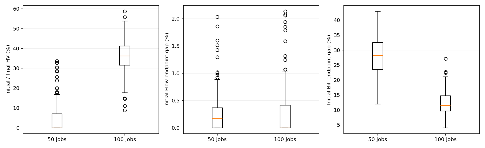
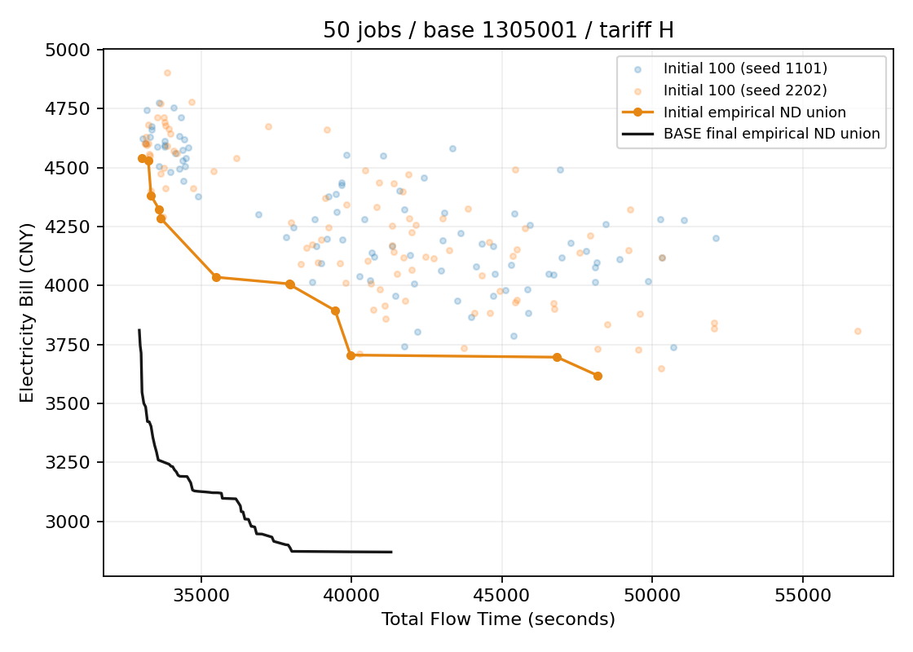
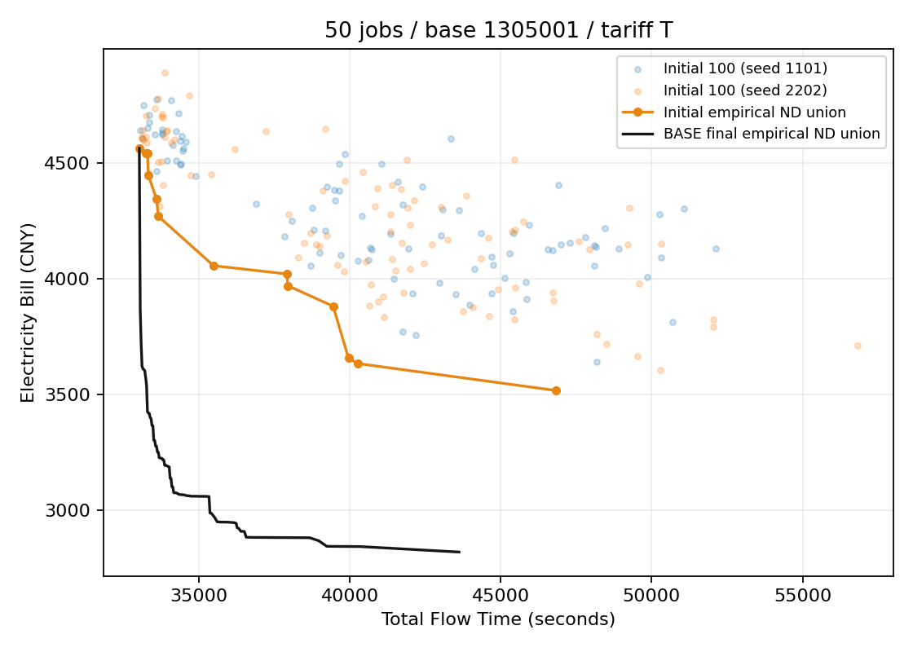
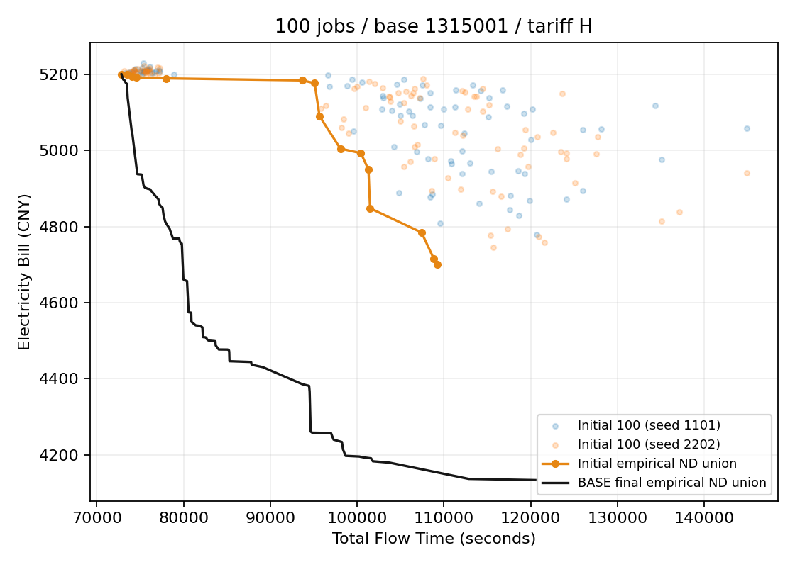
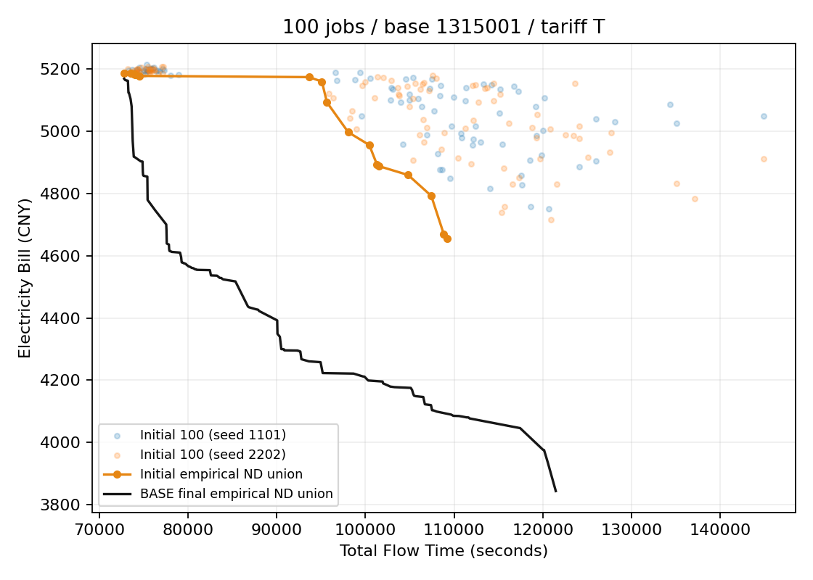
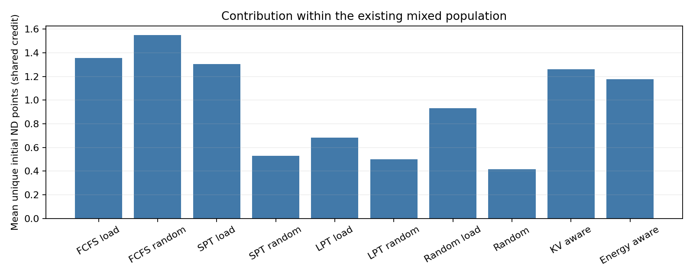

# 初始化 Pareto 前沿首轮诊断：费用端仍有明显缺口

日期：2026-10-11。状态：256组匹配观察已完成；新随机/纯方法/压力场景对照尚未启动。运行源码仍为D8冻结d5374fed12bfe8950175d7e2693af078ad977c2c。

## 结论与研究意义

现有初始化能够形成一小段非支配前沿，但还不能称为覆盖充分、接近最终搜索质量的前沿。每组100个不同基因型平均有9.71个不同非支配目标点，BASE最终平均有65.65个。最小Flow端相对最终仅差0.29%，最小Bill端平均高20.20%。下一步应优先构造低电费解和有效折中解，再验证这些初始优势是否保留到迭代结束。

这项比较包含最终BASE额外900/1800秒的搜索，不能据此判定原初始化比另一种初始化更差。当前证据回答的是“距离已观察到的搜索前沿还有什么缺口”，不能证明改好初始化一定提高整程效果。随机和纯方法对照仍是必要的下一步。

## 数据、验真与配对边界

64独立base，50/100任务各32；每base有H/T两电价版本、1101/2202两个算法seed，共128实例版本、256种群、25,600候选。每个种群100个不同基因型；原SSGS解码和exact评价后，服务器独立重复exact，25,600条全部一致。原输入/初始化/source/BASE archive SHA绑定，所有观测基因型逐项与D8冻结初始化一致。全部在北京时间07:26:51前完成，原07:30停止派发窗口内。

**D8使用H输入生成共同初始化，再把同一基因型列表用于H/T。** 原准备入口run_d8_campaign.py即如此，来源回放按H输入重建，全部列表和RNG后态匹配。这保证D8因素对照一致，但T图不是“按T电价原生生成初始化”的测试。报告保留该边界；未来新诊断会按各自H/T输入生成。来源回放最初的T输入断言发现了这一差异，证据保留，修正的是分析来源映射，没有重跑或改动原实验。

两种电价、两seed不作为256个独立样本。此处结果为完整平衡矩阵的描述性均值、范围和全算例图，未做初始化方法之间的显著性比较。100任务原BASE在原四host完成，50任务整块在新两host重跑；该阶段差异沿用D8配对限制。

## 如何量化“不错的前沿”

同一实例的D8十六组×两个seed最终经验非支配union只提供共同ideal/nadir归一化；它不是真实Pareto最优集合。HV参考点为(1.1,1.1)，初始/最终同一除数和参考点。初始化HV保留率指初始HV除以同seed BASE最终HV，不是算法成功率；较差初始点超出参考点时不贡献HV，0%也不表示没有可行解。原始物理单位散点和端点差距同时保留。

IGD+这里以同seed BASE最终非支配集合为目标，取共同归一化距离；双向coverage按弱支配、1e-12归一化容差。额外检查11个等间隔Tchebycheff权重方向的最优标量差，用来观察折中方向缺口，而非把少量权重当整条真实前沿。

|规模/电价|初始ND目标点|最终ND目标点|初始/最终HV|Flow端差距|Bill端差距|IGD+到最终|
|---|---:|---:|---:|---:|---:|---:|
|50_H|9.39|58.72|4.77%|0.28%|27.16%|0.8906|
|50_T|9.48|57.14|5.57%|0.31%|29.08%|0.8047|
|100_H|9.84|74.00|35.15%|0.23%|11.76%|0.3477|
|100_T|10.11|72.73|36.72%|0.35%|12.81%|0.2947|

整体HV保留率均值20.55%，范围0–58.68%；不同非支配目标点4–16；Bill端差距4.03–42.93%。最终BASE弱覆盖全部初始ND点；初始仅覆盖最终约0.75%。这与Archive保留初始解和后续逐步替换相容，不是独立证明全局最优。

50任务的费用端缺口约27–29%，100任务约12–13%。两规模还伴随不同预算和执行阶段，不能只据这组差异断言规模增大就使初始化更好。唯一直接的方向信号是：两个规模、两个电价版本均以费用端缺口为主。

## 全算例图与固定展示样本

完整结果包含128张算例图，每张画两个seed各100个原始散点、两seed初始经验ND union和对应BASE最终经验ND union。连线仅帮助阅读，不代表两个离散调度方案之间任意线性插值可行。下列示例固定选每个规模的第一个base，不按表现挑样。

### 50任务 / base1305001 / H

### 50任务 / base1305001 / T

### 100任务 / base1315001 / H

### 100任务 / base1315001 / T

## 十类原构造的来源贡献

来源标签通过原H构造器完整回放恢复，不从目标值猜测。相同ND目标点若由多个来源产生，按不同来源均分一次点贡献；同一来源多个相同目标候选不重复计贡献。所有组实际均为每模式10名成员，没有出现随机补额。下表只是同一个混合池中的条件贡献，不能当作每种方法单独构造100成员的胜负。

|模式|构造规则|成员/组|ND候选/组|唯一ND点均分贡献/组|
|---|---|---:|---:|---:|
|0|FCFS+MinLoad|10|1.363|1.355|
|1|FCFS+Random assignment|10|1.551|1.551|
|2|SPT+MinLoad|10|1.305|1.305|
|3|SPT+Random assignment|10|0.527|0.527|
|4|LPT+MinLoad|10|0.684|0.684|
|5|LPT+Random assignment|10|0.500|0.500|
|6|Random order+MinLoad|10|0.934|0.934|
|7|Random order+Random assignment|10|0.414|0.414|
|8|KV-aware|10|1.262|1.260|
|9|Energy-aware|10|1.184|1.178|

FCFS随机assignment、FCFS负载、SPT负载和KV-aware贡献相对较多，纯随机的即时ND贡献较少。但随机成员仍可能提供后续进化有用的结构多样性，当前不能直接删除。每种来源只获得10名，抽样、相互支配以及H生成共同初始都会影响贡献，纯方法对照和整程实验必须补齐。

## 下一步测试和改进顺序

### 1. 先完成已有的原方法对照

新入口已实现并通过502本地完整测试、准确head双Python CI和两个目标各26专项。冻结source e57d385b2a4dcc7546e2f54e920cccbe2b6eb7a1，Draft PR46未合并。计划36新base、72H/T版本，50/100/200任务，六类混合/集中释放/KV高延迟/计算紧张/VRAM紧张/高Demand场景，MIXED、RANDOM和其余九pure模式共11组；P100、扰动0.1保持。先独立技术pilot，再在质量观察前按时间/资源冻结3–10次seed重复；先全场景首轮覆盖再加重复。纯模式去重补不满需真实记录，不静默随机fallback。

**本轮该pilot和正式矩阵均未派发。** 原07:30截止已过，延长问题尚待用户回复；已完成的是上面的256组原D8匹配观察。没有在窗口后自动启动新实验。

### 2. 优先检验费用构造，而非只加强Flow排序

现有Energy-aware用Prefill所选region的全时域平均电价优先，负载作tie。代码并未在该score中估计实际P/D开始时刻、Decode所在region的费用、功率活动并集或15分钟Demand峰值。它不是完整Bill目标的构造器。候选可包括：按两个phase的预计时间段电价/增量活动能耗排序；按资源可行的初始SSGS时刻评估少量路径；考虑同region/KV延迟与峰值协同。先拆开TOU、Demand与时间代价测试，保留exact ground truth，不能仅优化代理分数。H原生和T原生分别验证。此处为代码诊断提出的待实验方向，没有修改默认规则。

### 3. 检验更大的候选池和方向覆盖选择

先保持原构造器，生成200或500个候选，以exact评价后选择100个：保留Flow/Bill端点，按MOEA/D权重方向分配覆盖名额，再用结构差异填余量。与同数量候选的随机选100、原混合100比较，另设原混合100的等总时间对照，以区分“额外采样计算”与“选择规则”的效果。覆盖选择需避免只保留小段同质ND，保留适量结构多样性。

### 4. 最后验证整程收益和停止条件

将初始化开销计入MOEA/D总wall budget，保持后续算子、状态、预算、Archive和独立RNG不变，在新留出base比较BASE与单一初始化改动；等exact预算作为补充机制实验。报告初始、10/25/50/100%时点HV/IGD+和方向覆盖。如果初始费用端改善但中后期优势消失，优先检查初始化结构是否被快速覆盖，而不是继续加大初始池。若额外初始化成本抵消等时间最终收益，应缩小候选池或停止该方案。未显著不当作等价，不按结果追加到显著。

## 完整产物与验收

完整raw同时包含4096正式D8运行、保留的旧中断历史以及256初始化观察。58,677文件/16,009,829,318字节、压缩包1,082,832,528字节均已完整本地逐size/SHA256验真。原件留在服务器和本地，原批次不清理。D8原worker最终exact哈希证据与本轮25,600fresh初始化exact区分。

[完整原始结果、全部128算例图/汇总图、统计、bundle与复现说明](https://github.com/atlantic0423/geo-llm-scheduler/releases/tag/d8-formal-analysis-20261011-d5374fe)。GitHub资产最终验收见Release的实际receipts；上传/验真进行阶段不冒充完整交付。

[初始总体结果](data/initial_report.json)、[全部256组指标](data/initial_run_metrics.csv)、[全部来源贡献](data/initial_source_metrics.csv)。[D8四因素结果报告](D8_results_analysis.md)单独给出算法质量结论。
